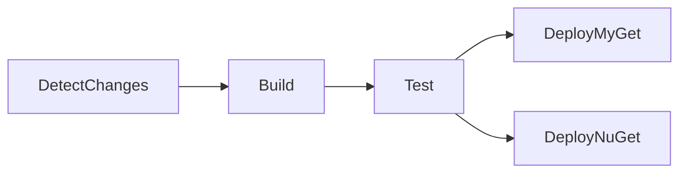

# Contributing to Umbraco.Ai

This guide explains how to contribute to the Umbraco.Ai monorepo, covering branch naming conventions, git workflows, and release processes.

## Table of Contents

- [Getting Started](#getting-started)
- [Branch Naming Convention](#branch-naming-convention)
- [Development Workflow](#development-workflow)
- [Pull Request Process](#pull-request-process)
- [Release Process](#release-process)
- [CI/CD Pipeline](#cicd-pipeline)
- [Coding Standards](#coding-standards)

## Getting Started

### Prerequisites

- .NET 10.0 SDK
- Node.js 20.x
- Git
- SQL Server or SQLite (for database development)
- IDE: Visual Studio 2022, VS Code, or JetBrains Rider

### Initial Setup

```bash
# Clone the repository
git clone https://github.com/umbraco/Umbraco.Ai.git
cd Umbraco.Ai

# Run setup script (creates unified solution + demo site)
.\scripts\install-demo-site.ps1  # Windows
./scripts/install-demo-site.sh   # Linux/Mac

# Configure git hooks (enforces branch naming)
.\scripts\setup-git-hooks.ps1  # Windows
./scripts/setup-git-hooks.sh   # Linux/Mac

# Open unified solution
start Umbraco.Ai.local.sln
```

### Repository Structure

```
Umbraco.Ai/                    # Monorepo root
├── Umbraco.Ai/                # Core AI layer (17.x)
├── Umbraco.Ai.Agent/          # Agent add-on (17.x)
├── Umbraco.Ai.Prompt/         # Prompt add-on (17.x)
├── Umbraco.Ai.OpenAi/         # OpenAI provider (1.x)
├── Umbraco.Ai.Anthropic/      # Anthropic provider (1.x)
├── Umbraco.Ai.Amazon/         # Amazon Bedrock provider (1.x)
├── Umbraco.Ai.Google/         # Google Gemini provider (1.x)
├── Umbraco.Ai.MicrosoftFoundry/ # Microsoft AI Foundry provider (1.x)
├── demo/                      # Demo site (generated)
└── docs/                      # Shared documentation
```

## Branch Naming Convention

**All branches MUST follow these patterns.** This is enforced by git hooks and CI/CD.

### Valid Branch Patterns

| Pattern | Description | Example |
|---------|-------------|---------|
| `main` | Main development branch | `main` |
| `dev` | Integration branch | `dev` |
| `feature/<anything>` | New feature development | `feature/add-embeddings` |
| `release/<anything>` | Release preparation | `release/2026.01` |
| `hotfix/<anything>` | Emergency fixes | `hotfix/2026.01.1` |

### Examples

**Correct:**
```bash
feature/add-streaming-support
feature/improve-context-handling
feature/add-versioning
release/2026.01
hotfix/2026.01.1
```

**Incorrect:**
```bash
feature-add-streaming        # Wrong delimiter
release-2026.01              # Wrong delimiter
```

### Enforcement

Branch naming is enforced at two levels:

1. **Git Hooks** (`.githooks/pre-push`): Local validation before push
2. **GitHub Actions** (`.github/workflows/validate-branch.yml`): CI/CD validation (cannot be bypassed)

To bypass git hooks temporarily (not recommended):
```bash
git push --no-verify
```

## Development Workflow

### Feature Development (Single Product)

```bash
# 1. Create feature branch from main
git checkout main
git pull origin main
git checkout -b feature/add-embeddings

# 2. Make changes in the product directory
# Edit: Umbraco.Ai/src/Umbraco.Ai.Core/...

# 3. Build and test
dotnet build Umbraco.Ai/Umbraco.Ai.sln
dotnet test Umbraco.Ai/Umbraco.Ai.sln

# 4. Test in demo site
cd demo/Umbraco.Ai.DemoSite
dotnet run

# 5. Commit changes
git add .
git commit -m "feat(core): add embedding support

Implements IChatClient.EmbeddAsync using M.E.AI abstractions"

# 6. Push and create PR
git push -u origin feature/add-embeddings
```

### Feature Development (Cross-Product)

When a feature spans multiple products (e.g., Core + Agent):

```bash
# 1. Create feature branch
git checkout -b feature/shared-context

# 2. Make changes to both products
# Edit: Umbraco.Ai/src/Umbraco.Ai.Core/...
# Edit: Umbraco.Ai.Agent/src/Umbraco.Ai.Agent.Core/...

# 3. Build unified solution (tests everything together)
dotnet build Umbraco.Ai.local.sln

# 4. Test in demo site
cd demo/Umbraco.Ai.DemoSite
dotnet run

# 5. Commit atomic changes
git add .
git commit -m "feat(core,agent): add shared context handling

- Core: Add IContextProvider interface
- Agent: Implement context sharing between agents"

# 6. Push and create PR
git push -u origin feature/shared-context
```

**Note:** Use a descriptive branch name that reflects the scope of the work.

### Frontend Development

```bash
# Watch all frontends in parallel (hot reload)
npm run watch

# Or watch specific product
npm run watch:core
npm run watch:agent

# Generate OpenAPI clients (demo site must be running)
npm run generate-client
```

### Working with Project References

By default, all products use **project references** to Core (changes visible immediately):

```xml
<!-- Agent.Core.csproj -->
<ProjectReference Include="..\..\..\Umbraco.Ai\src\Umbraco.Ai.Core\Umbraco.Ai.Core.csproj"
                  Condition="'$(UseProjectReferences)' == 'true'" />
```

This means:
- **Local builds**: Agent/Prompt/Providers automatically use your local Core changes
- **Distribution builds**: CI/CD builds with `UseProjectReferences=false` for package references

### Running Tests

```bash
# Run tests for specific product
dotnet test Umbraco.Ai/Umbraco.Ai.sln
dotnet test Umbraco.Ai.Agent/Umbraco.Ai.Agent.sln

# Run all tests
dotnet test Umbraco.Ai.local.sln
```

## Pull Request Process

### PR Title Format

Use conventional commits format:

```
<type>(<scope>): <description>

Types: feat, fix, docs, chore, refactor, test, perf
Scopes: core, agent, prompt, openai, anthropic
```

**Examples:**
```
feat(core): add streaming chat support
fix(agent): resolve context memory leak
docs(prompt): update README with examples
chore(core,agent): update dependencies
```

### PR Description Template

```markdown
## Summary
Brief description of what this PR does.

## Changes
- List of key changes
- Another change

## Testing
- [ ] Unit tests pass
- [ ] Integration tests pass
- [ ] Tested in demo site
- [ ] Frontend builds successfully (if applicable)

## Breaking Changes
None / List any breaking changes

## Related Issues
Closes #123
```

### PR Checklist

Before submitting a PR:

- [ ] Branch name follows convention (`feature/<anything>`)
- [ ] Code follows [coding standards](CLAUDE.md#coding-standards)
- [ ] All tests pass
- [ ] Frontend builds (if frontend changes)
- [ ] Documentation updated (if needed)
- [ ] CLAUDE.md updated (if architecture changes)
- [ ] No console errors or warnings

### Review Process

1. **Automated Checks**: GitHub Actions runs branch validation + unit tests
2. **Code Review**: At least one team member must approve
3. **CI/CD**: Azure DevOps builds affected products
4. **Merge**: Squash merge to main (keeps history clean)

## Release Process

Each product is versioned and released independently using Nerdbank.GitVersioning (NBGV).

### Version Numbers

| Product | Version Scheme | Current |
|---------|----------------|---------|
| Umbraco.Ai (Core) | 17.x (matches Umbraco CMS) | 17.0.0 |
| Umbraco.Ai.Agent | 17.x (matches Umbraco CMS) | 17.0.0 |
| Umbraco.Ai.Prompt | 17.x (matches Umbraco CMS) | 17.0.0 |
| Umbraco.Ai.OpenAi | 1.x (independent) | 1.0.0 |
| Umbraco.Ai.Anthropic | 1.x (independent) | 1.0.0 |
| Umbraco.Ai.Amazon | 1.x (independent) | 1.0.0 |
| Umbraco.Ai.Google | 1.x (independent) | 1.0.0 |
| Umbraco.Ai.MicrosoftFoundry | 1.x (independent) | 1.0.0 |

### Release Workflow

#### 1. Create Release Branch

```bash
git checkout main
git pull origin main
git checkout -b release/2026.01
```

#### 2. Define Release Manifest

Create `release-manifest.json` at repo root:

```json
[
  "Umbraco.Ai",
  "Umbraco.Ai.OpenAi"
]
```

#### 3. Update Versions

Edit each product's `version.json` in the manifest:

```json
{
  "version": "17.1.0",
  "assemblyVersion": {
    "precision": "build"
  },
  "publicReleaseRefSpec": [
    "^refs/heads/main$",
    "^refs/heads/release/",
    "^refs/heads/hotfix/",
    "^refs/tags/release-",
    "^refs/tags/hotfix-"
  ]
}
```

```bash
git add release-manifest.json Umbraco.Ai/version.json
git commit -m "chore(release): prepare 2026.01"
git push -u origin release/2026.01
```

#### 4. CI/CD Builds and Deploys

Azure DevOps detects the `release/*` branch pattern:
- Enforces `release-manifest.json`
- Packs only the listed products
- Deploys to **MyGet** (pre-release feed)

MyGet URL: `https://www.myget.org/F/umbraco-ai/api/v3/index.json`

#### 5. Test Pre-Release

```bash
# Add MyGet feed
dotnet nuget add source https://www.myget.org/F/umbraco-ai/api/v3/index.json -n UmbracoAi

# Install pre-release package
dotnet add package Umbraco.Ai.Core --version 17.1.0-*
```

Test the package in a real Umbraco site.

#### 6. Create Release Tag

Once testing passes:

```bash
git checkout release/2026.01
git pull origin release/2026.01

# Create and push tag
git tag release-2026.01
git push origin release-2026.01
```

#### 7. Production Deployment

Azure DevOps detects the `release-*` tag pattern:
- Rebuilds with release configuration
- Deploys to **NuGet.org** (production feed)

NuGet URL: `https://www.nuget.org/packages/Umbraco.Ai.Core`

#### 8. Merge to Main

```bash
# Create PR: release/2026.01 → main
# After approval and merge, delete release branch
git checkout main
git pull origin main
git branch -d release/2026.01
git push origin --delete release/2026.01
```

### Hotfix Workflow

For emergency fixes to production:

```bash
# 1. Create hotfix branch from the release tag
git checkout release-2026.01
git checkout -b hotfix/2026.01.1

# 2. Fix the issue
# Edit: Umbraco.Ai/src/...

# 3. Update version.json for affected products
# Change: "version": "17.1.1"

# 4. (Optional) Add release-manifest.json if you want an explicit pack list

# 5. Commit and push
git commit -am "fix(core): resolve critical security issue"
git push -u origin hotfix/2026.01.1

# 6. CI/CD deploys to MyGet
# 7. Test hotfix
# 8. Create tag
git tag hotfix-2026.01.1
git push origin hotfix-2026.01.1

# 9. CI/CD deploys to NuGet.org
# 10. Merge hotfix to main
```

### Releasing Multiple Products

List all products in `release-manifest.json` on a single `release/*` branch and update their `version.json` files together. CI will pack only the manifest list and fail if any changed product is missing.

## CI/CD Pipeline

### Change Detection

The Azure DevOps pipeline uses smart change detection to build only affected products:

**Branch Builds:**
```powershell
# Analyze git diff
$changedFiles = git diff --name-only HEAD~1 HEAD

# Determine changed products
if ($file.StartsWith("Umbraco.Ai/")) {
    $changedProducts["core"] = $true
}

# No dependency propagation (only products with direct changes pack)
```

**Release Branches:**
- `release/*` branches require `release-manifest.json` and pack only the listed products.
- `hotfix/*` branches honor the manifest if present; otherwise, change detection is used.

### Pipeline Stages



**1. DetectChanges**
- Analyzes git changes or tag names
- Sets variables: `CoreChanged`, `AgentChanged`, etc.

**2. Build (Parallel)**
- Builds only changed products
- Uses `UseProjectReferences=false` for distribution
- Generates NuGet packages
- Publishes artifacts

**3. Test (Parallel)**
- Runs unit tests
- Runs integration tests
- Publishes code coverage

**4. DeployMyGet**
- Triggers on: `release/*` branches
- Deploys to MyGet (pre-release feed)

**5. DeployNuGet**
- Triggers on: `release-*` tags
- Deploys to NuGet.org (production feed)

### Manual Triggers

To force a build of all products (bypass change detection):

```yaml
# Azure DevOps: Queue new build
# Set pipeline variables:
forceReleaseCore: true
forceReleaseAgent: true
forceReleasePrompt: true
forceReleaseOpenAi: true
forceReleaseAnthropic: true
```

## Coding Standards

All contributions must follow the [coding standards in CLAUDE.md](CLAUDE.md#coding-standards).

### Key Conventions

**Method Naming:**
```csharp
// Async methods: [Action][Entity]Async
Task<AiProfile?> GetProfileAsync(Guid id, CancellationToken ct);
Task<IEnumerable<AiAgent>> GetAllAgentsAsync(CancellationToken ct);
```

**Repository Access:**
```csharp
// Only access your own repository
public class AiProfileService
{
    private readonly IAiProfileRepository _profileRepository;  // ✓ Own repo
    private readonly IAiConnectionRepository _connectionRepository; // ✗ Other repo
}
```

**Extension Methods:**
```csharp
// Must be in .Extensions namespace
namespace Umbraco.Ai.Extensions
{
    public static class ChatClientExtensions { }
}
```

### Code Review Guidelines

Reviewers should check:
- [ ] Follows method naming conventions
- [ ] No cross-repository access (services use services, not repositories)
- [ ] Extension methods in correct namespace
- [ ] Async methods have CancellationToken
- [ ] No hardcoded strings (use constants or resources)
- [ ] Tests included for new functionality
- [ ] No breaking changes without discussion

## Documentation

### When to Update Documentation

Update documentation when:
- Adding new features or public APIs
- Changing build/deployment process
- Modifying architecture or patterns
- Adding new dependencies

### Documentation Locations

| Type | Location |
|------|----------|
| Product-specific guidance | `<Product>/CLAUDE.md` |
| Shared coding standards | `CLAUDE.md` |
| Contributing guide | `CONTRIBUTING.md` (this file) |
| Monorepo structure | `docs/migration-guide.md` |
| User guides | `docs/<topic>.md` |
| API documentation | XML comments in code |

## Questions and Support

### Getting Help

1. **Search existing issues**: [GitHub Issues](https://github.com/umbraco/Umbraco.Ai/issues)
2. **Ask on Discord**: [Umbraco Discord Server](https://discord.umbraco.com)
3. **Create new issue**: Provide minimal reproduction

### Reporting Bugs

Include:
- Product and version (e.g., Umbraco.Ai.Core 17.0.0)
- Umbraco CMS version
- .NET version
- Steps to reproduce
- Expected vs actual behavior
- Stack trace (if applicable)

### Suggesting Features

Include:
- Which product(s) would be affected
- Use case / problem to solve
- Proposed API or interface
- Breaking change considerations

## License

By contributing, you agree that your contributions will be licensed under the same license as the Umbraco.Ai project.

---

Thank you for contributing to Umbraco.Ai! 🚀
