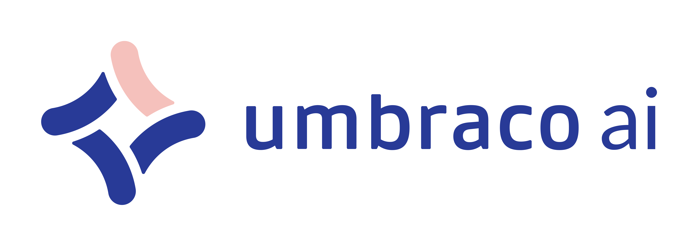

<p align="center">
  <picture>
    <source media="(prefers-color-scheme: dark)" srcset="./assets/logo_white.png">
    <source media="(prefers-color-scheme: light)" srcset="./assets/logo_dark.png">
    
  </picture>
  <br />
  AI integration layer for Umbraco CMS, built on Microsoft.Extensions.AI.
</p>

<hr />

## Products

This is a monorepo containing multiple Umbraco.AI packages:

| Product                                                         | Description                                | Version | Location                       |
| --------------------------------------------------------------- | ------------------------------------------ | ------- | ------------------------------ |
| [**Umbraco.AI**](Umbraco.AI/)                                   | Core AI integration layer                  | 1.x     | `Umbraco.AI/`                  |
| [**Umbraco.AI.Agent**](Umbraco.AI.Agent/)                       | AI agent management and runtime            | 1.x     | `Umbraco.AI.Agent/`            |
| [**Umbraco.AI.Agent.UI**](Umbraco.AI.Agent.UI/)                 | Reusable chat UI infrastructure (library)  | 1.x     | `Umbraco.AI.Agent.UI/`         |
| [**Umbraco.AI.Agent.Copilot**](Umbraco.AI.Agent.Copilot/)       | Copilot chat UI for agents (frontend-only) | 1.x     | `Umbraco.AI.Agent.Copilot/`    |
| [**Umbraco.AI.Prompt**](Umbraco.AI.Prompt/)                     | Prompt template management                 | 1.x     | `Umbraco.AI.Prompt/`           |
| [**Umbraco.AI.Deploy**](Umbraco.AI.Deploy/)                     | Deploy support for AI entities             | 1.x     | `Umbraco.AI.Deploy/`           |
| [**Umbraco.AI.Prompt.Deploy**](Umbraco.AI.Prompt.Deploy/)       | Deploy support for prompts                 | 1.x     | `Umbraco.AI.Prompt.Deploy/`    |
| [**Umbraco.AI.Agent.Deploy**](Umbraco.AI.Agent.Deploy/)         | Deploy support for agents                  | 1.x     | `Umbraco.AI.Agent.Deploy/`     |
| [**Umbraco.AI.OpenAI**](Umbraco.AI.OpenAI/)                     | OpenAI provider                            | 1.x     | `Umbraco.AI.OpenAI/`           |
| [**Umbraco.AI.Anthropic**](Umbraco.AI.Anthropic/)               | Anthropic provider                         | 1.x     | `Umbraco.AI.Anthropic/`        |
| [**Umbraco.AI.Amazon**](Umbraco.AI.Amazon/)                     | Amazon Bedrock provider                    | 1.x     | `Umbraco.AI.Amazon/`           |
| [**Umbraco.AI.Google**](Umbraco.AI.Google/)                     | Google Gemini provider                     | 1.x     | `Umbraco.AI.Google/`           |
| [**Umbraco.AI.MicrosoftFoundry**](Umbraco.AI.MicrosoftFoundry/) | Microsoft AI Foundry provider              | 1.x     | `Umbraco.AI.MicrosoftFoundry/` |

## Quick Start

The fastest way to get started is using the install-demo script, which creates a unified development environment with all packages and a demo Umbraco site:

```bash
# Windows
.\scripts\install-demo-site.ps1

# Linux/Mac
./scripts/install-demo-site.sh
```

This creates:

- `Umbraco.AI.local.sln` - Unified solution with all products
- `demo/Umbraco.AI.DemoSite/` - Umbraco instance with all packages referenced

After running the script, build the frontend and backend:

```bash
# Install frontend dependencies
npm install

# Build all frontend packages
npm run build

# Build the unified solution
dotnet build Umbraco.AI.local.sln

# Run the demo site (from demo/Umbraco.AI.DemoSite/)
cd demo/Umbraco.AI.DemoSite
dotnet run
```

**Demo site credentials:** admin@example.com / password1234

## Local Development

### Building Individual Products

Each product has its own solution file and can be built independently:

```bash
# Build individual products
dotnet build Umbraco.AI/Umbraco.AI.sln
dotnet build Umbraco.AI.Agent/Umbraco.AI.Agent.sln
dotnet build Umbraco.AI.Prompt/Umbraco.AI.Prompt.sln
dotnet build Umbraco.AI.Deploy/Umbraco.AI.Deploy.sln
dotnet build Umbraco.AI.Prompt.Deploy/Umbraco.AI.Prompt.Deploy.sln
dotnet build Umbraco.AI.Agent.Deploy/Umbraco.AI.Agent.Deploy.sln
dotnet build Umbraco.AI.OpenAI/Umbraco.AI.OpenAI.sln
dotnet build Umbraco.AI.Anthropic/Umbraco.AI.Anthropic.sln
dotnet build Umbraco.AI.Amazon/Umbraco.AI.Amazon.sln
dotnet build Umbraco.AI.Google/Umbraco.AI.Google.sln
dotnet build Umbraco.AI.MicrosoftFoundry/Umbraco.AI.MicrosoftFoundry.sln
```

### Frontend Development (npm Workspaces)

This monorepo uses **npm workspaces** for frontend dependency management. Add-on packages (`@umbraco-ai/prompt`, `@umbraco-ai/agent`) automatically reference the local `@umbraco-ai/core` during development using the `workspace:*` protocol.

```bash
# Install all workspace dependencies (run from monorepo root)
npm install

# Build all frontends (sequential: core -> prompt -> agent)
npm run build

# Watch all frontends in parallel
npm run watch

# Build/watch specific packages
npm run build:core
npm run build:prompt
npm run watch:agent
```

**Workspace Benefits:**

- Single `npm install` installs all dependencies across all packages
- Automatic local package linking (no manual `npm link` required)
- Common dependencies are hoisted to the root `node_modules`
- `workspace:*` automatically replaced with published version during `npm pack`

## Architecture

```
Umbraco.AI (Core)
    ├── Umbraco.AI.OpenAI (Provider - depends on Core)
    ├── Umbraco.AI.Anthropic (Provider - depends on Core)
    ├── Umbraco.AI.Amazon (Provider - depends on Core)
    ├── Umbraco.AI.Google (Provider - depends on Core)
    ├── Umbraco.AI.MicrosoftFoundry (Provider - depends on Core)
    ├── Umbraco.AI.Prompt (Add-on - depends on Core)
    │   └── Umbraco.AI.Prompt.Deploy (Deploy - depends on Prompt + Deploy)
    ├── Umbraco.AI.Agent (Add-on - depends on Core)
    │   ├── Umbraco.AI.Agent.UI (Frontend library - depends on Agent)
    │   ├── Umbraco.AI.Agent.Copilot (Chat UI - depends on Agent + Agent.UI)
    │   └── Umbraco.AI.Agent.Deploy (Deploy - depends on Agent + Deploy)
    └── Umbraco.AI.Deploy (Deploy - depends on Core)
```

## Documentation

- **[User Documentation](docs/public/README.md)** - Getting started, concepts, API reference, and guides
- [CLAUDE.md](CLAUDE.md) - Development guide, build commands, and coding standards
- Product-specific guides:
    - [Umbraco.AI/CLAUDE.md](Umbraco.AI/CLAUDE.md) - Core package
    - [Umbraco.AI.Agent/CLAUDE.md](Umbraco.AI.Agent/CLAUDE.md) - Agent add-on
    - [Umbraco.AI.Agent.UI/CLAUDE.md](Umbraco.AI.Agent.UI/CLAUDE.md) - Agent UI library
    - [Umbraco.AI.Agent.Copilot/CLAUDE.md](Umbraco.AI.Agent.Copilot/CLAUDE.md) - Agent Copilot add-on
    - [Umbraco.AI.Prompt/CLAUDE.md](Umbraco.AI.Prompt/CLAUDE.md) - Prompt add-on
    - [Umbraco.AI.Deploy/CLAUDE.md](Umbraco.AI.Deploy/CLAUDE.md) - Deploy support
    - [Umbraco.AI.Prompt.Deploy/CLAUDE.md](Umbraco.AI.Prompt.Deploy/CLAUDE.md) - Deploy Prompt support
    - [Umbraco.AI.Agent.Deploy/CLAUDE.md](Umbraco.AI.Agent.Deploy/CLAUDE.md) - Deploy Agent support

## Target Framework

- .NET 10.0 (`net10.0`)
- Umbraco CMS 17.x
- Central Package Management via `Directory.Packages.props`

## Contributing

Contributions are welcome! See [CONTRIBUTING.md](CONTRIBUTING.md) for guidelines on:

- Development workflow and branch naming conventions
- Commit message format (conventional commits)
- Changelog generation and maintenance
- Pull request process
- Release and deployment procedures
- Coding standards

For development setup and build commands, see [CLAUDE.md](CLAUDE.md).

## License

This project is licensed under the MIT License. See [LICENSE.md](LICENSE.md) for details.
