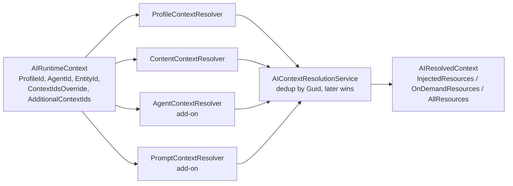

# Research: The Context / Context Resource system and how code-defined knowledge is surfaced to the LLM

**Date**: 2026-07-17
**Git Commit**: `5aa77cf83eed5c17d6afdc64394f0cae0a909a79`
**Branch**: `v18/dev`
**Repository**: Umbraco.AI

## Research Question

1. How does a Context and its Context Resources work end to end today — from the domain models through the service layer to being consumed by a request (full lifecycle of one resource)?
2. How does context resolution work at request time — the resolution service, the `IAIContextResolver` extension point, the collection builder, the built-in resolvers, the override behaviour, and how the Agent add-on contributes into the same pipeline?
3. How does the resource-type extension point work — the interface, base class, attribute + `IDiscoverable` auto-discovery, the settings/data contract, and the built-ins? What must a package supply to register a new resource "kind"?
4. How is resolved context injected into the LLM, and what supports on-demand retrieval — the injecting middleware, its pipeline position, the injection-mode branch, `IAIContextAccessor`, and the context tools?
5. What are the established patterns for a package to contribute code-defined items that Core enumerates at runtime? Which allow items to originate purely from an add-on package with no server-side registration code?
6. How are Contexts persisted, mapped, and integrated across the wider system (repositories, factory/encryption, migrations, notifications, Deploy)? Which parts assume a context is user-created and mutable?
7. How is the Context backoffice UI structured, and how does a package ship frontend extensions and localization into the backoffice?
8. How do comparable systems (Microsoft.Extensions.AI, Model Context Protocol) bundle static, code-shipped knowledge with plugins for LLM grounding?

## Research Methodology (verbatim)

This document will remain objective and factual. It does not contain any recommendations or implementation suggestions.
Open questions will not ask Why things haven't been built or what should be built in the future.

There is no "implementation" section - that is intentional.

## Summary

An **`AIContext`** is a reusable, named, user-authored bag of **`AIContextResource`** items (brand-voice text, free-form instructions, etc.). Contexts are full-CRUD, DB-persisted, versioned domain entities managed by `AIContextService`, whereas the *kinds* of resource a context can hold — **resource types** — are the opposite: code-defined, attribute-discovered, read-only registry entries (`IAIContextResourceType`) with no database row and no create/update/delete API. Every `AIContextResource` carries a `ResourceTypeId` string that links it (late-bound, at format time) to one of those code-defined resource types, which owns the logic for turning stored settings into text for the model. This split — mutable persisted *contexts* referencing immutable code-defined *resource types* — is the single most relevant precedent in the codebase for how "code-shipped knowledge" is modelled today.

At request time, a chain of ordered **`IAIContextResolver`** implementations (Profile → Content → Agent/Prompt, wired by composer order) each read request-scoped state from `IAIRuntimeContextAccessor`, load the relevant `AIContext`s through `IAIContextService`, and emit resolver resources. `AIContextResolutionService` aggregates them, de-duplicating by resource `Guid` so **later resolvers win**, and splits the result into `InjectedResources` (`InjectionMode.Always`) and `OnDemandResources` (`InjectionMode.OnDemand`). The outermost chat middleware, `AIContextInjectingChatClient`, formats "Always" resources into the system prompt via `AIContextProcessor`, stashes the whole resolved context into an `HttpContext.Items`-backed `IAIContextAccessor`, and lists "OnDemand" resources by name/ID so the model can pull their content through the `list_context_resources` / `get_context_resource` system tools — which run the identical formatting path on demand.

Two distinct extension mechanisms coexist. **Pure attribute discovery** (`IDiscoverable` marker + a `[…]` attribute, scanned by Umbraco's `TypeLoader`) lets an add-on assembly contribute providers (`[AIProvider]`), tools (`[AITool]`), **and context resource types (`[AIContextResourceType]`)** with *zero* server-side registration code — just ship a decorated class. **Explicit collection-builder registration** (`OrderedCollectionBuilderBase` / `LazyCollectionBuilderBase` populated by `.Append<T>()`/`.Add<T>()` from a composer, sequenced with `[ComposeAfter]`) is required for everything ordered or non-attributed — including the `IAIContextResolver`s themselves. So a package can ship a new resource *kind* with no composer, but contributing a new *resolver* (or middleware) requires a composer.

Persistence, versioning, notifications, and Deploy all assume an `AIContext` is a writable, GUID-identified row: `EFCoreAIContextRepository.SaveAsync` performs real inserts/updates, `AIContextService.SaveContextAsync` enforces alias-uniqueness by querying the repository and writes version snapshots, resource rows have a required cascade FK to `umbracoAIContext`, and the Deploy connector round-trips through `SaveContextAsync` to create-or-update a row keyed by the artifact's GUID UDI. Externally, neither Microsoft.Extensions.AI nor MCP offers a first-class "static code-shipped knowledge" primitive — both reduce to the same two knobs this codebase already uses: inline text injected into the prompt, or an on-demand callable/URI-addressable retrieval interface (M.E.AI `AIFunction` tools; MCP `resources`).

## Detailed Findings

### 1. A Context is a persisted bag of resources; a resource points at a code-defined resource *type*

The domain splits cleanly into three model objects, all under `Umbraco.AI/src/Umbraco.AI.Core/Contexts/`.

**`AIContext`** (`AIContext.cs:14-63`) is a `sealed class : IAIVersionableEntity` — a top-level entity with `Id`, `Alias`, `Name`, audit fields (`DateCreated/Modified`, `CreatedBy/ModifiedByUserId`), an `internal set` `Version` that starts at 1, and an ordered `IList<AIContextResource> Resources`.

**`AIContextResource`** (`AIContextResource.cs:6-46`) is the unit of knowledge:

| Field | Type | Notes |
|---|---|---|
| `Id` | `Guid` | `internal set` |
| `ResourceTypeId` | `required string` (`init`) | links to `IAIContextResourceType.Id` (e.g. `"brand-voice"`, `"text"`) — documented as **immutable** |
| `Name` | `required string` | |
| `Description` | `string?` | shown to the LLM for OnDemand resources |
| `SortOrder` | `int` | injection order within a context |
| `Settings` | `object?` | type-specific settings, user-configured; stored as JSON |
| `InjectionMode` | `AIContextResourceInjectionMode` | default `Always` |

A `// V2: public float[]? Embedding` comment at `AIContextResource.cs:45` documents a planned-but-absent semantic field.

**`AIContextResourceInjectionMode`** (`AIContextResourceInjectionMode.cs:6-21`) has two live values — `Always` (line 12, "always included in the system prompt") and `OnDemand` (line 18, "made available as a tool the LLM can invoke") — plus a documented-only `Semantic` V2 idea.

The full lifecycle of one resource:

```text
define AIContextResource (ResourceTypeId="brand-voice", Settings={...}, InjectionMode=Always)
  → IAIContextService.SaveContextAsync(context)                 # assign IDs, alias check, version snapshot, notifications
    → IAIContextRepository.SaveAsync                            # EFCore: encrypt+serialize Settings, INSERT/UPDATE rows
  ─── (later, per request) ───
  → AIContextInjectingChatClient.PrepareContextAsync
    → IAIContextResolutionService.ResolveContextAsync          # run resolver chain, dedup, split by InjectionMode
      → each IAIContextResolver.ResolveAsync                    # load AIContext via IAIContextService, emit resources
    → AIContextProcessor.ProcessContextForLlmAsync             # per resource: look up resource type, resolve+format
      → IAIContextResourceType.ResolveDataAsync(settings)      # JSON/object Settings → typed TSettings (config refs resolved)
      → IAIContextResourceType.FormatDataForLlm(typedData)     # typed data → text block
    → InjectContextIntoMessages                                # append "## Context / ### {name}" to system message
```

`AIContextService` (`AIContextService.cs:12`, `internal sealed`) is the sole gateway to the `internal IAIContextRepository`. `SaveContextAsync` (`AIContextService.cs:59-113`) assigns GUIDs to the context and any resource with `Guid.Empty`, enforces alias uniqueness by querying `GetByAliasAsync` (throws `InvalidOperationException` on collision), sets `DateModified`, publishes the cancelable `AIContextSavingNotification`, snapshots the *pre-save* state via `IAIEntityVersionService.SaveVersionAsync` when updating, calls `_repository.SaveAsync`, then publishes `AIContextSavedNotification`. `DeleteContextAsync` (116-142) and `RollbackContextAsync` (167-228) follow the same cancelable-notification + version-service pattern. Method names follow the repo's `[Action][Entity]Async` convention (`GetContextAsync`, `GetContextByAliasAsync`, `GetContextsPagedAsync`, `ContextAliasExistsAsync`).

Resolution produces richer copies of the resource. Pre-aggregation, resolvers emit `AIContextResolverResource` (`Resolvers/AIContextResolverResource.cs:10-46`, same shape plus `ContextName`, no `Source`). Post-aggregation, `AIContextResolutionService` converts each into `AIResolvedResource` (`AIResolvedResource.cs:6-47`, adds `Source` = resolver type name) and packages them into `AIResolvedContext` (`AIResolvedContext.cs:7-36`) with three lists: `InjectedResources`, `OnDemandResources`, `AllResources`, plus `Sources`.

Formatting is `AIContextProcessor` (`AIContextProcessor.cs:10`, single dependency `AIContextResourceTypeCollection`). `ProcessResourceForLlmAsync` (76-92) looks up the resource type by `ResourceTypeId`, calls `ResolveDataAsync(resource.Settings, ct)` then `FormatDataForLlm(resolvedData)`; if the type is unknown it falls back to raw JSON. `ProcessContextForLlmAsync` (24-73) wraps injected resources under a `## Context` header with `### {resource.Name}` sub-headers, and lists on-demand resources under `## Available On-Demand Context Resources` telling the model to call `get_context_resource`.

#### Testing patterns

`AIContextServiceTests.cs` (`tests/Umbraco.AI.Tests.Unit/Services/`) unit-tests the service with Moq (`Mock<IAIContextRepository>`, `Mock<IAIEntityVersionService>`, `Mock<IEventAggregator>`) + Shouldly, covering get/save/delete but **not** notification-cancellation branches, `RollbackContextAsync`, or `ContextAliasExistsAsync`. Fluent builders live in `tests/Umbraco.AI.Tests.Common/Builders/AIContextBuilder.cs` and `AIContextResourceBuilder.cs` (the latter has `AsBrandVoice()/AsText()/AsAlwaysInjected()/AsOnDemand()` helpers), with a dictionary-backed `Fakes/FakeAIContextRepository.cs`. **No test exists** for `AIContextProcessor` — confirmed by repo-wide search (matches only in `bin`/`obj`).

### 2. Resolution runs an ordered resolver chain, dedups by GUID (later wins), and splits by injection mode

`IAIContextResolutionService.ResolveContextAsync(CancellationToken)` (`IAIContextResolutionService.cs:34`) is the single entry point, called once per request from `AIContextInjectingChatClient.PrepareContextAsync` (`Middleware/AIContextInjectingChatClient.cs:91`). The extension point is `IAIContextResolver.ResolveAsync(CancellationToken) : Task<AIContextResolverResult>` (`Resolvers/IAIContextResolver.cs:18-26`).



The aggregator (`AIContextResolutionService.cs:24-79`) iterates resolvers **in registration order**, tags each source with `resolver.GetType().Name`, and on a duplicate resource `Id` calls `allResources.RemoveAll(r => r.Id == resource.Id)` before appending — so a later resolver's resource replaces an earlier one (`AIContextResolutionService.cs:45-51`). It then partitions by `InjectionMode` (68-78). There is no cross-resolver sorting beyond insertion order; within a single context, resources are ordered `OrderBy(r => r.SortOrder)` at the resolver level.

**Built-in resolvers** (both `internal sealed`, registered `Append<ProfileContextResolver>().Append<ContentContextResolver>()` at `Configuration/UmbracoBuilderExtensions.cs:246-248`, comment "content can override profile-level context"):

- **`ProfileContextResolver`** (`Resolvers/ProfileContextResolver.cs:16`) reads `ProfileId` from the runtime context; if absent returns `Empty`. It combines the profile's `AIChatProfileSettings.ContextIds` with `AdditionalContextIds`, then loads each `AIContext` and flattens its resources.
- **`ContentContextResolver`** (`Resolvers/ContentContextResolver.cs:30`) reads `ParentEntityId` (preferred) or `EntityId`, skips members, ensures an `UmbracoContext`, then walks the node and its **ancestors** looking for the first property whose editor alias is `Uai.ContextPicker` (`Constants.PropertyEditors.Aliases.ContextPicker`) — closest node wins (`FindNearestContexts`, 124-154). It re-fetches each context fresh via `IAIContextService` rather than trusting the content cache.

**The "override" mechanism** (no literal "sentinel" in code — the key is named `ContextIdsOverride`): `Constants.ContextKeys.ContextIdsOverride = "Umbraco.AI.ContextIdsOverride"` (`Constants.cs:223`) and `AdditionalContextIds` (`Constants.cs:231`). It is written by `AIContextBuilderState.WriteToContext` (`Contexts/AIContextBuilderState.cs:55-84`) **whenever `Set(Guid[])` was called, even with an empty array** — letting a caller say "use exactly these / zero contexts". When present:
- `ProfileContextResolver` treats it as a full replacement of the profile's `ContextIds` and skips fetching the profile (`ProfileContextResolver.cs:55-60`), becoming the **sole** emitter of the override set.
- `AgentContextResolver` (`AgentContextResolver.cs:44-47`) and `PromptContextResolver` (`PromptContextResolver.cs:43-46`) detect the same key and **self-suppress** (`return AIContextResolverResult.Empty`) to avoid duplicate emission.

Callers that populate it: `AIChatBuilder`/`AIInlineAgentBuilder` via `AIContextBuilderState.Set`, `AIAgentExecutionOptions.ContextIdsOverride` (`AIAgentService.cs:952-954`), `AIPromptExecutionOptions.ContextIdsOverride` (`AIPromptService.cs:273-275`), and test-runner request models.

**The collection builder** is `AIContextResolverCollectionBuilder : OrderedCollectionBuilderBase<…>` (`Resolvers/AIContextResolverCollectionBuilder.cs:22`) feeding `AIContextResolverCollection : BuilderCollectionBase<IAIContextResolver>` (`Resolvers/AIContextResolverCollection.cs:14`). Because it is **ordered**, there is no attribute-based auto-discovery — ordering is 100% explicit via `Append`/`InsertBefore`/`InsertAfter`.

**Agent contribution**: `AgentContextResolver` (`Umbraco.AI.Agent/src/Umbraco.AI.Agent.Core/Context/AgentContextResolver.cs:17`) is registered `builder.AIContextResolvers().Append<AgentContextResolver>()` at `Umbraco.AI.Agent.Core/Configuration/UmbracoBuilderExtensions.cs:70`, invoked from `UmbracoAIAgentComposer` which is `[ComposeAfter(typeof(UmbracoAIComposer))]` (`Umbraco.AI.Agent.Startup/Configuration/UmbracoAIAgentComposer.cs:11-19`). This composer ordering yields the runtime chain **Profile → Content → Agent** (and Prompt, likewise `[ComposeAfter]`). The `InsertAfter<ProfileContextResolver, AgentContextResolver>()` form appears only in doc-comments, never in executed code.

#### Testing patterns

`ProfileContextResolverTests.cs`, `AgentContextResolverTests.cs`, and `PromptContextResolverTests.cs` (under each package's `tests/…/Context(s)/Resolvers/`) all use the same approach: a real `AIRuntimeContext([])` seeded via `SetValue`, `IAIRuntimeContextAccessor` mocked to return it, downstream services mocked with Moq, Shouldly assertions. They cover the override-precedence and self-suppression paths. **No test** exists for `AIContextResolutionService` (aggregation/dedup) or `ContentContextResolver`.

### 3. Resource types are code-defined, attribute-discovered, and read-only — a package ships a new "kind" with zero registration code

`IAIContextResourceType : IDiscoverable` (`ResourceTypes/IAIContextResourceType.cs:14-67`) is the contract:

```csharp
public interface IAIContextResourceType : IDiscoverable
{
    string Id { get; }
    string Name { get; }
    string? Description { get; }
    string? Icon { get; }
    Type? SettingsType { get; }
    AIEditableModelSchema? GetSettingsSchema();
    Type? DataType { get; }
    Task<object?> ResolveDataAsync(object? settings, CancellationToken cancellationToken = default);
    string FormatDataForLlm(object? data);
}
```

`AIContextResourceTypeBase<TSettings, TData>` (`ResourceTypes/AIContextResourceTypeBase.cs:31-137`) provides the generic base: its constructor reads the `[AIContextResourceType]` attribute reflectively (throwing if absent, 78-80), exposes `SettingsType`/`DataType`, delegates `GetSettingsSchema()` to `_infrastructure.SchemaBuilder.BuildForType<TSettings>(Id)`, and implements the boxed interface methods by converting raw settings via `_infrastructure.ModelResolver.ResolveModel<TSettings>(settings)` (this is where `$`-prefixed config-variable references are resolved) before calling the strongly-typed virtual `ResolveDataAsync(TSettings)`/`FormatDataForLlm(TData)`. The convenience `AIContextResourceTypeBase<TSettings>` (10-24) sets `TData == TSettings` and echoes settings as data.

Discovery is wired **once** in Core (`Configuration/UmbracoBuilderExtensions.cs:233-236`):

```csharp
services.AddSingleton<IAIContextResourceTypeInfrastructure, AIContextResourceTypeInfrastructure>();
builder.AIContextResourceTypes()
    .Add(() => builder.TypeLoader.GetTypesWithAttribute<IAIContextResourceType, AIContextResourceTypeAttribute>(cache: true));
```

Call stack: `IDiscoverable` marks the interface for `TypeLoader`'s cached fast path → `AIContextResourceTypeCollectionBuilder : LazyCollectionBuilderBase` stores the producer delegate → at `Build()`, `TypeLoader.GetTypesWithAttribute` returns all types across all loaded assemblies implementing the interface AND carrying the attribute → each concrete type is registered in DI (so its constructor gets `IAIContextResourceTypeInfrastructure`) → `AIContextResourceTypeCollection : BuilderCollectionBase<IAIContextResourceType>` (`ResourceTypes/AIContextResourceTypeCollection.cs:8`) exposes case-insensitive `GetById(string id)`.

**Built-ins** live in `ResourceTypes/BuiltIn/`: `TextResourceType` (`[AIContextResourceType("text", "Text", …)]`, settings = one `Content` `TextArea` field; `FormatDataForLlm` returns `Content?.Trim()`) and `BrandVoiceResourceType` (`[AIContextResourceType("brand-voice", …)]`, settings = `ToneDescription`/`TargetAudience`/`StyleGuidelines`/`AvoidPatterns`; `FormatDataForLlm` builds a labelled `Tone:/Audience:/Style:/Avoid:` block). Both are `sealed`, take only `IAIContextResourceTypeInfrastructure`.

The Management API surface is **read-only**: `GET /v1/context-resource-type` (`AllContextResourceTypeController`) and `GET /v1/context-resource-type/{id}` (`ByIdContextResourceTypeController`) — no create/update/delete. Settings-schema is mapped for the frontend via `ContextResourceTypeMapDefinition.MapResourceTypeToResponse` (`…/Mapping/ContextResourceTypeMapDefinition.cs:26-35`).

**What a package must supply for a new resource kind:** (1) a settings class with `[AIField]`-decorated properties and a parameterless ctor; (2) a class with `[AIContextResourceType(id, name, …)]` deriving from `AIContextResourceTypeBase<TSettings>` (or `<TSettings, TData>`), taking `IAIContextResourceTypeInfrastructure`, overriding `FormatDataForLlm` (and optionally `ResolveDataAsync`). **No DI/composer registration is required** — the `IDiscoverable` + attribute producer in Core auto-discovers any decorated class in any loaded assembly. Manual `builder.AIContextResourceTypes().Add<T>()`/`.Exclude<T>()` is only needed to force-add a non-attributed type or remove a built-in.

#### Testing patterns

**No dedicated tests** for the resource-type extension point (`IAIContextResourceType`, the base class, `TextResourceType`, `BrandVoiceResourceType`, or their `ResolveDataAsync`/`FormatDataForLlm`). Only incidental usage: `AIContextResourceBuilder` fixtures, an empty `AIContextResourceTypeCollection` constructed to satisfy repository-test ctors, and `AIExtensionUsageTelemetryProviderTests` which mocks an `IAIContextResourceType` to assert telemetry counters.

### 4. Injection happens in the outermost chat middleware; on-demand resources are fetched via system tools

The chat pipeline is assembled in `Configuration/UmbracoBuilderExtensions.cs:116-124` (comment "first = innermost, last = outermost"):

```text
AIOpenTelemetryChatMiddleware          # innermost (closest to provider)
AIFileProcessingChatMiddleware
AIChatOptionsOverrideChatMiddleware
AIRuntimeContextInjectingChatMiddleware
AIFunctionInvokingChatMiddleware       # MEAI UseFunctionInvocation — runs the tool loop
AIGuardrailChatMiddleware
AITrackingChatMiddleware
AIContextInjectingChatMiddleware       # outermost (appended last)
```

`AIChatClientFactory.ApplyMiddleware` (`Chat/AIChatClientFactory.cs:60-71`) wraps each successive middleware around the previous, so the last-appended `AIContextInjectingChatMiddleware` sees the outgoing call first. Crucially, because it sits **outside** `AIFunctionInvokingChatMiddleware`, context resolution and accessor population happen once and remain valid for the entire nested tool-calling loop.

`AIContextInjectingChatClient.PrepareContextAsync` (`Middleware/AIContextInjectingChatClient.cs:86-112`), called from both `GetResponseAsync` and `GetStreamingResponseAsync`:

```text
resolvedContext = ResolveContextAsync()
if AllResources.Count == 0: return messages unchanged, null scope
scope = contextAccessor.SetContext(resolvedContext)          # exposes OnDemandResources to tools
content = contextProcessor.ProcessContextForLlmAsync(...)     # Always → full text; OnDemand → name/ID list
if content non-blank: InjectContextIntoMessages(...)          # append to first System msg, else insert new at [0]
return (messages, scope)                                       # scope disposed in finally after inner call
```

The injection-mode branch is checked twice: `AIContextResolutionService` splits `AllResources` into `InjectedResources`/`OnDemandResources` (`AIContextResolutionService.cs:68-78`), and `AIContextProcessor.ProcessContextForLlmAsync` (`AIContextProcessor.cs:24-73`) formats each list differently — Always resources get their full formatted content under `## Context`; OnDemand resources get only `**{Name}** (ID: \`{Id}\`)` under `## Available On-Demand Context Resources` plus the instruction to call `get_context_resource`.

`IAIContextAccessor` (`IAIContextAccessor.cs:10-23`) exposes `AIResolvedContext? Context` and `IDisposable SetContext(...)`. Its implementation `AIContextAccessor` (`AIContextAccessor.cs:13`) stores the context in `HttpContext.Items["Umbraco.AI.ResolvedContext"]` **deliberately, not `AsyncLocal`** — the class remark (8-12) explains `AsyncLocal` doesn't survive the async boundaries MEAI's `FunctionInvokingChatClient` creates during tool execution, whereas `HttpContext.Items` is preserved for the whole request.

**On-demand tools** (`Tools/Context/`), both `[AITool(...)]` + `IAISystemTool`:
- `ListContextResourcesTool` (`ListContextResourcesTool.cs:14`) reads `_contextAccessor.Context.OnDemandResources`, returns `ContextResourceSummary(Id, Name, Description, ResourceTypeId, ContextName)` per resource.
- `GetContextResourceTool` (`GetContextResourceTool.cs:23`, arg `GetContextResourceArgs(Guid ResourceId)`) finds the matching resource in `OnDemandResources` only (Always resources cannot be fetched this way), calls `_processor.ProcessResourceForLlmAsync(resource, ct)` — **the same formatting path used for Always resources** — and returns `ContextResourceContent(...)`.

`IAISystemTool` (`Tools/IAISystemTool.cs:16`, `internal` marker) means these are always included in agent requests, hidden from permission UIs, and skip approval. The Agent add-on wires them in: `AIAgentToolHelper.GetAllowedToolIds` adds all `IAISystemTool` IDs first (`AIAgentToolHelper.cs:30-37`), and `AIAgentFactory` converts them to `AIFunction`s and excludes them from destructive-approval wrapping (`AIAgentFactory.cs:132`).

#### Testing patterns

**No tests** for `AIContextInjectingChatMiddleware`/`Client`, `AIContextResolutionService`, `AIContextProcessor`, `AIContextAccessor`, or either context tool. Adjacent generic tests exist: `MiddlewarePipelineTests.cs` (middleware application mechanics with fakes) and `AIToolCollectionTests.cs` (`GetSystemTools()`/`GetUserTools()` via `FakeSystemTool`/`FakeTool`).

### 5. Two contribution patterns: attribute discovery (zero-registration) vs explicit collection-builder registration

There are two ways for code to contribute items Core enumerates at runtime, both built on Umbraco CMS's `CollectionBuilderBase`/`BuilderCollectionBase` machinery.

| Extension point | Builder base | Marker | Attribute | Populated by | Add-on needs composer? |
|---|---|---|---|---|---|
| Providers | `LazyCollectionBuilderBase` | `IAIProvider : IDiscoverable` | `[AIProvider]` | Core `TypeLoader` producer | **No** — pure attribute |
| Tools | `LazyCollectionBuilderBase` | `IAITool : IDiscoverable` | `[AITool]` | Core `TypeLoader` producer | **No** |
| Tool scopes | `LazyCollectionBuilderBase` | `IAIToolScope` | `[AIToolScope]` | Core `TypeLoader` producer | **No** |
| **Context resource types** | `LazyCollectionBuilderBase` | `IAIContextResourceType : IDiscoverable` | `[AIContextResourceType]` | Core `TypeLoader` producer | **No** |
| Guardrail evaluators / test features / graders | `LazyCollectionBuilderBase` | `IDiscoverable`-based | `[AIGuardrailEvaluator]` etc. | Core `TypeLoader` producer | **No** |
| Property value handlers | `LazyCollectionBuilderBase` | `IAIPropertyValueHandler` | none (unattributed scan) | Core `TypeLoader` producer | **No** |
| Versionable / entity adapters | `LazyCollectionBuilderBase` | interface | none | explicit `.Add<T>()` only | **Yes** |
| **Context resolvers** | `OrderedCollectionBuilderBase` | `IAIContextResolver` | none | explicit `.Append<T>()` only | **Yes** |
| Chat/embedding/etc. middleware, file handlers, runtime-context contributors, guardrail resolvers | `OrderedCollectionBuilderBase` | interface | none | explicit `.Append<T>()` only | **Yes** |

The attribute path is proven by `Umbraco.AI.OpenAI`: `[AIProvider("openai","OpenAI")]` on `OpenAIProvider` (`OpenAIProvider.cs:11`) with **no `IComposer` anywhere in the package** — dropping a decorated class in a referenced assembly is sufficient. Registration is wired once in Core, e.g. providers at `Configuration/UmbracoBuilderExtensions.cs:104-106`, tools at 139-140, resource types at 235-236, all via `builder.TypeLoader.GetTypesWithAttribute<TInterface, TAttribute>(cache: true)`.

The key difference: `LazyCollectionBuilderBase` exposes `Add<T>()`/`Add(Func<IEnumerable<Type>>)` (the producer overload used for scanning) and unions results as an unordered set; `OrderedCollectionBuilderBase` exposes only `Append`/`Insert*`/`Remove`/`Replace` with **no producer overload and no TypeLoader wiring anywhere in the repo** — every ordered collection (all middleware, and the context resolvers) is populated by explicit `.Append<T>()` in a composer. `[ComposeAfter(typeof(UmbracoAIComposer))]` on each add-on composer sequences its registrations after Core's; `WithCollectionBuilder<TBuilder>()` caches builder instances by type so all composers mutate the same shared builder before a single `Build()` materializes it.

**Direct answer to Q5:** only the attribute-discovered, `IDiscoverable`-marked points allow a pure code-only contribution with no server-side registration — and **context resource types are one of them**. Context *resolvers* (and middleware) require a composer.

#### Testing patterns

**No test exercises the real `TypeLoader`/assembly-scanning discovery path.** `ServiceResolutionTests.cs` explicitly bypasses the collection builder ("requires TypeLoader that can't be mocked"), constructing `new AIProviderCollection(() => providers)` around a `FakeAIProvider`. `AIToolCollectionTests.cs` tests query methods on a directly-constructed collection. No `WebApplicationFactory`/`TestServer` boot of the real composer graph exists — end-to-end discovery is exercised only by running the demo site.

### 6. Persistence, versioning, notifications, and Deploy all assume a mutable, GUID-keyed row

The repository is `internal IAIContextRepository` (`Contexts/IAIContextRepository.cs:9`). The Core default `InMemoryAIContextRepository` (`Contexts/InMemoryAIContextRepository.cs:10`, `ConcurrentDictionary`-backed) is registered at `Configuration/UmbracoBuilderExtensions.cs:239`; the Persistence override `EFCoreAIContextRepository` (`Umbraco.AI.Persistence/Context/EFCoreAIContextRepository.cs:11`) is registered at `Umbraco.AI.Persistence/Configuration/UmbracoBuilderExtensions.cs:66`. Because both are `AddSingleton` for the same type and `AddUmbracoAI()` calls Core then Persistence, the EF Core one silently supersedes the in-memory one (registration-order override, same pattern as connections/profiles/guardrails).

Mapping and encryption run through `AIContextFactory` (`Umbraco.AI.Persistence/Context/AIContextFactory.cs:11`, deps `IAIEditableModelSerializer` + `AIContextResourceTypeCollection`). On write, `SerializeSettings` (127-136) looks up the resource type's schema via `GetById(resourceTypeId)?.GetSettingsSchema()` and serializes+encrypts only fields marked `IsSensitive` (via `_serializer.Serialize`); on read, `BuildResourceDomain` deserializes/decrypts into an untyped `JsonElement?` (typed conversion is deferred to the resource-type layer). **Neither built-in resource type declares a sensitive field today**, so no encryption is currently triggered, though the schema-driven mechanism is fully wired.

EF entities: `AIContextEntity` → table **`umbracoAIContext`** (unique index on `Alias`), `AIContextResourceEntity` → table **`umbracoAIContextResource`** with a required `ContextId` FK, `OnDelete(DeleteBehavior.Cascade)` (`UmbracoAIDbContext.cs:249-311`). `Settings` is stored as JSON string, `InjectionMode` as `int`. Migrations (`UmbracoAI_` prefix, mirrored in SqlServer + Sqlite): `AddAIContext` (original `Data` column), `AddVersioningAndUserTracking` (adds `CreatedByUserId/ModifiedByUserId/Version` + the shared `umbracoAIEntityVersion` table), `ChangeUserIdToGuid`, and `RenameContextResourceDataToSettings` (`Data` → `Settings`).

Notifications (`AIContextSaving/Saved/Deleting/Deleted/RollingBack/RolledBack`) are published by `AIContextService`. The only handlers reacting to them live in **Deploy**: `AIContextSavedDeployRefresherNotificationAsyncHandler` writes the on-disk artifact; `AIContextDeletedDeployRefresherNotificationAsyncHandler` deletes the artifact keyed by `EntityId` (it never re-fetches the entity). Versioning is bridged by `AIContextVersionableEntityAdapter` (`Contexts/AIContextVersionableEntityAdapter.cs:9`), registered at `Configuration/UmbracoBuilderExtensions.cs:212`, delegating rollback/get back to `IAIContextService`.

Deploy: `AIContextArtifact : DeployArtifactBase<GuidUdi>` (`Umbraco.AI.Deploy/Artifacts/AIContextArtifact.cs:11`) adds one property, `JsonElement? Resources`. `UmbracoAIContextServiceConnector` (`…/Connectors/ServiceConnectors/UmbracoAIContextServiceConnector.cs:15`, `[UdiDefinition(…Context, GuidUdi)]`) exports via `IAIContextService.GetContextAsync/GetContextsAsync`, serializes the full `Resources` list (no per-resource UDI dependencies), and on import (`Pass2Async`) reuses the found entity or **constructs a new `AIContext` with `Id = artifact.Udi.Guid`** and calls `SaveContextAsync` — round-tripping through the same save path, notifications, and versioning as a UI save. The `UmbracoAIContextPickerValueConnector` round-trips a context GUID as a `GuidUdi` but currently does **not** validate the context exists (`// TODO` at lines 37, 62).

**Parts that assume a mutable, persisted row:** the repository `SaveAsync`/`DeleteAsync` write path (both InMemory and EFCore); `SaveContextAsync`'s alias-uniqueness query and unconditional version snapshot on update; the required cascade FK from `umbracoAIContextResource` to `umbracoAIContext` (resource rows cannot exist without a context row); Deploy's `GetEntity`/`Pass2Async` create-or-update-by-GUID; and rollback (no version history would ever exist for a code-defined context). The one existing precedent for a **code-defined, immutable, discovered** entity alongside mutable `AIContext` is `ResourceTypeId` → `AIContextResourceTypeCollection`, whose Web API is read-only.

#### Testing patterns

`EFCoreAIContextRepositoryTests.cs` (`tests/Umbraco.AI.Tests.Unit/Repositories/`) is integration-style against a real SQLite `EFCoreTestFixture` with a real `AIContextFactory`/`AIEditableModelSerializer` and mocked `IAISensitiveFieldProtector`, covering get/save/update/delete/cascade and `InjectionMode` int↔enum mapping (no sensitive-field encryption test, since no built-in declares one). `AIContextServiceTests.cs` uses `FakeAIContextRepository`. **No tests** exist for `UmbracoAIContextServiceConnector`, `AIContextArtifact`, or `UmbracoAIContextPickerValueConnector` — only connection/profile/settings connectors are tested.

### 7. The Context backoffice is a standard CRUD entity built from Lit manifests; packages ship UI via a Razor Class Library `wwwroot` + `umbraco-package.json`

The Context UI (`Umbraco.AI.Web.StaticAssets/Client/src/context/`) is a full CRUD entity type assembled from backoffice extension manifests (`collection`, `collectionView`, `workspace`, `workspaceView`, `workspaceAction`, `entityAction`, `menuItem`, `modal`, `repository`, `store`, `localization`) composed bottom-up through barrel `manifests.ts` files into one flat array at `Client/src/manifests.ts:19-36`.

```text
context/
├── collection/          # <uai-context-collection>, table view, create/bulk-delete actions
├── components/
│   ├── context-picker/  # reusable <uai-context-picker> form control (used by content property editor)
│   └── resource-list/   # <uai-resource-list>, resource-options modal, resource-type-picker modal
├── entity-actions/      # create / delete
├── menu/                # menuItem under AI Configuration
├── repository/          # detail + collection repositories, data sources, detail store
└── workspace/
    ├── context-root/    # entity-container root workspace + collection view
    └── context/         # routable workspace, Settings + Info workspace views, save action
context-resource-type/   # read-only: only item/detail repositories, manifests.ts is EMPTY
```

Component tree for the editor:

```text
<umb-workspace> (api: UaiContextWorkspaceContext)
 <uai-context-workspace-editor>                          (context-workspace-editor.element.ts:15)
  ├─ header: <uui-input> name + <uui-input-lock> alias (async alias-uniqueness check)
  ├─ "settings" → <uai-context-details-workspace-view>   (context-details-workspace-view.element.ts:14)
  │    └─ <uai-resource-list .items=${model.resources}>  (resource-list.element.ts:18)
  │         ├─ <uui-card-block-type> per resource
  │         └─ "Add" → UAI_CONTEXT_RESOURCE_TYPE_PICKER_MODAL
  │              <uai-context-resource-type-picker-modal>  → on select →
  │               <uai-resource-options-modal>              (name/description/injection mode
  │                └─ <uai-model-editor>)                    + dynamic settings-schema editor)
  └─ "info" → <uai-context-info-workspace-view>          (version history + Id/Created/Modified)
```

Notably the `context-resource-type` frontend has **no UI extensions** (`manifests.ts` is an empty array) — it is consumed purely as a read-only reference list feeding the resource-type picker and the schema-driven `<uai-model-editor>`, whose `UaiContextResourceTypeItemRepository` is instantiated directly inside `resource-list.element.ts:19` rather than via the registry.

Design-system conventions: Umbraco UI Library `uui-*` components, backoffice framework elements (`umb-workspace-editor`, `umb-property-layout`, `umb-table`, `umb-router-slot`), base classes/mixins (`UmbLitElement`, `UmbFormControlMixin`, `UmbModalBaseElement`, `UmbSubmittableWorkspaceContextBase`), the context/controller DI pattern (`this.consumeContext(TOKEN, cb)`), Umbraco CSS design tokens (`var(--uui-…)`), and localization via `this.localize.term("uaiLabels_name")` with nested keys in `Client/src/lang/en.ts` registered as a `type: "localization"` manifest.

**Shipping mechanism:** the Core client is a Razor Class Library — `Umbraco.AI.Web.StaticAssets.csproj:1,6` uses `Sdk="Microsoft.NET.Sdk.Razor"` with `<StaticWebAssetBasePath>App_Plugins/UmbracoAI</StaticWebAssetBasePath>`, which maps the RCL's `wwwroot/*` to `/App_Plugins/UmbracoAI/*`. Vite (`Client/vite.config.ts`) builds two chunks (`umbraco-ai-manifests.js` = the bundle, `umbraco-ai-app.js` = the `backofficeEntryPoint` + the `@umbraco-ai/core` import-map module) into `../wwwroot`, alongside `Client/public/umbraco-package.json` (the file Umbraco scans on startup). An MSBuild target rewrites the manifest `version` to `$(PackageVersion)` during CI. Provider packages like `Umbraco.AI.OpenAI` use the same RCL + `StaticWebAssetBasePath` pattern but **have no Vite pipeline** — they ship only a hand-authored `wwwroot/umbraco-package.json` registering a `type: "localization"` extension + a plain `wwwroot/lang/en.js` (their settings UI is generated by the core `[AIField]`-driven model editor).

#### Testing patterns

**No frontend tests** for the Context UI or the core `Web.StaticAssets/Client` — no `vitest.config.ts`, no `*.test.ts`/`*.spec.ts` under `context/` or `context-resource-type/`, and no `test` script in `Client/package.json`. (A `vitest` setup exists only in the unrelated `Umbraco.AI.Agent.Copilot` client.)

### 8. Neither M.E.AI nor MCP has a first-class "static code-shipped knowledge" primitive — both reduce to inject-inline vs retrieve-on-demand

Microsoft.Extensions.AI splits into `Microsoft.Extensions.AI.Abstractions` (exchange types: `IChatClient`, `ChatMessage`, `ChatOptions`, `AIFunction`) and `Microsoft.Extensions.AI` (middleware/utilities via `ChatClientBuilder`). It deliberately stays thin and offers **no** built-in notion of "resources", RAG, or a read-only knowledge attachment. It gives exactly two knobs: (1) inline text you inject yourself — a `ChatMessage(ChatRole.System, …)` or the per-request `ChatOptions.Instructions` string (`ChatOptions.AdditionalProperties` is untyped passthrough metadata, not a knowledge contract); and (2) `AIFunction`/`AIFunctionFactory.Create(...)` added to `ChatOptions.Tools`, invoked on-demand by the model (wired via `UseFunctionInvocation`). The closest "attached knowledge" analog lives a layer up in Microsoft Agent Framework's `AIContextProvider` (abstract, `InvokingAsync`/`InvokedAsync` hooks that compute text to inject every turn) — confirming that in this ecosystem knowledge is either prompt-injected at request-build time or exposed as a model-triggered tool.

MCP defines three primitives distinguished by *who controls them*: **tools** (model-controlled, ≈ `AIFunction`), **resources** (application-controlled read-only data), and **prompts** (user-controlled templates). Resources are **not auto-injected** — the spec is explicit that surfacing is "application-driven": the host/client decides whether to pull resource content into the prompt. The contract is URI-addressable: `resources/list` returns descriptors (`uri`, `name`, `description`, `mimeType`, `size`), `resources/read` returns `text` or base64 `blob` contents, `resources/templates/list` supports RFC 6570 parameterized URIs, and annotations (`audience`, `priority`, `lastModified`) are host-side inclusion hints. In the C# SDK, MCP **tools** bridge directly to M.E.AI (`McpClientTool : AIFunction`, droppable into `ChatOptions.Tools`), but there is **no** equivalent first-class type for resources — `McpClientResource` content must be manually converted to a `ChatMessage`/`AIContent` by the consuming app.

| Mechanism | Auto-injected? | Contract | On-demand retrieval? |
|---|---|---|---|
| M.E.AI system message / `Instructions` | Yes (by request assembler) | Plain string | No |
| M.E.AI `AIFunction`/tools | No (model decides) | Function schema → JSON result | Yes, model-triggered |
| Agent Framework `AIContextProvider` | Yes (hook every turn) | Free-form text | Computed per-turn, app-controlled |
| MCP Resources | No (host decides) | URI + mimeType + text/blob + hints | Yes, `resources/read` |
| MCP Tools | No (model decides) | `AIFunction`-bridged | Yes, model-triggered |

The takeaway relevant to this codebase: both ecosystems point to the same architecture Umbraco.AI already implements — a resource-like, id-addressable, host-readable data source whose composition layer decides whether to inline it into the system prompt or expose it as an on-demand tool. MCP `resources` is the closer conceptual match to "read-only package-embedded knowledge"; M.E.AI `AIFunction` tool-calling is the more mature on-demand mechanism within the `IChatClient` pipeline this repo is built on.

**Authoritative links:**
- M.E.AI overview: https://learn.microsoft.com/en-us/dotnet/ai/microsoft-extensions-ai
- `ChatOptions.Instructions`: https://learn.microsoft.com/en-us/dotnet/api/microsoft.extensions.ai.chatoptions.instructions
- `ChatOptions` / `AdditionalProperties`: https://learn.microsoft.com/en-us/dotnet/api/microsoft.extensions.ai.chatoptions — source: https://github.com/dotnet/extensions/blob/main/src/Libraries/Microsoft.Extensions.AI.Abstractions/ChatCompletion/ChatOptions.cs
- Function calling quickstart: https://learn.microsoft.com/en-us/dotnet/ai/quickstarts/use-function-calling
- Agent Framework context providers: https://learn.microsoft.com/en-us/agent-framework/agents/conversations/context-providers
- MCP resources spec: https://modelcontextprotocol.io/specification/2025-06-18/server/resources
- MCP tools spec: https://modelcontextprotocol.io/specification/2025-11-25/server/tools
- MCP C# SDK resources: https://csharp.sdk.modelcontextprotocol.io/concepts/resources/resources.html
- `McpClientTool`: https://modelcontextprotocol.github.io/csharp-sdk/api/ModelContextProtocol.Client.McpClientTool.html
- csharp-sdk repo: https://github.com/modelcontextprotocol/csharp-sdk

## Code References

### Domain models & service (Q1)
- `Umbraco.AI/src/Umbraco.AI.Core/Contexts/AIContext.cs:14-63` — top-level context entity
- `Umbraco.AI/src/Umbraco.AI.Core/Contexts/AIContextResource.cs:6-46` — resource model (`ResourceTypeId`, `Settings`, `InjectionMode`)
- `Umbraco.AI/src/Umbraco.AI.Core/Contexts/AIContextResourceInjectionMode.cs:6-21` — Always / OnDemand
- `Umbraco.AI/src/Umbraco.AI.Core/Contexts/AIContextService.cs:12` — service (save/delete/rollback, notifications, versioning)
- `Umbraco.AI/src/Umbraco.AI.Core/Contexts/IAIContextService.cs:9-111` — service interface
- `Umbraco.AI/src/Umbraco.AI.Core/Contexts/AIResolvedContext.cs`, `AIResolvedResource.cs`, `AIContextSource.cs` — post-resolution value objects
- `Umbraco.AI/src/Umbraco.AI.Core/Contexts/AIContextProcessor.cs:10` — formatting to LLM text
- `Umbraco.AI/src/Umbraco.AI.Core/Contexts/AIContext*Notification.cs` — save/delete/rollback notifications

### Resolution (Q2)
- `Umbraco.AI/src/Umbraco.AI.Core/Contexts/AIContextResolutionService.cs:24-79` — aggregation, dedup, split
- `Umbraco.AI/src/Umbraco.AI.Core/Contexts/Resolvers/` — `IAIContextResolver`, `ProfileContextResolver`, `ContentContextResolver`, collection + builder, resolver DTOs (exhaustive for this dir)
- `Umbraco.AI/src/Umbraco.AI.Core/Contexts/AIContextBuilderState.cs:55-84` — writes `ContextIdsOverride`/`AdditionalContextIds`
- `Umbraco.AI/src/Umbraco.AI.Core/Constants.cs:223,231` — override/additional context keys
- `Umbraco.AI.Agent/src/Umbraco.AI.Agent.Core/Context/AgentContextResolver.cs:17` + `…/Configuration/UmbracoBuilderExtensions.cs:70` — agent resolver + registration
- `Umbraco.AI.Prompt/src/Umbraco.AI.Prompt.Core/Context/PromptContextResolver.cs:43-46` — prompt resolver self-suppression

### Resource types (Q3)
- `Umbraco.AI/src/Umbraco.AI.Core/Contexts/ResourceTypes/` — interface, base class, attribute, collection + builder, `Infrastructure`, and `BuiltIn/` (`TextResourceType`, `BrandVoiceResourceType` + settings) — exhaustive for this dir
- `Umbraco.AI/src/Umbraco.AI.Core/Configuration/UmbracoBuilderExtensions.cs:233-236` — discovery registration
- `Umbraco.AI/src/Umbraco.AI.Web/Api/Management/ContextResourceTypes/Controllers/` — read-only API

### Injection & tools (Q4)
- `Umbraco.AI/src/Umbraco.AI.Core/Contexts/Middleware/AIContextInjectingChatMiddleware.cs`, `AIContextInjectingChatClient.cs:86-144`
- `Umbraco.AI/src/Umbraco.AI.Core/Contexts/IAIContextAccessor.cs`, `AIContextAccessor.cs:13-38`
- `Umbraco.AI/src/Umbraco.AI.Core/Tools/Context/ListContextResourcesTool.cs`, `GetContextResourceTool.cs`
- `Umbraco.AI/src/Umbraco.AI.Core/Configuration/UmbracoBuilderExtensions.cs:116-124` — middleware pipeline order
- `Umbraco.AI/src/Umbraco.AI.Core/Chat/AIChatClientFactory.cs:31-71` — middleware wrapping
- `Umbraco.AI.Agent/src/Umbraco.AI.Agent.Core/Chat/AIAgentFactory.cs:100-141`, `Agents/AIAgentToolHelper.cs:30-37` — system-tool wiring

### Contribution patterns (Q5)
- `Umbraco.AI/src/Umbraco.AI.Core/Providers/` (`IAIProvider`, `AIProviderBase`, collection/builder), `Tools/` (`IAITool`, `AIToolBase`, `AIToolAttribute`, collection/builder)
- `Umbraco.AI/src/Umbraco.AI.Core/Configuration/UmbracoBuilderExtensions*.cs` — all discovery + `.Append<T>()` registrations
- `Umbraco.AI.OpenAI/src/Umbraco.AI.OpenAI/OpenAIProvider.cs:11` — attribute-only provider (no composer)
- `Umbraco.Cms/src/Umbraco.Core/Composing/` — `TypeLoader`, `LazyCollectionBuilderBase`, `OrderedCollectionBuilderBase`, `CollectionBuilderBase`, `BuilderCollectionBase`, `ComposeAfterAttribute` (upstream mechanism)

### Persistence & Deploy (Q6)
- `Umbraco.AI/src/Umbraco.AI.Core/Contexts/InMemoryAIContextRepository.cs:10`, `IAIContextRepository.cs:9`
- `Umbraco.AI/src/Umbraco.AI.Persistence/Context/` — `EFCoreAIContextRepository.cs:11`, `AIContextFactory.cs:11`, entities, `IAIContextFactory.cs`
- `Umbraco.AI/src/Umbraco.AI.Persistence/UmbracoAIDbContext.cs:249-311` — table/FK config
- `Umbraco.AI/src/Umbraco.AI.Persistence.{SqlServer,Sqlite}/Migrations/*UmbracoAI_*Context*.cs` — migrations
- `Umbraco.AI.Deploy/src/Umbraco.AI.Deploy/Artifacts/AIContextArtifact.cs:11`, `Connectors/ServiceConnectors/UmbracoAIContextServiceConnector.cs:15`, `Connectors/ValueConnectors/UmbracoAIContextPickerValueConnector.cs:12`, `NotificationHandlers/AIContext*DeployRefresher*.cs`

### Frontend (Q7)
- `Umbraco.AI/src/Umbraco.AI.Web.StaticAssets/Client/src/context/` and `context-resource-type/` — full UI (exhaustive; file tree above)
- `Umbraco.AI/src/Umbraco.AI.Web.StaticAssets/Client/src/manifests.ts:19-36`, `app.ts`, `vite.config.ts`, `public/umbraco-package.json`
- `Umbraco.AI/src/Umbraco.AI.Web.StaticAssets/Umbraco.AI.Web.StaticAssets.csproj:1-34` — RCL packaging
- `Umbraco.AI.OpenAI/src/Umbraco.AI.OpenAI/Umbraco.AI.OpenAI.csproj`, `wwwroot/umbraco-package.json` — provider static-asset example

## Architecture Documentation

The Context feature is architected as a **mutable, DB-persisted entity (`AIContext`) whose behaviour is delegated to a code-defined, attribute-discovered registry (`IAIContextResourceType`)**. This is a deliberate two-tier design: the *what to say* (a context's resources and their settings) is user-authored and versioned; the *how to render it for the model* (resolving settings into typed data and formatting to text) is shipped as code and discovered at startup with no persistence. `ResourceTypeId` is the late-bound string link between the two, resolved only at format time in `AIContextProcessor`.

Two composition idioms govern extensibility, both layered on Umbraco CMS's collection-builder system. Attribute discovery (`IDiscoverable` + a marker attribute, scanned by `TypeLoader` into a `LazyCollectionBuilderBase`) is the zero-registration path used by providers, tools, and — importantly — context resource types, so an add-on assembly can contribute a new resource *kind* purely by shipping a decorated class. Ordered, explicit registration (`OrderedCollectionBuilderBase` + `.Append<T>()` from a `[ComposeAfter]`-sequenced composer) is the path for anything order-sensitive, including the `IAIContextResolver` chain and the chat middleware pipeline. Consumers depend on the concrete `BuilderCollectionBase<T>` subclass by constructor injection.

Request-time flow is a middleware-driven pull: `AIContextInjectingChatClient` sits outermost in the chat pipeline (so it survives the nested tool loop), pulls resolved context from the resolver chain, injects "Always" resources into the system prompt, and publishes the resolved context into an `HttpContext.Items`-scoped accessor so "OnDemand" resources can be retrieved mid-conversation by system tools running the same formatting path. Resolvers read request state indirectly from `IAIRuntimeContextAccessor` rather than parameters, and coordinate via a shared `ContextIdsOverride` key (one resolver emits, the others self-suppress) to avoid duplication.

The persistence, versioning, notification, and Deploy layers uniformly treat an `AIContext` as a writable row identified by GUID: repository writes are unconditional, the service enforces alias-uniqueness against the store and snapshots versions on update, resource rows have a required cascade FK to the context table, and Deploy import creates-or-updates by GUID through the same `SaveContextAsync` path. The lone existing precedent for a code-defined, immutable, discovered entity living beside the mutable `AIContext` is the resource-type registry itself, which is exposed over a read-only API and has no persistence, migrations, or Deploy connector.

## Open Questions

None.
