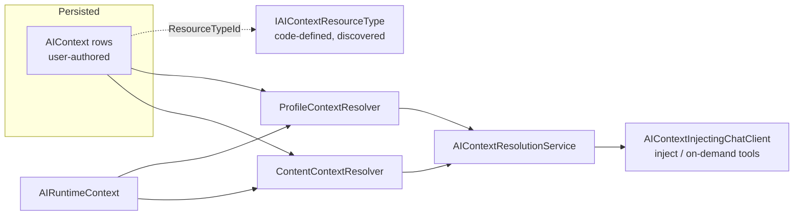
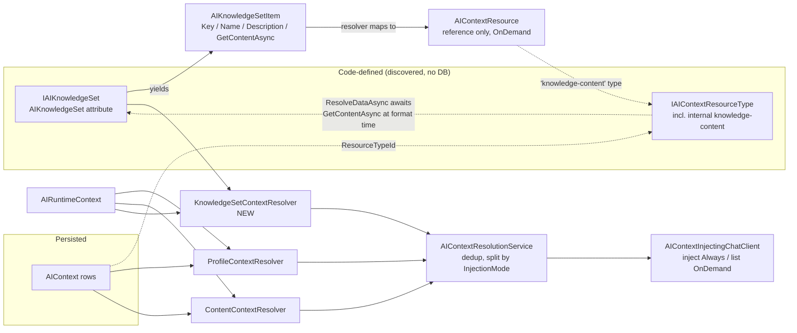
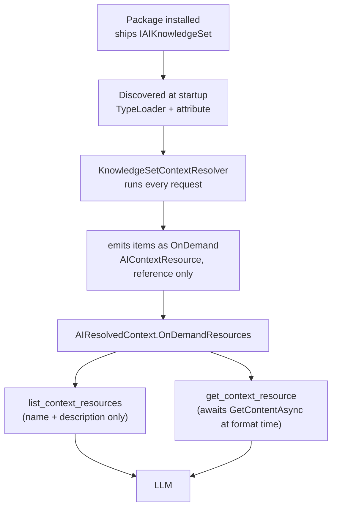

### Summary of change request

Introduce **Knowledge Sets** — code-defined, package-embeddable bundles of knowledge about a
particular subject (e.g. "Umbraco Engage") that an LLM can use to understand that product better.
Conceptually they are like Contexts / Context Resources, but instead of being user-authored and
stored in the database, they are **shipped as code by an add-on package** and discovered at startup.
A package author drops a decorated class into their assembly and its knowledge becomes available to
the LLM with no server-side registration, no database rows, and no CRUD UI.

### Current State

- The only way to give the LLM reusable, named background knowledge today is an **`AIContext`** — a
  user-authored, database-backed entity that an admin builds by hand in the backoffice (adding text
  resources, brand-voice resources, etc.) and then attaches to a profile or a content node.
- A package that wants the LLM to "know about" its product (docs, concepts, terminology, how-tos) has
  **no first-class way to ship that knowledge**. Its only options are to make the customer manually
  recreate a Context, or to register a custom context resolver/tool in a composer — both are bespoke
  and neither is a turnkey "install the package, the AI now understands the product" experience.
- Contexts must be explicitly selected (profile context list or the content context picker) to reach
  the model. There is no notion of knowledge that is simply "available because a package is installed".
- The codebase already contains the exact precedent for code-shipped, immutable, discovered items:
  **context resource types** (`IAIContextResourceType`) are `IDiscoverable` + attribute-scanned,
  have a read-only API, and no persistence. Knowledge Sets are the missing sibling — the *content*
  equivalent of that pattern, rather than the *rendering* equivalent.

### Desired End State

- A package author ships a **Knowledge Set** by adding a single decorated, discoverable class to their
  assembly (the same zero-registration experience as shipping a provider, tool, or resource type). No
  composer, no migration, no DB row.
- Once the package is installed, that knowledge is automatically available to the LLM across chat and
  agent requests, flowing through the **existing** context resolution → injection/on-demand pipeline,
  reusing `AIContextProcessor`, `AIResolvedContext`, the context accessor, and the existing
  `list_context_resources` / `get_context_resource` tools.
- Knowledge Sets are visible (read-only) in the backoffice so an admin can see — and audit — exactly
  what knowledge a package has contributed to the AI. There is nothing to configure; installing the
  package is the whole action.
- A customer asking the agent "how do I configure an Engage goal?" gets an accurate answer grounded in
  the Engage knowledge set, without anyone having hand-built a Context.

### What we're not doing

- **Not** making Knowledge Sets user-editable or database-persisted. They are code-defined and
  immutable, like resource types. (Editing package knowledge in the backoffice is explicitly out.)
- **Not** replacing or deprecating `AIContext`. User-authored Contexts remain the mechanism for
  customer-specific knowledge; Knowledge Sets are the package-shipped complement.
- **Not** building semantic/embedding retrieval or vector search over knowledge in this iteration (the
  documented `// V2 Embedding` / `Semantic` injection mode remains future work; noted as a Search
  integration seam only).
- **Not** shipping a Deploy connector — code-defined items have nothing to transfer between environments.
- **Not** authoring the actual Engage (or any specific product) knowledge content here — that belongs
  to the respective add-on package. This design delivers the *primitive*.

### Proposed End State Architecture

**Before** — knowledge only reaches the LLM via user-authored, DB-persisted Contexts:



**After** — a new code-defined `IAIKnowledgeSet` primitive feeds the *same* resolution pipeline:



**Concise outline:**

1. **New discovered primitive** — `IAIKnowledgeSet : IDiscoverable` + `[AIKnowledgeSet(id, name)]`
   attribute, registered once in Core via `TypeLoader.GetTypesWithAttribute<...>` into a new
   `AIKnowledgeSetCollection` (`LazyCollectionBuilderBase`), exactly mirroring how
   `IAIContextResourceType` is discovered. A base class `AIKnowledgeSetBase` reads the attribute
   reflectively and exposes metadata (`Id`, `Name`, `Description`, `Icon`).

2. **Knowledge → items** — a knowledge set produces one or more `AIKnowledgeSetItem`s of
   `{ Key, Name, Description, GetContentAsync }`. `Name`/`Description` are cheap metadata; the markdown
   body is fetched **lazily and asynchronously** via `GetContentAsync`, only when actually needed. The
   author never picks a resource type or injection mode. The resolver maps each item to a real (sealed)
   `AIContextResource` that carries a *reference* to the item (not its content), points at a
   Core-internal `knowledge-content` resource type, and is locked to `InjectionMode = OnDemand` — so
   everything flows through `AIContextProcessor` and the on-demand tools unchanged, with content
   materialised only at format time. (See Resolved: "Content model", "Item content", "InjectionMode".)

3. **New resolver** — `KnowledgeSetContextResolver` (ordered, `.Append`-registered in Core's composer
   like `ProfileContextResolver`), reads which knowledge sets apply from the runtime context / profile
   settings, asks each set for its resources, and emits them as `AIContextResolverResource`s tagged
   with the knowledge set as their `ContextName`. Everything downstream (dedup, split by
   `InjectionMode`, injection, on-demand retrieval) is untouched.

4. **Enablement** — every installed set is auto-active and surfaced OnDemand; there is no per-request
   or per-profile configuration in v1. Installing a package is the entire "enablement" action.

5. **Read-only, transparency-only surface** — a read-only Management API (`GET /v1/knowledge-set[/{id}]`)
   and a read-only backoffice section (listing + audit detail) so admins can *see* what knowledge a
   package contributed. No pickers, no editing, no configuration. (See Resolved: "Surfacing".)

### Design Questions

_All design questions have been resolved — see below._

### Resolved Design Questions

#### Default surfacing mode — OnDemand

**Decision: knowledge-set knowledge is surfaced OnDemand by default.** Each item is advertised to the
LLM by its name + description (injected cheaply every request); the model pulls full content on demand
via the existing `get_context_resource` tool. This is the MCP-resources model and keeps per-request
token cost minimal even with many installed sets.

_Not chosen:_ Always-inject-everything (prompt bloat, irrelevant knowledge on every request);
per-content selection (wrong granularity — product knowledge is global, not node-specific).

#### Content model — text/markdown items, resolved via a Core-internal knowledge resource type

**Decision: a knowledge set yields `AIKnowledgeSetItem`s of `{ Key, Name, Description, GetContentAsync }`.**
`Name`/`Description` are cheap metadata (breadcrumb + admin listing); the markdown body comes from an
async `GetContentAsync` delegate (see "Item content" below). Authors do **not** pick a resource type,
supply settings, or set an injection mode. The `KnowledgeSetContextResolver` maps each item to a real
sealed `AIContextResource` that carries a *reference* to the item (not its content) and points at a
**Core-internal `knowledge-content` resource type**, so the whole downstream pipeline
(`AIContextProcessor`, dedup, on-demand tools) works with zero changes.

Rationale for a Core-internal resource type (revised from an earlier "reuse the built-in `text` type"
idea): a resource type's classic values are settings-UI generation and settings→text formatting,
neither of which knowledge needs. But async lazy content is a **third** value —
`IAIContextResourceType.ResolveDataAsync` is already async and is only called at format time
(`AIContextProcessor.ProcessResourceForLlmAsync`), which is exactly the seam to defer the fetch. So
Core ships one `internal` `knowledge-content` type whose `ResolveDataAsync` looks up the set + item and
awaits `GetContentAsync`, and whose `FormatDataForLlm` returns the markdown. It stays **invisible to
authors** (Core-internal, not attribute-discovered for third parties). Bonus: because Core owns this
type, content is *not* routed through `AIEditableModelResolver`, so the `$`-prefix config-reference
wart of the `text` type does not apply — knowledge content is always treated as literal prose.

```csharp
public sealed class AIKnowledgeSetItem   // author-facing — no resource type, no settings, no mode
{
    public required string Key { get; init; }    // stable identity within the set (GUID + API url)
    public required string Name { get; init; }
    public string? Description { get; init; }     // the OnDemand breadcrumb the LLM sees
    public required Func<CancellationToken, Task<string>> GetContentAsync { get; init; }
    // convenience factory wraps a literal string in Task.FromResult for the common static case
}
// resolver — emits a reference, NOT the content (kept lazy); resources are transient, never persisted:
new AIContextResource {
    ResourceTypeId = "knowledge-content",                    // Core-internal type
    Name = item.Name, Description = item.Description,
    Settings = new KnowledgeContentRef(knowledgeSet.Id, item.Key),
    InjectionMode = AIContextResourceInjectionMode.OnDemand,
};
```

_Not chosen:_ reuse the built-in `text` type with content stuffed into settings (forces eager
materialisation — defeats async lazy fetch, and drags in the `$`-resolution wart);
set-as-self-formatting-unit (new injection/on-demand plumbing, can't reuse the processor);
set-as-code-defined-`AIContext` (version/audit/alias-uniqueness concerns that don't apply to immutable
code items); author-defined custom resource types (UI-only benefit authors don't need).

#### Item content — async, lazily fetched

**Decision: item content is exposed as an async `GetContentAsync(CancellationToken)` delegate, invoked
lazily only when the content is actually consumed** — i.e. when the LLM calls `get_context_resource`,
or an admin opens the item in the backoffice modal. It is **never** fetched merely to list items (the
breadcrumb and listing use only `Name`/`Description`).

This lets a set read content from an embedded resource file, compute it, or fetch it from an external
service, without paying that cost on every request. It fits OnDemand perfectly: enumeration is cheap,
materialisation is deferred to the one moment the content is needed, at the already-async
`ResolveDataAsync` seam.

Implementation notes to carry forward: the internal `knowledge-content` resource type resolves an item
by `(knowledgeSetId, item.Key)` and awaits its delegate; a per-request cache can avoid re-fetching if
the same item is materialised twice in one request; `GetContentAsync` must honour the
`CancellationToken`; and a fetch that throws should degrade gracefully (surface an error/empty block to
the model rather than failing the whole request). The common static case stays trivial via a
literal-wrapping convenience factory, so simple sets pay no async ceremony.

_Not chosen:_ an eager `string Content` property (can't fetch/compute on demand; forces all content to
be materialised and held in memory even when never used).

#### InjectionMode control — locked to OnDemand by a narrow author-facing item type

**Decision: package authors cannot set injection mode; it is locked to OnDemand structurally.**
Because the author-facing `AIKnowledgeSetItem` has no `InjectionMode` field, `Always` is simply
inexpressible; the resolver is the only code that constructs the real (sealed) `AIContextResource` and
it always sets `OnDemand`. Any future `Always` path is a site-owner/profile-layer decision, never the
author's.

Rationale: author-controlled `Always` is the exact token-bloat failure mode to avoid — an installed
package could silently inflate every request with no site-owner lever. The OnDemand name/description
breadcrumb already gives a package an "always-visible" hint without `Always`.

_Not chosen:_ resolver clamps a settable field (confusing API — a setter that's silently ignored);
author sets it freely (bloat risk); author *suggests* + profile gates (extra machinery, deferred with
the promotion lever).

_Note the implementation facts that shaped this:_ `AIContextResource` is `sealed`
(`AIContextResource.cs:6`) so it can't be subclassed, and `InjectionMode` lives on the resource
*instance* (`AIContextResource.cs:43`), not on `IAIContextResourceType` — so "subclass the resource
type and override the mode" isn't possible; enforcement must live at the item/resolver boundary.

#### Enablement — auto-active, no attachment anywhere in v1

**Decision: every installed knowledge set is automatically active and surfaced OnDemand; there is no
per-request, per-profile, per-prompt, or per-agent configuration in v1.** Installing the package *is*
the enablement action. Because knowledge is auto-OnDemand and authors cannot set `Always` (see
InjectionMode control), v1 has no Always path and no attachment surface at all — all installed
knowledge is uniformly available on demand. This is an accepted, safe default.

**Deferred control layer — if/when added, shape it like Contexts (attach at profile + prompt +
agent).** Explicit attachment is *not* needed in v1 precisely because knowledge is already
auto-available everywhere. When a control layer is added post-v1, it should **mirror the existing
Context attachment surface** rather than be profile-only: Contexts already attach at all three levels
via the resolver chain — `ProfileContextResolver` reads `AIChatProfileSettings.ContextIds`, and
`AgentContextResolver` / `PromptContextResolver` read agent/prompt state (plus the
`AIAgentExecutionOptions` / `AIPromptExecutionOptions` `ContextIdsOverride`). Knowledge-set attachment
should follow the same pattern (a `KnowledgeSetIds` collection read by the resolver(s), like
`ContextIds`). This attachment layer is also the natural, owner-controlled home for the deferred
**Always** path — e.g. a scoped "Engage support agent" that wants Engage knowledge always injected.

The v1 primitive is **forward-compatible**: the global `KnowledgeSetContextResolver` emits everything
OnDemand today; adding attachment later means reading attached IDs from runtime context and optionally
promoting the attached subset to Always — additive, non-breaking.

_Not chosen (deferred):_ per-profile/prompt/agent opt-in, restriction, and promote-to-Always — a
single deferred attachment layer, no proven demand yet.

#### Resource identity — deterministic namespaced GUIDs

**Decision: the resolver assigns each item a deterministic GUID derived from
`knowledgeSetId + item.Key`** (name-based/UUIDv5-style hash), where `Key` is the item's stable
author-supplied identity (distinct from the display `Name`, which may change). Dedup and
`get_context_resource` keep working unchanged, IDs are stable across restarts, and the knowledge-set
namespace makes collisions with user-authored context GUIDs effectively impossible. The same
`(knowledgeSetId, Key)` pair addresses an item in the admin API and lets the internal
`knowledge-content` resource type re-locate it to invoke `GetContentAsync`.

_Not chosen:_ a new string identity alongside `Guid` (invasive to model + tools); ephemeral
per-request GUIDs (unstable — breaks caching/telemetry that assume stable IDs).

#### Resolver ordering & precedence vs user Contexts

**Decision: register `KnowledgeSetContextResolver` in Core's composer after Content
(`Profile → Content → KnowledgeSet`).** Because knowledge-set GUIDs are namespaced they never collide
with user-authored context resources, so ordering only controls *prompt sequence*, not override.

_Not chosen:_ relying on order for deliberate user-Context-shadows-knowledge-set override — no such
feature is wanted for v1.

#### Retrieval granularity for large sets — flat OnDemand for v1

**Decision: v1 exposes items as a flat OnDemand list**; the LLM pulls the ones it needs via the
existing `get_context_resource` tool. Semantic search over knowledge (via Umbraco.AI.Search, which
would also realise the documented `Semantic` injection mode) is the flagged follow-up, added when a
real large-corpus set exists to validate against.

_Not chosen for v1:_ a dedicated `search_knowledge_set` tool; hierarchical browse. Both add surface
area ahead of demand.

#### Where the primitive lives — Core, under `Contexts/KnowledgeSets/`

**Decision: the primitive lives in Umbraco.AI Core under `Contexts/KnowledgeSets/`**, beside the
resource-type registry (its closest sibling) and the resolution/processor/tool machinery it reuses.
Every add-on already references Core.

_Not chosen:_ a new top-level Core area — premature separation given how much it shares with Contexts.

#### Surfacing — how Knowledge Sets actually appear (runtime + admin)

Given Enablement is auto-on-demand with no configuration, the surface splits cleanly into a **runtime
path** (how knowledge reaches the LLM — fully automatic) and an **admin path** (read-only
transparency — the *only* reason the UI/API exist).

**Runtime surfacing (automatic, no config):**



Every request, each installed set's items appear in `OnDemandResources`; their **name + description**
are advertised cheaply, and the model retrieves full `Content` on demand through the existing tools.
Nothing here is configurable — it is the direct consequence of the package being installed.

**Admin surfacing (read-only transparency):**

- **Management API** (mirrors the read-only `context-resource-type` controllers — no
  create/update/delete), with **content fetched lazily** to match the async item model:
  - `GET /v1/knowledge-set` → list of installed sets: `{ id, name, description, icon, itemCount }`.
  - `GET /v1/knowledge-set/{id}` → detail: metadata + `items: [{ key, name, description }]` — **no**
    content (items are not materialised here).
  - `GET /v1/knowledge-set/{id}/item/{key}` → awaits that item's `GetContentAsync` and returns the
    markdown. Called on demand (e.g. when the admin opens the modal), so expensive/computed content is
    only fetched when actually viewed. Content is not secret (it ships in the assembly), so returning
    it for audit is fine.
- **Backoffice — closely mirror the Contexts UI, read-only.** Clone the structure of the existing
  Context entity UI (`Client/src/context/`) and strip all mutation, rather than inventing a new layout:
  - a `menuItem` "Knowledge Sets" under **AI Configuration**, sibling to Contexts;
  - a **collection/listing** view mirroring the context collection (icon, name, description, item
    count) with **no** create / bulk-delete actions;
  - a **read-only workspace** per set mirroring `uai-context-workspace-editor`: header shows the set
    name (plain, no editable name/alias lock); a details view renders the items via a read-only
    analogue of `<uai-resource-list>` (a `<uui-card-block-type>` per item showing Name + Description)
    with **no** "Add" button; an info view shows Id/metadata (**no** version history — code-defined
    items have no versions).
  - **Repurposed modal for content display.** Where a Context opens the resource-options modal to
    *edit* a resource's settings (`<uai-resource-options-modal>` → `<uai-model-editor>`), a Knowledge
    Set opens the equivalent modal on click to *display* the selected item's content: it calls the
    per-item endpoint above and renders the returned markdown, read-only. Same interaction the admin
    already knows, inverted from edit to view, and it dovetails with lazy fetch (content loads when the
    modal opens).

This is deliberately more UI than the `context-resource-type` frontend (which is empty — it only
feeds a picker) but far less than the full Contexts CRUD: **no** detail store with save, **no** entity
actions, **no** property editors, **no** resource-type picker, **no** pickers anywhere (nothing is
selectable — everything is auto-active). The modal is the one component meaningfully repurposed
(edit → read-only view); the rest is the Context UI with mutation affordances removed.

_Explicitly out:_ any create/edit/delete; any profile or content picker; any enable/disable toggle.
The single admin capability is "see what's installed and read what each item contains."

### Patterns to follow

#### Attribute discovery for a zero-registration package primitive — `IAIContextResourceType`

Knowledge sets should be discovered exactly like resource types (and providers/tools): an
`IDiscoverable` marker interface + a marker attribute, scanned once in Core. A package ships a
decorated class with **no composer**.

Existing (Core wiring, `Umbraco.AI.Core/Configuration/UmbracoBuilderExtensions.cs:233-236`):

```csharp
services.AddSingleton<IAIContextResourceTypeInfrastructure, AIContextResourceTypeInfrastructure>();
builder.AIContextResourceTypes()
    .Add(() => builder.TypeLoader.GetTypesWithAttribute<IAIContextResourceType, AIContextResourceTypeAttribute>(cache: true));
```

Proposed (new knowledge-set discovery, same shape):

```csharp
builder.AIKnowledgeSets()
    .Add(() => builder.TypeLoader.GetTypesWithAttribute<IAIKnowledgeSet, AIKnowledgeSetAttribute>(cache: true));
```

Existing base class reads its attribute reflectively (`ResourceTypes/AIContextResourceTypeBase.cs:78-80`):

```csharp
var attr = GetType().GetCustomAttribute<AIContextResourceTypeAttribute>()
           ?? throw new InvalidOperationException($"{GetType().Name} must be decorated with [AIContextResourceType]");
Id = attr.Id; Name = attr.Name; // ...
```

#### Add-on resolver appended to the ordered chain — `AgentContextResolver`

The new `KnowledgeSetContextResolver` follows how the Agent add-on contributes into the resolver chain:
an ordered `.Append<T>()` from a composer (Core, in this case), coordinating via the runtime context.

Existing (`Umbraco.AI.Agent.Core/Configuration/UmbracoBuilderExtensions.cs:70`):

```csharp
builder.AIContextResolvers().Append<AgentContextResolver>();
```

Existing resolver reads request state indirectly and emits resources
(`Resolvers/ProfileContextResolver.cs` pattern): read from `IAIRuntimeContextAccessor`, load the
relevant knowledge, `OrderBy(r => r.SortOrder)`, return an `AIContextResolverResult`. The knowledge-set
resolver does the same but sources its resources from `AIKnowledgeSetCollection` instead of
`IAIContextService`.

#### Read-only Management API — context resource type controllers

Existing (`Umbraco.AI.Web/Api/Management/ContextResourceTypes/Controllers/`): `AllContextResourceTypeController`
(`GET /v1/context-resource-type`) and `ByIdContextResourceTypeController` (`GET /v1/context-resource-type/{id}`),
with `ContextResourceTypeMapDefinition` mapping to a response DTO. Knowledge sets mirror this exactly
for their listing surface — no create/update/delete controllers.

#### Reuse of the resolution → injection → on-demand pipeline — `AIContextProcessor` + context tools

By expressing knowledge as `AIContextResource`s emitted into the shared `AIResolvedContext`, knowledge
sets require **no new** injection or retrieval code — the only new server-side piece is one
Core-internal resource type:

- `AIContextResolutionService` (`AIContextResolutionService.cs:24-79`) dedups and splits by
  `InjectionMode` — unchanged.
- `AIContextProcessor.ProcessResourceForLlmAsync` (`AIContextProcessor.cs:76-92`) formats each resource
  via its resource type — unchanged. The `async` `ResolveDataAsync` seam is what lets the internal
  `knowledge-content` type defer and await `GetContentAsync` at format time.
- `ListContextResourcesTool` / `GetContextResourceTool` (`Tools/Context/`) operate on
  `OnDemandResources` by `Guid` — unchanged, provided knowledge-set resources carry stable
  (deterministic) GUIDs.

#### Read-only, mutation-stripped clone of the Contexts UI — `Client/src/context/`

The knowledge-set backoffice mirrors the Context entity UI (research §7 component tree) with all
mutation removed. Reuse the collection/workspace/details layout and, notably, the resource modal —
but inverted from edit to view:

Existing (Context edits a resource via the options modal → schema-driven editor):

```text
<uai-resource-list> → "Add" → resource-type-picker → <uai-resource-options-modal>
                                                       └ <uai-model-editor>   (edits settings)
```

Proposed (Knowledge Set displays an item's content, no add/edit):

```text
<uai-knowledge-item-list> (read-only) → click item → <uai-knowledge-item-modal>
                                                       └ renders markdown from
                                                         GET /v1/knowledge-set/{id}/item/{key}
```
