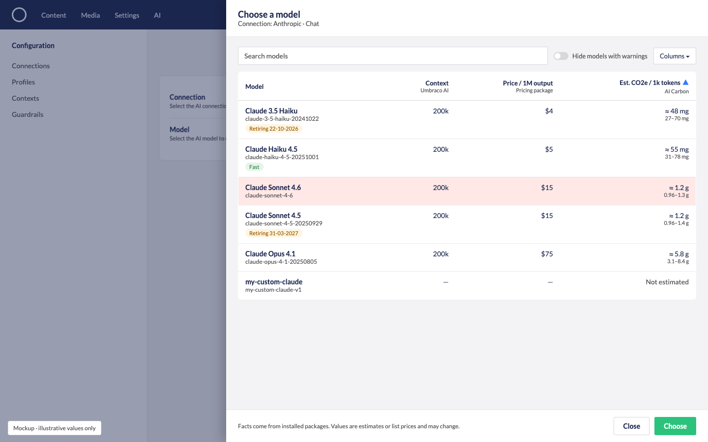

# Model Facts: Structured Model Information from Packages

## Status: Under Consideration

Let packages (and core itself) supply short, structured **facts about a model**, such as estimated
CO2e, price per token, context window or a retirement warning. Umbraco.AI then shows them in a
consistent way wherever a model is chosen, starting with the profile editor's model field.

The key design choice is that packages supply **data, not UI**. Core owns how facts look, how
many show and where they appear. This keeps the profile editor tidy and the contract small enough to
keep stable across majors.

---

## Why

- **Model choice is where cost, quality and footprint get decided.** Today the profile editor's
  Model field is a plain dropdown with no context beyond the model name.
- **Packages have useful context but nowhere to put it.** The motivating case is
  [Umbraco.Community.AI.Carbon](https://github.com/mattbrailsford/Umbraco.Community.AI.Carbon). It
  estimates CO2e per model using EcoLogits, and in testing the gap between a large and a small model
  (roughly 20x per output token) was far bigger than the uncertainty on either. Showing "≈ 1.2 g CO2e
  per 1,000 output tokens" at the point of choice is the most useful place for that number.
- **Core has its own candidates.** Context window size, a "retiring on DD-MM-YYYY" warning, or
  provider notes would use the same mechanism, so this isn't built for one package.

## How it works today

- The profile Settings view (`profile-details-workspace-view.element.ts`) renders Connection and
  Model as plain `uui-select` elements inside `umb-property-layout`. There's no extension slot.
- `UAI_PROFILE_WORKSPACE_CONTEXT` and the profile model types aren't in the public
  `@umbraco-ai/core` exports.
- A package can only add a `workspaceFooterApp` or its own workspace view (tab) to
  `UmbracoAI.Workspace.Profile`. Neither sits next to the Model field. Injecting into the view's
  shadow DOM works, but depends on internal markup and would break silently.
- Providers can already return `AIModelDescriptor.Metadata` (a string dictionary) with the model
  list. That's provider-owned and unstructured, so it doesn't cover facts from other packages.

## Rejected alternative: a free-form UI slot

An `umb-extension-slot` under the Model field, where packages render any element they like. It's
simple, but:

- the layout becomes a dump of unrelated views with different styles and sizes
- accessibility and spacing are left to each package
- facts can't be reused elsewhere (dropdown options, a comparison table, Copilot)
- the public contract would be shaped by a single consumer

## Proposed shape

### Server side (Umbraco.AI.Core)

The contract is **batch-first**, because the picker (below) asks for facts on a whole model list at
once, and lists can be long (an OpenAI connection lists around 100 models, OpenRouter over 300).

```csharp
// Registered via a collection builder, like providers and middleware.
public interface IAIModelInfoProvider
{
    /// <summary>How long core may cache this provider's facts for a model.</summary>
    TimeSpan CacheDuration { get; }

    /// <summary>Facts for each requested model. Models with no facts can be left out.</summary>
    Task<IReadOnlyDictionary<AIModelRef, IReadOnlyList<AIModelFact>>> GetFactsAsync(
        AIModelInfoContext context,
        IReadOnlyList<AIModelRef> models,
        CancellationToken cancellationToken);
}

public sealed record AIModelInfoContext(AICapability Capability);

public sealed record AIModelFact(
    string Key,              // unique per fact, e.g. "carbon.co2ePer1kTokens"; also the column id
    string Label,            // "Estimated CO2e"
    string ShortLabel,       // column title in the picker: "CO2e / 1k tokens"
    string Value,            // display text: "≈ 1.2 g per 1,000 output tokens"
    double? SortValue = null,// lets core sort the column (e.g. grams), null = not sortable
    string? Detail = null,   // tooltip: "Range 0.9–1.3 g. Estimated with EcoLogits."
    AIModelFactTone Tone = AIModelFactTone.Neutral,
    string? Url = null);     // optional "learn more"

public enum AIModelFactTone { Neutral, Positive, Warning }
```

- Facts are display text produced by the provider of the fact, plus an optional `SortValue`. Core
  never needs to understand what a fact means to show, sort or filter it.
- Core aggregates all providers, so one request covers every installed provider of facts.

### Server load

Facts across a full model list must not turn into hundreds of calls, or stall the picker.

- **One call per provider per list:** the batch contract means a picker opening costs one
  `GetFactsAsync` per fact provider, not one per model.
- **Most facts are cheap:** Carbon's are in-memory lookups against bundled EcoLogits data (a batch
  of 300 is milliseconds). Context window and retirement dates are also static.
- **Core caches per model:** results are cached per provider, model and capability for the
  provider's `CacheDuration` (Carbon: until its data version changes; a pricing package might choose
  an hour). Only models not in the cache are passed to `GetFactsAsync`.
- **Time limit per provider:** each provider gets a short timeout. A slow or failing provider is
  skipped and logged, and its column shows as unavailable. It never blocks the model list.
- **Load facts after the list:** the picker shows models as soon as the connection's model list
  arrives (today's slow step, which already happens), then fills in fact columns when they're
  ready.
- **Only if needed:** for very long lists, core could request facts only for rows being viewed or
  matching the current search. With caching this is probably unnecessary, so it's not part of the
  first version.

### Management API

- `POST /v1/model-facts` with `{ capability, models: [{ providerId, modelId }] }` returns the facts
  per model. Used by the picker for the whole list and by the profile editor for the selected
  model (including unsaved profiles).
- POST rather than GET because the model list can be too long for a query string. It's read-only
  and safe to repeat.

### Backoffice (core-rendered)

**Model picker.** The Model field becomes a picker, in line with Umbraco's picker convention for
choosing from a long list, instead of a plain `uui-select`:

- Clicking the field opens a modal listing the connection's models in a table, with search.
- Columns are the model name plus one column per fact key, titled by `ShortLabel`. Which columns
  appear depends on the installed fact providers. Columns with a `SortValue` can be sorted, so an
  editor can sort by cheapest or lowest estimated CO2e.
- Warning facts are shown on the row (for example "Retiring 31-12-2026"), and a filter can hide
  models with warnings.
- Picking a row selects the model. The modal could later offer comparing two or three models side by
  side.



*Mockup with illustrative values. Source: [images/model-facts-picker.html](images/model-facts-picker.html).*

**Selected model.** Under the Model field, core shows the chosen model's facts as a compact list:
label, value, a tooltip for `Detail` and a warning style for `Tone = Warning`.

Core owns the rules in both places: order (warnings first, then provider registration order), a
maximum number of facts per provider, and showing nothing when there are none.

## What it would enable

- **Carbon:** "Estimated CO2e: ≈ 1.2 g per 1k tokens", with the range and method in the tooltip.
- **A pricing package:** "Price: $3 per 1M input tokens".
- **Core:** context window size, a retirement warning, "Doesn't support tools".
- Later, the same data in a model comparison view or for Copilot to explain model choices.

## Open questions

- Is `capability` enough context, or do providers also need the connection (for region-specific
  facts such as pricing or electricity zone)? Connection-aware facts are more useful but widen the
  contract.
- Is a provider-chosen `CacheDuration` enough, or does core also need a way to clear the cache (for
  example when Carbon updates its EcoLogits data)?
- How many fact columns can the picker show before it gets crowded? Should editors choose which
  columns to show, and should that choice be remembered?
- Is there a case for core consuming `AIModelDescriptor.Metadata` through this same rendering, so
  provider metadata and package facts look the same?
- Should the picker replace the dropdown everywhere a model is chosen, or only in the profile editor
  at first?

## When to revisit

Build this when a second real consumer appears (the picker raises the bar further, as it's more
core work than a list under the field), for example core wanting to show context window
or retirement dates, or another package beyond Carbon. Until then, Carbon can show its hint in a
`workspaceFooterApp` on the profile workspace, which needs no core changes.

Like any public API here, this would follow the usual contribution process and the "never break
a public API" rule, so the contract should be shaped by at least two real uses before it ships.
