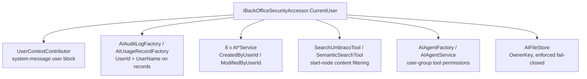

# Research: Copilot prompt suggestions and storage system

**Date**: 2026-09-15T13:45:15+01:00
**Git Commit**: `0ae8ebeae50ecabf27b1679c395cb1bb4ee48b10`
**Branch**: `v17/dev`
**Repository**: Umbraco.AI

## Research Question

1. How does the Copilot sidebar render its pre-conversation / start state end to end, what agent/entity data is in scope at that moment, and what extension points, slots, or manifest kinds already exist for contributing content into that view?
2. How does a user message travel from the chat input to a run, and what is retained client-side — the message shape, where the transcript lives, and how per-message actions are registered and rendered?
3. What is the complete vertical slice for the `AIAgent` entity, layer by layer, and which layers are mandatory when a field is added?
4. How does `AIAgent` model, persist, and edit structured or collection-shaped configuration today (columns vs JSON, API round-trip, workspace editors, versioning, Deploy)?
5. What per-user-scoped persistence, identity, and authorization mechanisms already exist across the stack — and what does Umbraco CMS 17/18 itself offer for storing per-user backoffice data?
6. How does the Copilot package — which ships no backend of its own — reach server data, register extensions, and export components, and where does new server-backed data have to live instead?
7. What design system, component library, and styling conventions govern this backoffice UI, and what comes closest to a compact, selectable, user-manageable list of short labelled items?

## Research Methodology (verbatim)

This document will remain objective and factual. It does not contain any recommendations or implementation suggestions.
Open questions will not ask Why things haven't been built or what should be built in the future.

There is no "implementation" section - that is intentional.

## Summary

The Copilot sidebar is a self-mounting overlay, not a slotted or composable view. A `backofficeEntryPoint` constructs `UaiCopilotContext` and appends a bare `<uai-copilot-sidebar>` into the entry point's shadow root; when opened, the sidebar renders a fixed three-part template — header, `<uai-entity-selector>`, `<uai-chat>` — with no named slots at any level. The "start state" a user sees before typing is decided inside `<uai-chat>` in Agent.UI by a single branch, `this._messages.length === 0`, which renders a hardcoded icon-plus-sentence block. Copilot influences that view only through data it feeds the shared chat context (the resolved agent name); it cannot contribute markup to it. The extension points that *do* exist around the sidebar are about agents, tools, and section eligibility — `uaiCopilotCompatibleSection`, `uaiAgentToolRenderer`, `uaiAgentFrontendTool`, `uaiAgentApprovalElement`, `uaiRequestContextContributor` — none of them target the empty state.

The chat pipeline is stateless and in-memory. `<uai-chat-input>` captures text and attachments, fires a bubbling `send` CustomEvent, and `<uai-chat>` forwards it to `UaiChatContextApi.sendUserMessage`; the only concrete implementation of that interface lives in Copilot (`UaiCopilotContext`), which delegates to Agent.UI's `UaiRunController`. The controller holds the whole transcript in an RxJS `BehaviorSubject<UaiChatMessage[]>` and re-sends the entire array to the AG-UI streaming endpoint on every turn. Nothing persists: there is no `localStorage`, `sessionStorage`, or `IndexedDB` anywhere in the Agent.UI client tree, and no server-side conversation or thread entity exists. Per-message affordances (copy, regenerate) are hardcoded in `message.element.ts`'s template, unlike tool rendering, which genuinely goes through the extension registry. There is no concept anywhere of suggested prompts, starter prompts, quick actions, or a public API for setting the input's draft text from outside the component. Prior art for the opposite design does exist in the repository, but not on any dev or main branch: `v17/release/2026.08.1` carries an `Umbraco.AI.Agent.Copilot.Workspace` product with a full `Conversations` persistence stack, a `UaiConversationStrategy` seam in Agent.UI with client-owned and server-persisted implementations, and a `localStorage` history cache in the sidebar package.

Server-backed data in this product family lives in `Umbraco.AI.Agent`, never in Copilot — Copilot's only .NET file is a single `CopilotAgentSurface` declaration with no controllers, DbContext, or composer. The `AIAgent` vertical slice shows what adding server-backed data costs: domain model, EF entity, hand-written entity factory, DbContext model config, paired-by-hand SQL Server and SQLite migrations (each with `.Designer.cs` plus a shared `ModelSnapshot`), API request/response models, an `IMapDefinition`, a regenerated-and-committed `@hey-api` client, frontend types, a type-mapper, and optionally a workspace view. Structured configuration on `AIAgent` is consistently stored as hand-serialized JSON blobs in string columns (`Config`, `Scope`, `GuardrailIds`, `SurfaceIds`) rather than EF owned types, with polymorphism resolved by a sibling `AgentType` int column at the persistence layer and by System.Text.Json `$type` discriminators at the Web API layer.

Per-user scoping exists but is narrow. Every governed entity carries `CreatedByUserId`/`ModifiedByUserId` (`Guid?`), populated at the repository layer from `IBackOfficeSecurityAccessor`, but nothing filters reads by them — API authorization is a single binary `SectionAccessAI` claim policy. The only place ownership is actually enforced is `AIFileStore`, which writes an `OwnerKey` into a sidecar JSON file and fails closed on read. The frontend never reads current-user identity at all: a repo-wide grep for `UMB_CURRENT_USER_CONTEXT`/`currentUser` across every `Client/src` tree returns zero matches. Umbraco CMS itself ships a generic per-user key/value store — `IUserDataService` over an `umbracoUserData` table, exposed at `/umbraco/management/api/v1/user-data` with every endpoint self-scoped to the calling user's key — but the backoffice client has only the auto-generated `UserDataService` OpenAPI stub for it; no `UmbUserDataRepository`, no `./user-data` package export, no consumers in the client tree, and no documentation in Umbraco.Docs, in either 17.4.2 or 18.1.0-rc.

## Detailed Findings

### 1. The Copilot sidebar mounts itself into a shadow root and renders a fixed template with no slots

The sidebar is not placed by a host view. `Client/public/umbraco-package.json:13-24` declares two `backofficeEntryPoint` extensions (the app bundle and the internal-components bundle), and a third is registered as a manifest — `UmbracoAIAgent.BackofficeEntryPoint.CopilotSidebar` (`copilot/components/sidebar/manifests.ts:3-9`) — pointing at `entry-point.ts`. That entry point's `onInit` does exactly two things (`entry-point.ts:6-13`): construct `new UaiCopilotContext(host)`, and create a bare `<uai-copilot-sidebar>` element appended to the entry-point host's shadow root.

```text
backoffice loads
  entry-point.ts onInit(host)
    new UaiCopilotContext(host)        # provides 5 context tokens
    host.shadowRoot.appendChild(<uai-copilot-sidebar>)
      copilot-sidebar.element.ts constructor
        new UaiCopilotSectionRegistry(this)
        consumeContext(UAI_COPILOT_CONTEXT)
          observe(context.isOpen) -> _isOpen / _showContent
          await agentClientReady
          context.loadAgents()
```

`render()` (`copilot-sidebar.element.ts:89-110`) gates the whole `<aside class="sidebar">` body on `this._showContent`, which is true only while open or mid-close-transition (`:51-53`, `:82-87`). Opening reveals a fixed three-part template — header, `<uai-entity-selector>`, `<uai-chat>` — with no `<slot>` elements. `#updateContentOffset` (`:18-22`) pushes the backoffice content over via `body.style.marginInlineEnd`.

Agent loading is deliberately deferred until first open: the constructor `await`s `agentClientReady` — a promise exported from `@umbraco-ai/agent` (`Umbraco.AI.Agent.Web.StaticAssets/Client/src/client-ready.ts:9-18`) and resolved once that package's `onInit` has configured the generated OpenAPI client's auth and base URL — before calling `context.loadAgents()` (`copilot-sidebar.element.ts:7,55-57`). This is the single cross-package synchronization point in Copilot.

#### The empty state is one branch on `_messages.length` inside Agent.UI, not a Copilot concern

What the user actually sees before typing is decided in `Umbraco.AI.Agent.UI/.../chat/components/chat.element.ts:156-163`:

```ts
${this._messages.length === 0
    ? html`<div class="empty-state">
             <uui-icon name="icon-chat"></uui-icon>
             <p>Start a conversation with ${this._agentName || "an agent"}</p>
           </div>`
    : this.#renderMessages()}
```

`_agentName` comes from the chat context's `selectedAgent` observable (`chat.element.ts:40`). `<uai-chat-input>` renders unconditionally below the messages area (`:173-176`), disabled while a run is in flight or a HITL approval is pending. There is no slot, no `part`, and no parameterization of this block by the consuming package — Copilot supplies the data behind `_agentName` and nothing else.

#### The agent catalog, entity selection, and a synthetic "Auto" entry are all in scope at that moment

`UaiCopilotContext` (`copilot/copilot.context.ts`) is the single facade. It implements `UaiChatContextApi` and provides five context tokens — `UAI_COPILOT_CONTEXT`, `UAI_CHAT_CONTEXT`, `UAI_HITL_CONTEXT`, `UAI_ENTITY_CONTEXT`, and the Copilot-only `UAI_ENTITY_ADAPTER_CONTEXT` (`:165-173`).

| State | Backing store | Observable | Line |
|---|---|---|---|
| Agent catalog | `UmbArrayState<UaiAgentItem>` | `agents` | `:46,56` |
| Selected agent | `UmbBasicState<UaiAgentItem \| undefined>` | `selectedAgent` | `:47,57` |
| Loading flag | `UmbBooleanState` | `agentsLoading` | `:48,58` |

```ts
async loadAgents(): Promise<void>                        // :178-182
selectAgent(agentId: string | undefined): void           // :196-205
hasAgent(): boolean                                       // :184
getAgentId(): string | undefined                          // :188
getAgentName(): string | undefined                        // :192
setSelectedEntityKey(key: string): void                   // :108-110
applyValueChange(change): void                            // :112-114
```

The subscription that populates `#agents` (`:136-157`) prepends a synthetic `{ id: "auto", name: "Auto", alias: "auto" }` entry whenever more than one agent is returned (`:140-145`), auto-selects the first entry if nothing is selected (`:149-151`), and clears the selection if the previously selected agent disappears (`:153-156`).

Entity scope is delegated rather than owned. `UaiCopilotEntityContext` (`services/copilot-entity.context.ts`) implements Agent.UI's `UaiEntityContextApi` by wrapping `UaiEntityAdapterContext` from `@umbraco-ai/core`: `entityType$`/`entityKey$` are derived from `selectedEntity$` via `.pipe(map(...))` (`:54-62`), `isDirty$` is hardcoded to emit `false` (`:64-71`) with the comment *"The entity adapter doesn't track dirty state directly / For now, return false - this would need workspace context integration / TODO: Integrate with workspace's isDirty$ when available"*, and `getValue(path)`/`setValue(path, value)` operate synchronously on a cached serialized snapshot refreshed on every `selectedEntity$` emission (`:36-49`, `:81-116`).

`isDirty$` currently has no reader. A repo-wide search finds exactly two hits: the interface declaration on `UaiEntityContextApi` (`Umbraco.AI.Agent.UI/.../chat/entity-context.ts:46`, exported at `exports.ts:29`) and this implementation. The only consumer of `UAI_ENTITY_CONTEXT` — `UaiCopilotAgentRepository` (`copilot-agent.repository.ts:39`) — reads `entityType$` only. On the CMS side at 17.4.2 there is no observable to wire it to: `UmbSubmittableWorkspaceContextBase` carries a commented-out `#isDirty`/`isDirty` pair and a commented-out `abstract getIsDirty(): Promise<boolean>` (`Umbraco.Web.UI.Client/src/packages/core/workspace/submittable/submittable-workspace-context-base.ts:37-51,172`, identical in the compiled `dist-cms` copy). What does exist is a synchronous poll: `getHasUnpersistedChanges(): boolean` on `UmbEntityWorkspaceDataManager` (`entity-workspace-data-manager.ts:132`, a `jsonStringComparison` of persisted vs current) surfaced on `UmbEntityDetailWorkspaceContextBase` (`entity-detail-workspace-base.ts:433-435`). It is not on the `UmbEntityWorkspaceContext` interface (`entity-workspace-context.interface.ts:5-8`, which declares only `unique`/`getUnique()`), so it is reachable only through the concrete class type, not the generic `UMB_ENTITY_WORKSPACE_CONTEXT` token.

`<uai-entity-selector>` (`entity-selector.element.ts`) consumes `UAI_COPILOT_CONTEXT` directly and renders three ways (`:80-116`): nothing at zero entities, a static badge at one, and clickable chips at more than one, auto-selecting `entities[entities.length - 1]` — the deepest detected entity (`:40-43`).

#### The extension points around this view target agents, tools, and sections, not the view's content

| Kind | Alias / declaration | What it contributes |
|---|---|---|
| `uaiCopilotCompatibleSection` | `copilot/manifests.ts:20-33` (content + media shipped); type in `copilot/types.ts:16-38` | Marks a backoffice section as Copilot-eligible; read by `UaiCopilotSectionRegistry` (`services/copilot-section-registry.ts:26-42`) |
| `globalContext` | `UmbracoAIAgent.Copilot.GlobalContext` (`copilot/manifests.ts:7-12`) | Registers `UaiCopilotContext` so any extension can `consumeContext(UAI_COPILOT_CONTEXT)` |
| `uaiRequestContextContributor` (kind `agentSurface`) | `UmbracoAI.Copilot.RequestContextContributor.AgentSurface`, `meta: { surface: "copilot" }` (`copilot/manifests.ts:39-48`) | Copilot-scoped request-context contribution; kind defined in Agent.UI |
| `uaiAgentToolRenderer` / `uaiAgentFrontendTool` / `uaiAgentApprovalElement` | Instances in `copilot/tools/manifests.ts:1-9` | Tool UI and frontend tool execution; kinds inherited from `@umbraco-ai/agent-ui` |
| `headerApp` + `condition` | `header-app/manifests.ts:19-39` | The toggle button, gated by `UaiCopilotSectionCondition` (`copilot-section.condition.ts:13-51`), a documented workaround for `Umb.Condition.SectionAlias` not working on `headerApp` (upstream CMS issue #21486) |
| `backofficeEntryPoint` | `sidebar/manifests.ts:3-9` | Mounts the sidebar |
| `localization` | `UAIAgent.Copilot.Localization.En` (`src/lang/manifests.ts:1-14`) | English dictionary, lazy-loaded, `weight: -100` |

#### Testing patterns

The Copilot package has vitest configured (`Client/vitest.config.ts:1-14`, `environment: "happy-dom"`, `include: ["src/**/*.test.ts"]`, JUnit reporter under `TF_BUILD`/`CI`) and a `"test": "vitest run"` script (`Client/package.json:15`). Exactly one test file exists in the entire package: `copilot/tools/entity/internal/variant-normalization.test.ts`. There are no tests for `copilot-sidebar.element.ts`, `copilot.context.ts`, `entity-selector.element.ts`, `copilot-section-registry.ts`, or `copilot-agent.repository.ts`, and no Playwright/e2e tests.

### 2. The transcript lives in one RxJS subject in memory and is re-sent in full on every turn

A message's journey is a straight line from a DOM event to an SSE stream and back into the same subject:

```text
user types / drops files in <uai-chat-input>
  #handleInput / #addAttachment / #handleTranscription   -> _value, _attachments
Enter (no Shift) or send click
  #handleKeydown -> #send()                               input.element.ts:112-117, 223-273
    build contentParts: UaiInputContent[] (base64 via FileReader)
    dispatchEvent(CustomEvent("send", {detail:{text, contentParts}, bubbles, composed}))
      chat.element.ts #handleSendMessage
        chatContext.sendUserMessage(text, contentParts)   [UAI_CHAT_CONTEXT]
          UaiCopilotContext.sendUserMessage               copilot.context.ts:236-243
            requestContextCollector.collect()
            runController.sendUserMessage(content, context, contentParts)
              UaiRunController.sendUserMessage            run.controller.ts:122-142
                push UaiChatMessage onto #messages (BehaviorSubject)
                agentState$.next({status:"thinking"})
                client.sendMessage(nextMessages, tools, context)
                  UaiAgentClient.sendMessage              uai-agent-client.ts:126
                    transport.run({threadId, runId, messages, tools, ...})
                      UaiHttpAgent.#runAsync              uai-http-agent.ts:41,95-107
                        AgentsService.streamAgentAGUI({path, body, signal})
                          for await (event of result.stream) -> subscriber.next(event)
                            UaiAgentClient.#handleEvent -> AgentClientCallbacks
                              callbacks registered in UaiRunController.#createClient()
                                mutate #messages / #streamingContent / #agentState
                                  messages$ emits -> chat.element re-renders
```

`<uai-chat-input>` holds `_value` (draft text, `input.element.ts:33-34`), `_attachments` (`{file, previewUrl?}`, `:13-16,42-43`), the agent list and selection mirrored from the context (`:36-40,66-71`), drag state, and CMS-configured allowed/disallowed upload extensions pulled from `UmbTemporaryFileConfigRepository` (`:48-52,77-86`). Attachments are validated against a 10 MB cap (`:11,189-194`) and the extension lists (`:172-185,196-203`), then read to base64 and classified into `image`/`audio`/`video`/`document` by MIME type via `classifyContentKind` (`:253-262`). The element defines no `<slot>`; its only outward surface is the `send` event, the `transcription` event from `<uai-voice-button>`, and the `disabled`/`placeholder` properties.

#### `UaiChatContextApi` is a contract in Agent.UI with its only implementation in Copilot

```ts
export interface UaiChatContextApi extends UmbContextMinimal {
    readonly messages$: Observable<UaiChatMessage[]>;
    readonly streamingContent$: Observable<string>;
    readonly agentState$: Observable<UaiAgentState | undefined>;
    readonly isRunning$: Observable<boolean>;
    readonly hitlInterrupt$: Observable<UaiInterruptInfo | undefined>;
    readonly pendingApproval$: Observable<PendingApproval | undefined>;
    readonly agents: Observable<UaiAgentItem[]>;
    readonly selectedAgent: Observable<UaiAgentItem | undefined>;
    readonly resolvedAgent$: Observable<{ agentId: string; agentName: string; agentAlias: string } | undefined>;
    readonly toolRendererManager: UaiToolRendererManager;

    sendUserMessage(content: string, contentParts?: UaiInputContent[]): Promise<void>;
    abortRun(): void;
    regenerateLastMessage(): void;
    selectAgent(agentId: string | undefined): void;
    respondToHitl(response: string): void;
}
```
(`chat/context.ts:16-61`; token at `:67`.) `Umbraco.AI.Agent.UI` ships no class implementing it — `UaiCopilotContext` calls `provideContext(UAI_CHAT_CONTEXT, this)` (`copilot.context.ts:166`), and most of its members are pass-through getters onto `UaiRunController` (`:62-80`) or `UaiHitlContext` (`:90-96`). Note that `Umbraco.AI.Agent.UI/CLAUDE.md` documents an older shape for this interface (`startRun`/`stopRun`/`agentStatus$`); the code above is current.

#### The message shape carries multimodal parts, tool calls, and an optional agent attribution

```ts
export interface UaiChatMessage {
    id: string;
    role: "user" | "assistant" | "tool";
    content: string;
    contentParts?: UaiInputContent[];   // multimodal; content is then a text summary
    toolCalls?: UaiToolCallInfo[];
    toolCallId?: string;                 // required for tool-role messages
    agentName?: string;                  // set when auto mode resolves an agent
    timestamp: Date;
}
```

These types are declared in `Umbraco.AI.Agent/.../transport/types.ts` and merely re-exported by `chat/types/index.ts:6-24`, which adds one local type of its own, `UaiAgentItem { id; name; alias }`. Alongside them: `UaiToolCallStatus` (`pending` → `streaming` → `awaiting_approval` → `executing` → `completed` | `error`), `UaiToolCallInfo`, `UaiInterruptInfo`, `UaiAgentState`, and the `UaiInputContent` union (`UaiTextInputContent` plus image/audio/video/document variants over a `{type:"data"|"url", value, mimeType}` source).

#### `UaiRunController` owns every piece of conversation state

| State | Type | Observable |
|---|---|---|
| Transcript | `BehaviorSubject<UaiChatMessage[]>` | `messages$` (`run.controller.ts:59-60`) |
| Streaming text | `BehaviorSubject<string>` | `streamingContent$` (`:62-63`) |
| Agent state | `BehaviorSubject<UaiAgentState \| undefined>` | `agentState$`; `isRunning$` derived as `state !== undefined` (`:65-67`) |
| Resolved agent | `BehaviorSubject<...>` | `resolvedAgent$`, set from the `agent_selected` custom event (`:69-70,313-317`) |

The SSE callbacks registered in `#createClient()` (`:192-325`) are where the transcript actually mutates: `onTextStart` begins a new assistant message, starting a fresh one rather than appending when the previous message ended in a tool call (`:198-230`); `onTextDelta` appends to both `#streamingContent` and the current message (`:231-240`); `onToolCallStart` correlates by tool-call id so an existing entry transitions in place rather than duplicating on HITL resume (`:244-303`); `onToolCallResult` appends a synthetic `role:"tool"` message (`:367-398`); `onRunFinished` routes `outcome:"interrupt"` into the interrupt-handler registry and `outcome:"error"` into `#handleError` (`:400-423`); `onMessagesSnapshot` reconciles a server-provided list against the client's, preserving client-only fields like `agentName` and `timestamp` while adopting server updates such as file references (`:312,541-569`).

Errors surface as an ordinary assistant-role message reading `Error: ${message}` (`:434-443`) — there is no distinct error role or message type, though the transport layer does classify errors with a `code: UaiErrorCategory` on `RUN_ERROR` events (`types.ts:293-311`). `abortRun()` calls `#client.reset()` and resets the local UI observables (`:153-162`), but that does not reach the network. `UaiAgentClient.reset()` only clears the pending tool-args map and rotates the thread id (`uai-agent-client.ts:373-376`); `sendMessage` subscribes to the transport observable inline without ever assigning the returned `Subscription` to a field (`:148-166`), so nothing can unsubscribe it and the teardown that would call `abortController.abort()` (`uai-http-agent.ts:55-57`) never runs. `UaiHttpAgent` does expose `abortRun()` (`:191-194`), and `AgentTransport` declares it (`types.ts:215`), but a search of the Agent and Agent.UI client trees finds no call site. The SSE request therefore keeps streaming until the server emits `RUN_FINISHED`/`RUN_ERROR` or the page closes, and its events continue invoking the still-registered callbacks against the reset state. `regenerateLastMessage()` truncates the transcript before the last assistant message and re-sends (`:164-190`).

#### Copy and regenerate are hardcoded in the template; only tool rendering goes through the registry

```ts
#renderActions() {
    if (this.message.role !== "assistant" || !this.message.content?.trim()) return html``;
    const isHidden = this.isRunning && this.isLastAssistantMessage;
    const visibilityClass = isHidden ? "hidden" : this.isLastAssistantMessage ? "always-visible" : "";
    return html`
        <div class="message-actions ${visibilityClass}">
            ${this.isLastAssistantMessage ? html`<uai-message-regenerate-button></uai-message-regenerate-button>` : ""}
            <uai-message-copy-button .content=${this.message.content}></uai-message-copy-button>
        </div>`;
}
```
(`message.element.ts:187-203`.) There is no manifest lookup, repository, or registry behind these two buttons. By contrast `#renderToolCalls()` (`:171-185`) emits `<uai-tool-renderer>`, which resolves an element through `UaiToolRendererManager` against `uaiAgentToolRenderer` manifests matched by `forToolName` — a genuine extension point. `<uai-message-copy-button>` writes to `navigator.clipboard` and flips a 2-second `_copied` flag (`message-copy-button.element.ts:16-26`); `<uai-message-regenerate-button>` dispatches a bubbling `regenerate` event (`:11-13`) that `<uai-chat>` forwards to `chatContext.regenerateLastMessage()` (`chat.element.ts:76-78,128`).

#### Nothing is retained, on either side

A search across the whole `Umbraco.AI.Agent.UI/.../Client/src` tree for `localStorage`, `sessionStorage`, and `IndexedDB` returns zero matches. The transcript lives only in `UaiRunController.#messages`; `UaiCopilotContext.resetConversation()` empties it on sidebar `close()`/`toggle()` (`copilot.context.ts:213-226`), and a page reload re-instantiates everything empty. The only cross-turn identity is `#threadId = crypto.randomUUID()` inside `UaiAgentClient` (`uai-agent-client.ts:42-43`), kept stable so uploaded-file references resolve and rotated on `reset()`; it is never stored durably. On the server, each turn re-sends the entire message array (`run.controller.ts:141`, `uai-http-agent.ts:95-99`), and a search of `Umbraco.AI.Agent`'s C# source for conversation/thread/history repositories or services returns no matches.

Searching both Agent.UI and Copilot for suggested prompts, starter prompts, quick actions, prefill, `setInputText`, or `setDraft` returns nothing. `UaiChatInputElement._value` is only ever set by `#handleInput` or `#handleTranscription`; neither the element nor `UaiChatContextApi` exposes any way to set draft text programmatically.

#### Testing patterns

There are no test files anywhere under `Umbraco.AI.Agent.UI/.../Client/src/chat/` — a glob for `*.test.ts`/`*.spec.ts` returns zero results, and the package has no `vitest.config.ts` and no `test` script. `Umbraco.AI.Agent.UI/CLAUDE.md` states the testing approach explicitly as manual testing via consumer packages, vitest "if added", and integration testing against the demo site.

### 3. Adding a field to `AIAgent` touches thirteen files across six layers, two of them written twice

`AIAgent` is a `sealed class` implementing `IAIVersionableEntity` (`Core/Agents/AIAgent.cs:21`) with sixteen properties. `Id` and `Version` have `internal set`; `AgentType` is `init`-only and its immutability is enforced again at the service layer.

```text
Umbraco.AI.Agent/src/
├── Umbraco.AI.Agent.Core/Agents/
│   ├── AIAgent.cs                        # domain model, 16 properties
│   ├── IAIAgentService.cs                 # public contract, 21 members (CRUD + execution + inline agents)
│   ├── AIAgentService.cs                  # internal sealed; validation, notifications, versioning, user attribution
│   ├── IAIAgentRepository.cs              # internal interface — "use IAIAgentService for external access"
│   └── InMemoryAIAgentRepository.cs       # internal, non-EF implementation
├── Umbraco.AI.Agent.Persistence/
│   ├── UmbracoAIAgentDbContext.cs          # table umbracoAIAgent, indexes, max lengths
│   ├── Agents/AIAgentEntity.cs             # internal EF entity
│   ├── Agents/AIAgentEntityFactory.cs      # hand-written domain <-> entity mapping + JSON (de)serialization
│   ├── Agents/EFCoreAIAgentRepository.cs   # internal sealed, IEFCoreScopeProvider-based
│   └── Notifications/RunAgentMigrationNotificationHandler.cs   # runs migrations on app start
├── Umbraco.AI.Agent.Persistence.SqlServer/Migrations/          # paired 1:1 with Sqlite
├── Umbraco.AI.Agent.Persistence.Sqlite/Migrations/
├── Umbraco.AI.Agent.Web/Api/Management/Agent/
│   ├── Controllers/                        # 11 controllers, one action each
│   ├── Models/                             # response/request DTOs, polymorphic AgentConfigModel
│   └── Mapping/AgentMapDefinition.cs       # 5 IUmbracoMapper maps
└── Umbraco.AI.Agent.Web.StaticAssets/Client/src/
    ├── api/                                # @hey-api generated, committed to git
    └── agent/                              # collection, repositories, workspace, type-mapper
```

The service is where validation and lifecycle live (`AIAgentService.cs:123-202`): alias/name non-empty checks, alias-uniqueness against `GetByAliasAsync`, agent-type immutability enforced by comparing against the stored entity, a version snapshot of the *existing* entity taken via `IAIEntityVersionService.SaveVersionAsync` before the save applies, cancellable `Saving`/`Saved` and `Deleting`/`Deleted` notifications through `IEventAggregator`, and resolution of the current user key from `IBackOfficeSecurityAccessor` threaded down as the repository's `userId`. There is no caching layer — reads go straight to the repository.

Persistence uses Umbraco's `IEFCoreScopeProvider<UmbracoAIAgentDbContext>` scoping throughout, `AsNoTracking()` on reads, `ToLower()` comparisons for alias lookups, and — notably — a `LIKE`-style `Contains` against the raw `SurfaceIds` JSON string with a quoted `"surfaceId"` pattern for surface filtering, chosen because it behaves identically on SQL Server and SQLite (`EFCoreAIAgentRepository.cs:94,132`). `SaveAsync` (`:145-181`) does an explicit existence lookup to decide insert versus update and bumps `Version` itself.

#### Every schema change is authored twice, by hand, in provider-specific SQL

Migrations are named `UmbracoAIAgent_<Name>` with a timestamp prefix and exist as matched pairs. The chronological list on both providers is `Initial`, `AddContextIds`, `AddVersioning`, `AddUserTracking`, `MakeProfileIdNullable`, `ChangeUserIdToGuid`, `AddScopeIds`, `AddToolPermissions`, `AddUserGroupPermissions`, `RenameScopeTerminology`, `UnifyAgentConfig`, `AddGuardrailIds`.

`AddGuardrailIds` (2026-03-16) is representative — six files for one field:

| File | Content |
|---|---|
| `Persistence.SqlServer/Migrations/20260316100000_UmbracoAIAgent_AddGuardrailIds.cs` | `AddColumn<string>("GuardrailIds", "umbracoAIAgent", "nvarchar(4000)", maxLength: 4000, nullable: true)` plus raw SQL lifting `guardrailIds` out of the `Config` blob using `JSON_QUERY`/`JSON_MODIFY` for `AgentType = 0`; `Down()` reverses it |
| `...SqlServer/...Designer.cs` | Generated target-model snapshot for this migration |
| `Persistence.Sqlite/Migrations/20260316100000_...AddGuardrailIds.cs` | Same logic, SQLite dialect: `type: "TEXT"`, `json_extract`/`json_remove`/`json_set` |
| `...Sqlite/...Designer.cs` | Generated target-model snapshot |
| `Persistence.SqlServer/Migrations/UmbracoAIAgentDbContextModelSnapshot.cs:60-62` | Whole-model snapshot updated |
| `Persistence.Sqlite/Migrations/UmbracoAIAgentDbContextModelSnapshot.cs:55-57` | Whole-model snapshot updated |

There is no shared or generated cross-provider migration source; the business logic is written twice. Execution is not via an Umbraco migration plan — `RunAgentMigrationNotificationHandler` (`Persistence/Notifications/RunAgentMigrationNotificationHandler.cs:14`) handles `UmbracoApplicationStartedNotification`, registered at `Persistence/Configuration/UmbracoBuilderExtensions.cs:38`. On startup it resolves the connection string via `AIConnectionStringResolver`, builds a standalone `UmbracoAIAgentDbContext` (bypassing Umbraco's pooled context factory, with an inline comment referencing umbraco/Umbraco-CMS#22124), migrates any legacy rows out of the shared `__EFMigrationsHistory` table via `AIMigrationHistoryHelper.MigrateHistoryRecordsAsync`, then runs `GetPendingMigrationsAsync`/`MigrateAsync`.

#### The API is eleven single-action controllers behind one route segment and one map definition

Route base `[UmbracoAIVersionedManagementApiRoute("agents")]` (`AgentControllerBase.cs:12`, `Constants.cs:43`), Swagger group `"Agents"`.

| Controller | Verb + route |
|---|---|
| `AllAgentController` | `GET agents` (paged/filtered → `AgentItemResponseModel`) |
| `ByIdOrAliasAgentController` | `GET agents/{agentIdOrAlias}` |
| `CreateAgentController` | `POST agents` — `[Authorize(SectionAccessAI)]`, 201 + `Location`, 409 on duplicate alias |
| `UpdateAgentController` | `PUT agents/{agentIdOrAlias}` |
| `DeleteAgentController` | `DELETE agents/{agentIdOrAlias}` |
| `AliasExistsAgentController` | `GET agents/{alias}/exists` |
| `AllAgentSurfaceController` | `GET agents/surfaces` |
| `AllAgentWorkflowController` | `GET agents/workflows` |
| `RunAgentController` | `POST agents/{agentIdOrAlias}/run` |
| `StreamAgentController` | `POST agents/{agentIdOrAlias}/stream` (SSE, M.E.AI updates) |
| `StreamAgentAGUIController` | SSE, AG-UI protocol, custom rather than MAF's `MapAGUI()` |

`AgentMapDefinition` (`Mapping/AgentMapDefinition.cs`) registers five maps: `AIAgent → AgentResponseModel` (`:79-95`), `AIAgent → AgentItemResponseModel` (`:98-111`, omitting `Config` and `Version`), `CreateAgentRequestModel → AIAgent` (factory at `:51-62`), `UpdateAgentRequestModel → AIAgent` (`:65-76`, deliberately not touching `AgentType`), and `IAIAgentSurface → AgentSurfaceItemResponseModel`.

The frontend client is generated by `npm run generate-client`, which runs `scripts/build/generate-openapi.js ai-agent-management` — fetching `umbraco/swagger/{endpoint}/swagger.json` over the branch-scoped named pipe from a running demo site, then invoking `@hey-api/openapi-ts` with the `typescript`, `client-fetch`, and `sdk` plugins (operations grouped `byTags`, container `{{name}}Service`), with a post-processing step fixing `AGUI` → `Agui` casing. The output — `src/api/types.gen.ts`, `sdk.gen.ts`, `index.ts`, and the `client/` and `core/` subtrees — **is committed to git**; the Client `.gitignore` excludes `node_modules`, `dist`, `types`, and `*.tgz`, but not `src/api`.

On the frontend, `agent/manifests.ts` aggregates collection, entity-action, menu, modal, repository, and workspace manifests. Data access is a repository/data-source/store trio for detail (`UaiAgentDetailRepository` extending `UmbDetailRepositoryBase`, `UaiAgentDetailServerDataSource`, `UaiAgentDetailStore`) and a pair for collection, plus a separate read-only `UaiAgentRepository` (`repository/read/uai-agent.repository.ts`) that maintains an observable `Map` of active agents for cross-package consumers like Copilot, kept fresh by `UaiEntityActionEvent` listeners rather than polling. The workspace context (`UaiAgentWorkspaceContext`) extends `UmbSubmittableWorkspaceContextBase` and uses a `UaiCommandStore`/`UaiPartialUpdateCommand` pattern where edits replay onto a freshly loaded model.

#### Which layers are mandatory for a new field

| Layer | File(s) | Mandatory? | Why |
|---|---|---|---|
| Domain entity | `Core/Agents/AIAgent.cs` | Yes | Nothing downstream can carry it otherwise |
| Service logic | `Core/Agents/AIAgentService.cs` | Optional | Only if the field needs validation, immutability, or notification changes |
| EF entity | `Persistence/Agents/AIAgentEntity.cs` | Yes | The column must exist |
| Entity factory | `Persistence/Agents/AIAgentEntityFactory.cs` | Yes | `BuildDomain`/`BuildEntity`/`UpdateEntity` must map it or it is silently dropped |
| DbContext config | `Persistence/UmbracoAIAgentDbContext.cs` | Yes if length/index/default needed | EF infers a column, but constraints must be declared |
| Migration — SQL Server | `*.cs` + `*.Designer.cs` + `ModelSnapshot.cs` | Yes | No column on real databases otherwise |
| Migration — SQLite | `*.cs` + `*.Designer.cs` + `ModelSnapshot.cs` | Yes | Paired convention, observed in every existing migration |
| Repository interface/impls | `IAIAgentRepository.cs`, `EFCoreAIAgentRepository.cs`, `InMemoryAIAgentRepository.cs` | Optional | Only if the field needs its own query/filter method |
| Response models | `AgentResponseModel.cs` (+ `AgentItemResponseModel.cs` if list-visible) | Yes | Field cannot reach any client otherwise |
| Request models | `CreateAgentRequestModel.cs`, `UpdateAgentRequestModel.cs` | Yes if user-settable | Cannot be written otherwise |
| Map definition | `Mapping/AgentMapDefinition.cs` | Yes | Silently dropped between domain and DTO otherwise |
| Generated client | `Client/src/api/**/*.gen.ts` | Yes, but automatic | Re-run `npm run generate-client`, re-commit output; never hand-edit |
| Frontend types | `Client/src/agent/types.ts` | Yes if frontend reads/edits it | `UaiAgentDetailModel`/`UaiAgentItemModel` need it |
| Frontend type-mapper | `Client/src/agent/type-mapper.ts` | Yes if frontend reads/edits it | Silently dropped between generated types and frontend models otherwise |
| Data-source scaffold | `agent-detail.server.data-source.ts` (`createScaffold`) | Optional | Only if a non-null default is needed on create |
| Workspace view | e.g. `views/agent-governance-workspace-view.element.ts` | Optional | Only if a human edits it; some fields are API-only |

#### Testing patterns

Both test projects use xUnit + Moq + Shouldly. Covered: `AIAgentServiceTests.cs` (CRUD, tool-permission resolution, scope selection, with `Mock<IAIAgentRepository>` and unused dependencies passed as `null!`), `AIAgentServiceExecutionTests.cs`, `AIAgentExecutionOptionsTests.cs`, `AIAgentConfigSerializerTests.cs`, `Api/ControllerActivationTests.cs` (reflection sweep asserting `ActivatorUtilities.CreateFactory` succeeds for every controller — structural, not behavioural), `Api/StreamAgentAGUIControllerScopeTests.cs`, `NotificationHandlers/AIProfileDeletingAgentNotificationHandlerTests.cs`, and `Tests.Integration/Agents/BackendToolApprovalFlowTests.cs` (which drives a real MAF `ChatClientAgent` over a scripted `IChatClient` — an in-process composition test, not a database or HTTP test). Untested: `EFCoreAIAgentRepository` and `InMemoryAIAgentRepository`, `AIAgentEntityFactory`, the EF model and migrations (no test in either project stands up a real database), `AgentMapDefinition`, the individual CRUD controllers, and the entire frontend `agent/` slice (no `*.test.ts` under `Client/src/agent/`).

### 4. Structured configuration is hand-serialized JSON in string columns, with polymorphism resolved differently at each layer

`AIAgentEntity` mixes scalar columns with four JSON blobs. There is no EF owned-type or `.HasConversion(...).ToJson()` configuration anywhere — every blob is serialized by hand in `AIAgentEntityFactory`.

| Column | Type | Content | Max length |
|---|---|---|---|
| `AgentType` | `int` | Discriminator: 0 = Standard, 1 = Orchestrated (`AIAgentEntity.cs:31`) | — |
| `Config` | `string?` | Whole `IAIAgentConfig` graph as JSON (`:34-36`) | none (`DbContext:94`) |
| `GuardrailIds` | `string?` | JSON `Guid[]` | 4000 (`DbContext:99-100`) |
| `SurfaceIds` | `string?` | JSON `string[]` | 2000 (`:102-103`) |
| `Scope` | `string?` | JSON `AIAgentScope` (AllowRules/DenyRules) | none (`:105`) |

`AIAgentEntityFactory` handles each with a private serialize/deserialize pair that swallows malformed JSON to a safe default: `GuardrailIds`/`SurfaceIds` fall back to `[]` (`:91-143`), `Scope` falls back to `null`, which means "available everywhere" (`:145-170`). Empty collections are written as `null` rather than `"[]"`.

At the persistence boundary, polymorphism is *not* done with System.Text.Json attributes:

```csharp
private static readonly JsonSerializerOptions JsonOptions = new() { PropertyNamingPolicy = JsonNamingPolicy.CamelCase };

public static string? Serialize(IAIAgentConfig? config) =>
    config is null ? null : JsonSerializer.Serialize(config, config.GetType(), JsonOptions);

public static IAIAgentConfig? Deserialize(AIAgentType agentType, string? json) =>
    string.IsNullOrWhiteSpace(json)
        ? agentType switch { Standard => new AIStandardAgentConfig(), Orchestrated => new AIOrchestratedAgentConfig(), _ => null }
        : agentType switch { Standard => JsonSerializer.Deserialize<AIStandardAgentConfig>(json, JsonOptions), ... };
```
(`Core/Agents/AIAgentConfigSerializer.cs`.) Serialization passes the runtime type explicitly; deserialization branches on the sibling `AgentType` column. There is no `$type` discriminator in the stored JSON and no schema-version field — forward and backward compatibility rely entirely on System.Text.Json ignoring unknown properties and defaulting missing ones, which is pinned by `AIAgentConfigSerializerTests.Deserialize_OldGraphData_IgnoresUnknownProperties` (`tests/.../AIAgentConfigSerializerTests.cs:120-130`), feeding a pre-refactor `{"graph":{"nodes":[],"edges":[]}}` shape in and asserting an empty config comes out.

At the Web API boundary the approach flips: `AgentConfigModel` (`Models/AgentConfigModel.cs:9-12`) is `[JsonPolymorphic(TypeDiscriminatorPropertyName = "$type")]` with `[JsonDerivedType(typeof(StandardAgentConfigModel), "standard")]` and `[JsonDerivedType(typeof(OrchestratedAgentConfigModel), "orchestrated")]`, so the discriminator does travel over the wire. Blobs are never passed through opaquely — `AgentMapDefinition` projects `Config` field by field via `MapConfigFromRequest`/`MapConfigToResponse` (`:142-185`), recursing into the `UserGroupPermissions` dictionary (`:194-233`), and rebuilds `Scope`'s allow/deny rule lists element by element (`:242-287`).

`AIAgentUserGroupPermissions` is doubly nested: a dictionary value keyed by user-group `Guid` inside `AIStandardAgentConfig.UserGroupPermissions` (`AIStandardAgentConfig.cs:38-43`), itself inside the `Config` blob. It has no independent storage of any kind.

`AIFrontendTool` is the odd one out — `record AIFrontendTool(AGUITool Tool, string? Scope, bool IsDestructive)` (`Core/Agents/AIFrontendTool.cs:12-15`) is never persisted at all. It is built per HTTP request by `AGUIToolConverter.ConvertToFrontendTools` (`Core/AGUI/AGUIToolConverter.cs:12-30`) from the `Tools` array of an incoming `AGUIRunRequest`, reading `scope` and `isDestructive` out of `AGUITool.Metadata`, and wired in at `StreamAgentAGUIController.cs:214`. It appears in no response model and no map definition.

#### Two distinct repeating-collection UX patterns exist in the workspace

Scope rules use an **inline collapsible-card list**. `agent-availability-workspace-view.element.ts` renders two independent `<uai-agent-scope-rules-editor>` instances for allow and deny rules (`:94-111`), each rebuilding the whole `scope` object and dispatching a partial-update command (`:40-68`). The editor itself is the canonical add/remove array pattern:

```ts
#onAddRule() { this.#dispatchChange([...this.rules, createEmptyAgentScopeRule()]); }
#onRemoveRule(index: number) { this.#dispatchChange(this.rules.filter((_, i) => i !== index)); }
render() {
    return html`<div class="rules-container">
        ${this.rules.map((rule, index) => html`
            <uai-agent-scope-rule-editor .rule=${rule}
                @rule-change=${(e) => this.#onRuleChange(index, e.detail)}
                @remove=${() => this.#onRemoveRule(index)}></uai-agent-scope-rule-editor>`)}
        <uui-button look="placeholder" @click=${this.#onAddRule}>
            <uui-icon name="icon-add"></uui-icon>${this.addButtonLabel}
        </uui-button>
    </div>`;
}
```
(`components/agent-scope-rules-editor/agent-scope-rules-editor.element.ts:21-65`.) Each row (`agent-scope-rule-editor.element.ts`) is a collapsible card with a computed one-line summary (`getRuleSummary`, `:21-37`, e.g. `"Section: content AND Entity Type: document"` or `"Matches all contexts"`), a `<uui-symbol-expand>` chevron, a hover-revealed `<uui-action-bar>` trash button driven by a CSS custom property (`--umb-scope-rule-entry-actions-opacity`, `:145-158`), and two tag inputs in the expanded body (`:113-137`).

User-group permissions use a **ref-list plus picker-then-modal** workflow, via the generic core component `uai-user-group-settings-list<TSettings>`:

```ts
private async _addUserGroup(): Promise<void> {
    const pickerResult = await modalManager.open(this, UMB_USER_GROUP_PICKER_MODAL, { data: { multiple: false } });
    const userGroupId = (await pickerResult?.onSubmit())?.selection?.[0];
    const modal = modalManager.open(this, this.config.editorModal.token, { data: modalData });
    const settings = this.config.editorModal.extractValue(await modal.onSubmit());
    this.value = { ...this.value, [userGroupId]: settings };
    this._dispatchChangeEvent();
}
```
(`Umbraco.AI/.../core/components/user-group-settings-list/user-group-settings-list.element.ts:183-226`; edit `:231-251`, remove by object destructure `:256-260`.) The agent-specific adapter (`components/user-group-tool-permissions/user-group-tool-permissions.element.ts:189-215`) supplies the editor-modal token and summary/tag renderers, and runs `_cleanupOrphanedOverrides` (`:114-177`) to strip overrides made redundant by changes to the agent-level defaults.

#### Versioning captures a subset; Deploy represents the same blobs two different ways

`AIAgentVersionableEntityAdapter.CreateSnapshot` (`Core/Agents/AIAgentVersionableEntityAdapter.cs:28-49`) serializes an anonymous object containing `Id`, `Alias`, `Name`, `Description`, `AgentType`, `ProfileId`, a **comma-joined** `SurfaceIds` string, `Config` as a nested JSON string via `AIAgentConfigSerializer.Serialize` (so double-encoded), `IsActive`, `Version`, dates, and the two user ids. **`Scope` and `GuardrailIds` are absent from the snapshot entirely** — they are neither captured nor restored nor compared. `RestoreFromSnapshot` (`:52-111`) walks the `JsonDocument` by hand (because `Id`/`Version` are `internal set`), splits `surfaceIds` back on commas, and tolerates the legacy int-shaped `createdByUserId` with a comment noting there is no conversion path (`:100-104`); any parse failure returns null. `CompareVersions` (`:114-160`) diffs alias, name, description, profile, and the joined surface string, and reports `Config` changes only as the literal string `"(modified)"` → `"(modified)"`. `RollbackAsync` (`:163-170`) re-saves the historical snapshot through `SaveAgentAsync`, creating a new version rather than rewriting history.

The comma-joined encoding is a house convention, not an Agent quirk. Eight adapters derive from `AIVersionableEntityAdapterBase<TEntity>` (`Umbraco.AI/src/Umbraco.AI.Core/Versioning/AIVersionableEntityAdapterBase.cs:17`); `Umbraco.AI.Search` has none.

| Adapter | Collections snapshotted | Encoding |
|---|---|---|
| `AIAgentVersionableEntityAdapter.cs:38,71-73` | `SurfaceIds` | Comma-joined, split on restore |
| `Umbraco.AI.Prompt/.../AIPromptVersionableEntityAdapter.cs:38-39,73-88` | `ContextIds`, `Tags` | Both comma-joined |
| `Umbraco.AI/.../Profiles/AIProfileVersionableEntityAdapter.cs:36,69` | `Tags` | Comma-joined |
| `Umbraco.AI/.../Tests/AITestVersionableEntityAdapter.cs:35-47,74-96` | `Graders`, `Tags` | Mixed — `Graders` as a JSON array, `Tags` comma-joined |
| `Umbraco.AI/.../Contexts/AIContextVersionableEntityAdapter.cs:35-67` | `Resources` | JSON array via inline LINQ projection; each resource's `Settings` is a nested JSON string |
| `Umbraco.AI/.../Guardrails/AIGuardrailVersionableEntityAdapter.cs:31-63` | `Rules` | JSON array via LINQ projection; each rule's `Config` a nested JSON string |
| `Umbraco.AI/.../Connections/AIConnectionVersionableEntityAdapter.cs:41` | None | Only scalars plus an encrypted `Settings` JSON string |

The snapshot string has exactly two readers, both inside `AIEntityVersionService` and both routed through the owning entity's own adapter: `GetVersionSnapshotAsync<TEntity>` calls `handler.RestoreFromSnapshot` (`Versioning/AIEntityVersionService.cs:112`, handler resolved by `GetHandler<TEntity>()` at `:297-307`), and `CompareVersionsAsync` restores both ends (`:203,215`) before delegating the diff to `handler.CompareVersions` (`:223`). Nothing else touches it: greps for `AIEntityVersion`/`VersionSnapshot`/`IAIEntityVersionService` across all three Deploy packages return zero matches, and the raw snapshot never crosses the wire — `EntityVersionResponseModel` (`Web/Api/Management/Common/Models/EntityVersionResponseModel.cs:8-48`) has no `Snapshot` property, `CommonMapDefinition.cs:73-82` copies only the metadata fields, and the compare endpoint returns the server-computed `changes` array (`Versioning/Controllers/EntityVersionHistoryController.cs:175-208`). The generated frontend type confirms it (`Client/src/api/types.gen.ts:294-302`), and the UI diff view works entirely off `changes` via `core/version-history/type-mapper.ts:9-41`.

`AIAgentArtifact` (`Umbraco.AI.Agent.Deploy/.../Artifacts/AIAgentArtifact.cs:11-53`) represents `Config` as an opaque `string?` but `Scope` as a structured `JsonElement?`. The connector (`Connectors/ServiceConnectors/UmbracoAIAgentServiceConnector.cs`) adds a `Match`-mode `UmbracoAIArtifactDependency` per guardrail id (`:71-76`) and one for the profile (`:69`), but nothing inside `Config` — `ContextIds`, `AllowedToolIds`, `UserGroupPermissions`, `WorkflowId` all travel opaquely with no dependency tracking. On import, `Pass3Async` (`:102-166`) deserializes `Scope` from the `JsonElement` (`:129-134`), parses `AgentType` with `Enum.TryParse` defaulting to `Standard` (`:137-139`), and deserializes `Config` via a **connector-local** `DeserializeConfig` (`:168-186`) that duplicates `AIAgentConfigSerializer`'s switch rather than reusing it, with its own `JsonSerializerOptions` instance (`:26-29`).

| Type | Storage | API shape | UI editor | Versioning | Deploy |
|---|---|---|---|---|---|
| `AIAgentScope` / `AIAgentScopeRule` | JSON blob, `Scope` column, no max length | Nested `AIAgentScopeModel`, field-mapped | Availability view → `uai-agent-scope-rules-editor` → collapsible card rows | **Not captured** | `JsonElement?`, no dependency tracking |
| `AIFrontendTool` | None — per-request only | None | N/A (governance view's tool picker uses a separate registry) | N/A | N/A |
| `AIAgentUserGroupPermissions` | Nested in `Config` blob, keyed by group `Guid` | `Dictionary<Guid, ...Model>` inside `StandardAgentConfigModel` | Governance view → `uai-user-group-tool-permissions` → `uai-user-group-settings-list` | Implicit inside the opaque `Config` string | Implicit inside `Config` string |
| `AIStandardAgentConfig` | JSON blob, `Config` column, `AgentType = 0` | `StandardAgentConfigModel`, `$type: "standard"` | Details view (instructions, contexts, output schema) + governance view | Whole-config JSON string, diffed as `"(modified)"` | Opaque string, re-deserialized locally |
| `AIOrchestratedAgentConfig` | JSON blob, `Config` column, `AgentType = 1` | `OrchestratedAgentConfigModel`, `$type: "orchestrated"` | Details view (workflow picker, `uai-model-editor` for settings) | Same | Same |

#### Testing patterns

`AIAgentConfigSerializerTests.cs` covers null/standard/orchestrated serialization, defaulting on null or empty JSON, round-trips, and the one explicit backward-compat case described above. `AGUIToolConverterTests.cs` and `Chat/FrontendToolFunctionTests.cs` cover `AIFrontendTool` construction and its M.E.AI wrapper. Scope filtering is tested only indirectly, through `Api/StreamAgentAGUIControllerScopeTests.cs`, which asserts an explicitly addressed agent outside its scope is rejected — there is no `AIAgentScopeValidatorTests.cs`. `Umbraco.AI.Agent.Deploy.Tests.Unit/.../UmbracoAIAgentServiceConnectorTests.cs` covers **export only**: full and minimal artifact creation, profile dependency presence, `Scope` and `Config` JSON content, orchestrated type, and null-entity handling. Untested: `AIAgentUserGroupPermissions` resolution in `AIAgentToolHelper`, `AIAgentVersionableEntityAdapter` in its entirety, `AIAgentEntityFactory`'s JSON round-trip and error swallowing, the connector's entire import path (`ProcessAsync`/`Pass3Async`), and the guardrail dependency-list construction.

### 5. Identity comes from one CMS primitive; ownership is only enforced in one place

Everything identity-related in this monorepo flows from `IBackOfficeSecurityAccessor.BackOfficeSecurity?.CurrentUser` (an `IUser` keyed by `Guid`). There is no bespoke current-user accessor. The 26 production usage sites split into six distinct purposes that do not compose into a per-user data system:



`UserContextContributor` (`Umbraco.AI/src/Umbraco.AI.Core/RuntimeContext/Contributors/UserContextContributor.cs:11-76`) formats a `## Current User` Markdown block into the LLM's system message: the user's `Guid` key, name, username (only when it doesn't look like an email — `IsEmailLike` at `:67`), language, and comma-joined group names. It is registered in the contributor collection at `Core/Configuration/UmbracoBuilderExtensions.cs:302` and never marks a context item as handled. It is informational, not an authorization mechanism.

#### `CreatedByUserId` is metadata, not an access-control column

Nine entities carry `CreatedByUserId`/`ModifiedByUserId` as `Guid?`: `AIProfileEntity`, `AIConnectionEntity`, `AITestEntity`, `AIGuardrailEntity`, `AIContextEntity`, `AISettingsEntity`, `AIEntityVersionEntity`, `AIPromptEntity`, `AIAgentEntity`. They were originally `int` (Umbraco's legacy integer user id — e.g. `20260122154057_UmbracoAI_AddVersioningAndUserTracking.cs:118`) and converted two days later by a per-product `20260124000000_UmbracoAI_ChangeUserIdToGuid.cs`; entities added after that date were born as `Guid`.

Population happens at the **repository** layer inside `AddAsync`/`UpdateAsync` — not via an EF `SaveChanges` interceptor. `EFCoreAIProfileRepository.cs:139-151` sets both on add and only `ModifiedByUserId` on update; the `userId` is resolved one layer up in the corresponding service (e.g. `AIConnectionService.cs:116,338`). `IAIAuditableEntity` (`Core/Models/IAIAuditableEntity.cs`) is the shared contract. These values surface in version-history API responses (`EntityVersionHistoryController.cs:87`, `CommonMapDefinition.cs:79`) but **nothing filters reads by them anywhere**.

#### `AIFileStore` is the only enforced per-user store, and it is files, not a table

`AIFileStore` (`Umbraco.AI.Agent/src/Umbraco.AI.Agent.Core/FileStore/AIFileStore.cs`) uses Umbraco's `IFileSystem` abstraction, not EF Core — layout `agui-files/{threadId}/{fileId}.bin` plus `{fileId}.json`, where the sidecar holds a private `FileMetadata { MimeType, Filename, OwnerKey }` (`:230-240`) and `fileId` is `file-{Guid:N}` (`:49`). No migration exists for it.

```text
StoreAsync(...)                         # :47-77
  OwnerKey = GetCurrentUserKey()?.ToString()     # :65 — null if unauthenticated

ResolveAsync(threadId, fileId)           # :80-131
  load metadata
  IsOwnedByCurrentUser(...)              # :138-169 — fails closed on three conditions:
    no current backoffice user                       -> null + warning   (:141-148)
    no OwnerKey recorded on the file                 -> null + warning   (:150-157)
    OwnerKey != current user key (case-insensitive)  -> null + warning   (:159-166)
  return bytes
```

Path-escape attempts on the client-supplied route segments surface as `UnauthorizedAccessException` from the file system and are translated to "not found" rather than a 500 (`:89-94,123-130`). The DI registration (`Core/Configuration/UmbracoBuilderExtensions.cs:69-97`) deliberately builds a fresh `IFileSystem` rooted at `/__umbraco-ai-agent-conversation-files-not-served__` rather than reusing `MediaFileManager.FileSystem`, because that one is served publicly at `/media`. Retention is thread-scoped, not owner-scoped: `CleanupExpiredAsync` (`:188-225`) walks thread directories and deletes ones older than `AIAgentOptions.FileRetentionHours`, driven hourly by `AIFileCleanupBackgroundJob` gated on runtime level, server role, and `IMainDom`. The single read endpoint is `GetFileController.GetFile(threadId, fileId)` (`Web/Api/Management/File/Controllers/GetFileController.cs:39-61`), whose doc comment is explicit that the real per-user gate is `ResolveAsync`, not `[Authorize]`; it sets `X-Content-Type-Options: nosniff`.

There is no upload endpoint — writes happen inside the streaming run. Attachments travel as inline base64 in the `AGUIRunRequest` body and are swapped for a URL reference before the model ever sees them:

```text
POST .../agents/{id}/stream-agui         # base64 in AGUIRunRequest.Messages[].content[]
  StreamAgentAGUIController.StreamAgentAGUI          StreamAgentAGUIController.cs:129,217
    AIAgentService.StreamAgentAGUIAsync              AIAgentService.cs:424,489
      AGUIStreamingService.StreamCoreAsync           AGUIStreamingService.cs:133,141
        AGUIFileProcessor.ProcessInboundAsync        AGUIFileProcessor.cs:42
          ProcessMediaPartAsync                       :110-120  # switches on Source type
            StoreAndRewriteAsync                      :122-155  # source is AGUIInputContentDataSource
              validate ext via ContentSettings.IsFileAllowedForUpload   :131-137
              AIFileStore.StoreAsync                  AIFileStore.cs:47-77
              build two views of the same part:        :144-154
                RewrittenMessages -> AGUIInputContentUrlSource(GetFileUrl(threadId, fileId))
                ResolvedMessages  -> raw bytes under metadata key "__resolvedData"
        if (!ReferenceEquals(Rewritten, Resolved))    AGUIStreamingService.cs:143-153
          yield MessagesSnapshotEvent { Messages = RewrittenMessages }
```

A follow-up turn that references an already-uploaded file arrives with an `AGUIInputContentUrlSource` carrying a `fileId` in metadata and routes to `ResolveStoredUrlAsync` (`AGUIFileProcessor.cs:157`) instead, calling `ResolveAsync` rather than storing again. The model sees the `ResolvedMessages` view: `AGUIMessageConverter` reads `GetResolvedBytes(media)` off the `__resolvedData` key (`AGUIMessageConverter.cs:197`) to build the M.E.AI `ChatMessage`.

The return path is the `MESSAGES_SNAPSHOT` event. `UaiAgentClient.#handleEvent` dispatches it (`uai-agent-client.ts:251-253`) to `#handleMessagesSnapshot` (`:308-345`), which treats an array `content` as `contentParts` and derives a flattened text summary, then fires `onMessagesSnapshot`. `UaiRunController.#mergeMessagesSnapshot` (`run.controller.ts:541-569`, wired at `:312`) matches by message `id`, preserves client-only `timestamp` and `agentName`, and takes `snapshotMsg.contentParts ?? clientMsg.contentParts` (`:564`) — which is exactly where the base64 is discarded. The part's `source` flips from `{type:"data", value:"<base64>", mimeType}` to `{type:"url", value:"/umbraco/ai/management/api/v1/files/{threadId}/{fileId}", mimeType}`, the URL shape produced by `AIFileUrlProvider.GetFileUrl` (`Web/Api/Management/File/AIFileUrlProvider.cs:10-14`).

Rendering never points an `` at that URL, because the endpoint requires backoffice auth. `message.element.ts` `#renderMediaPart` → `#sourceToImageSrc` (`:113-169`) runs `parseUaiFileUrl` (`transport/uai-file-source.ts:16-26`) against the URL; a non-match is rendered directly as an external image, a match goes through `#requestObjectUrl` (`:52-71`) → `resolveUaiFileObjectUrl` (`uai-file-source.ts:41-68`), which awaits `agentClientReady`, calls `FilesService.getFile({path:{threadId, fileId}, parseAs:"blob"})`, and hands `URL.createObjectURL(blob)` to `` (`message.element.ts:125`). Object URLs are cached in `_objectUrls` and revoked in `disconnectedCallback` (`:40-50`).

#### Authorization is a single binary section claim

`AIAuthorizationPolicies.SectionAccessAI` (`Umbraco.AI/src/Umbraco.AI.Web/Authorization/AIAuthorizationPolicies.cs:12`) is registered at `Web/Configuration/UmbracoBuilderExtensions.cs:54-60` as requiring the OpenIddict validation scheme plus `policy.RequireClaim(AllowedApplicationsClaimType, Sections.AI)`. Sixty-plus controllers carry it. Beneath it, `UmbracoAIManagementControllerBase.cs:18` applies Umbraco's `BackOfficeAccess` policy. The effect is that any backoffice user whose group has AI-section access can read and write every connection, profile, guardrail, test, context, and audit-log record regardless of who created it. `AllAuditLogController.GetAuditLogs` (`AuditLog/Controllers/AllAuditLogController.cs:50-85`) accepts an optional `userId` filter but never defaults it to the caller. One controller deliberately opts out of `SectionAccessAI` with an explanatory comment — `InvokePropertyValueOperationController.cs:21-28`, because gating a property-editor operation on AI-section access would lock out ordinary editors.

Group-scoped (not user-scoped) filtering does exist in three places: `AIAgentUserGroupPermissions` resolution in `AIAgentToolHelper.GetAllowedToolIds` (`Core/Agents/AIAgentToolHelper.cs:19-115`, where system tools are always allowed and denies always win, and the caller's groups default to `user.Groups.Select(g => g.Key)` via `AIAgentFactory.cs:275-281` / `AIAgentService.cs:358-362`), Umbraco start-node filtering applied to AI tool results (`Tools/Umbraco/SearchUmbracoTool.cs:107-115,248-311`, `Umbraco.AI.Search/.../SemanticSearchTool.cs:112-115`), and workspace-membership filtering in Automate's tools (`RunAutomationTool.cs:80-86`, `ListAutomationsTool.cs:58-59`).

#### The frontend never asks who the user is

A grep of every `*/Client/src/**/*.ts` file in the monorepo for `UMB_CURRENT_USER_CONTEXT`, `UmbCurrentUserContext`, `currentUser`, `umbUserContext`, and `@umbraco-cms/backoffice/current-user` returns **zero matches**. The only auth-related client construct is `UMB_AUTH_CONTEXT`, used in exactly one place to attach credentials to outgoing requests:

```ts
export function configureAiClient(host: UmbElement, client: UmbApiClient): Promise<void> {
    return new Promise<void>((resolve) => {
        host.consumeContext(UMB_AUTH_CONTEXT, (authContext) => {
            if (!authContext) return;
            authContext.configureClient(client);
            client.setConfig({ throwOnError: true });
            resolve();
        });
    });
}
```
(`Umbraco.AI/src/Umbraco.AI.Web.StaticAssets/Client/src/core/client/configure-client.ts:29-38`.) Every generated API client in every product routes through this one helper.

#### Umbraco CMS ships a per-user key/value store the backoffice client does not consume

The backend feature exists and is complete. `UserData` (`Umbraco.Cms/src/Umbraco.Core/Models/Membership/UserData.cs:6-22`) is `{ Guid Key; Guid UserKey; string Group; string Identifier; string Value; }`, persisted to `umbracoUserData` (`Constants-DatabaseSchema.cs:266`, DTO at `Persistence/Dtos/UserDataDto.cs:14-60`) where `value` is `[SpecialDbType(NVARCHARMAX)]` — no size limit at the DB or view-model level (no `[MaxLength]` on `UserDataViewModel.Value`, `:21`). The index `IX_umbracoUserDataDto_UserKey_Group_Identifier` is **non-unique** (`UserDataDto.cs:35`), and `CreateAsync` only rejects duplicates by primary `Key` (`Services/UserDataService.cs:59-77`) while the API mapper generates a fresh `Guid.NewGuid()` for it (`Mapping/UserData/UserDataMapDefinition.cs:33`) — so nothing prevents multiple rows sharing the same user + group + identifier.

```csharp
Task<IUserData?> GetAsync(Guid key);
Task<PagedModel<IUserData>> GetAsync(int skip, int take, IUserDataFilter? filter = null);
Task<Attempt<IUserData, UserDataOperationStatus>> CreateAsync(IUserData userData);
Task<Attempt<IUserData, UserDataOperationStatus>> UpdateAsync(IUserData userData);
Task<Attempt<UserDataOperationStatus>> DeleteAsync(Guid key);
```
(`Umbraco.Core/Services/IUserDataService.cs:11-52`.) `IUserDataFilter` offers `UserKeys`, `Groups`, `Identifiers` collections (`Persistence/Querying/IUserDataFilter.cs:6-22`).

Every endpoint under `[VersionedApiBackOfficeRoute("user-data")]` self-scopes to the caller:

| Verb | Route | Enforcement |
|---|---|---|
| GET | `/umbraco/management/api/v1/user-data?groups=&identifiers=&skip=&take=` | Forces `UserKeys = [currentUserKey]` (`GetUserDataController.cs:64`); no way to query another user |
| POST | `/umbraco/management/api/v1/user-data` | Overwrites `userData.UserKey = currentUserKey` regardless of body (`CreateUserDataController.cs:61`) |
| PUT | `/umbraco/management/api/v1/user-data` | Same (`UpdateUserDataController.cs:52`) |
| GET | `/umbraco/management/api/v1/user-data/{id:guid}` | `Unauthorized` if `data.UserKey != currentUserKey` (`ByKeyUserDataController.cs:65-67`) |
| DELETE | `/umbraco/management/api/v1/user-data/{id:guid}` | Same check before delete (`DeleteUserDataController.cs:57-59`) |

On the client, the only trace is auto-generated: a `UserDataService` static class with `getUserData`/`postUserData`/`putUserData`/`deleteUserDataById`/`getUserDataById` in `packages/core/backend-api/sdk.gen.ts:6826-6899`, plus `UserDataResponseModel` and friends in `types.gen.ts`, re-exported at `backend-api/index.ts:4`. **No file in the entire client tree references it.** There is no `UmbUserDataRepository`, no `UmbUserDataStore`, and no `./user-data` entry in `@umbraco-cms/backoffice`'s `exports` map — only `./current-user` → `dist-cms/packages/user/current-user/index.js`. `UMB_CURRENT_USER_CONTEXT` (`current-user.context.token.ts:4`) and `UmbCurrentUserContext` (`current-user.context.ts:16`, exposing `allowedSections` and `languages` observables) exist for reading the logged-in user's profile and permissions, not for storing anything.

This is identical in both lines: the installed `@umbraco-cms/backoffice` here is 17.4.2, and the `Umbraco.Cms` checkout used for comparison is `18.1.0-rc`. The 17.4.2 dist bundle contains the same generated `UserDataService` (`dist-cms/packages/core/backend-api/sdk.gen.js:7116`), and neither version has a dedicated client package. No article in `Umbraco.Docs` (17 or 18) covers `IUserDataService` or `umbracoUserData` at all — the only near-matches are an unrelated local variable named `_userData` in a custom-dashboard tutorial and the separate `IExternalLogin.UserData` blob column documented at `run-in-production/security/external-login-providers.md:177`.

Other per-user options in the CMS, for completeness: `IKeyValueService` (`Umbraco.Core/Services/IKeyValueService.cs:6-45`) is global, not user-scoped; `IUser.StartContentIds`/`StartMediaIds` (`Models/Membership/IUser.cs:29,34`) are fixed tree-restriction fields; `INotificationService` (`Services/INotificationService.cs:11-97`) is per-user-per-content-entity subscription routing for email; `IBackOfficeUserClientCredentialsManager` handles OAuth2 client-credentials registration; and `IExternalLogin.UserData` (`Security/IExternalLogin.cs:21`) is a per-external-login blob for provider state.

#### Testing patterns

`AIFileStoreOwnershipTests.cs` (174 lines, `Umbraco.AI.Agent/tests/.../FileStore/`) is thorough and deliberate: owned-file success (`:29-42`), other-user's file returns null (`:44-55`), no-owner fails closed (`:57-70`), no-current-user fails closed (`:72-83`), path-escape returns null rather than throwing (`:85-103`), and `StoreAsync` recording the owner key (`:105-129`), all with `Mock<IBackOfficeSecurityAccessor>`/`IBackOfficeSecurity`/`IUser` (`:158-172`). `UserContextContributorTests.cs` (236 lines) covers every formatting branch. By contrast, `AIAuditLogFactoryTests.cs` and `AIAuditLogServiceTests.cs` contain **zero references** to `UserId`, `BackOfficeSecurity`, or `CurrentUser` — the factory's user capture is untested — and no test anywhere asserts that `CreatedByUserId` is actually sourced from the current backoffice user across the eight services that set it. `AIAgentFactoryToolPermissionTests.cs` covers the group-based tool-permission path.

### 6. Copilot's only server-side artifact is a surface declaration; everything else is someone else's API

The whole .NET side of `Umbraco.AI.Agent.Copilot` is:

```text
Umbraco.AI.Agent.Copilot/src/Umbraco.AI.Agent.Copilot/
├── Client/                                   # all TS/Lit
├── Surface/CopilotAgentSurface.cs             # one class, no logic
└── Umbraco.AI.Agent.Copilot.csproj            # Sdk="Microsoft.NET.Sdk.Razor"
```

`CopilotAgentSurface` (`Surface/CopilotAgentSurface.cs:6-13`) is `class CopilotAgentSurface : AIAgentSurfaceBase` decorated `[AIAgentSurface("copilot", Icon = "icon-chat", SupportedScopeDimensions = [Section, EntityType])]` — a declarative registration into `Umbraco.AI.Agent.Core`'s surface registry so the backend scope validator and the agent-editing UI know the surface exists. The csproj (`:1-29`) sets `StaticWebAssetBasePath` to `App_Plugins/UmbracoAIAgentCopilot`, references `Umbraco.AI.Agent.UI`, and excludes the `Client\` folder from packaging except `package.json`/`tsconfig.json`. There is no `IComposer`, no service-collection extension, no controller, no DbContext.

A sibling product with a full backend does exist on other branches. `Umbraco.AI.Agent.Copilot.Workspace` is absent from `v17/dev`, `v18/dev`, `v17/main`, and `v18/main`, but present on `v17/release/2026.08.1`, `v18/release/2026.08.1`, both `hotfix/disable-block-context` branches, and several feature branches. Its `.slnx` lists nine projects, including a whole separate `Umbraco.AI.Agent.Conversations` domain — `Conversations.Core`, `.Persistence`, `.Persistence.SqlServer`, `.Persistence.Sqlite`, `.Web` — alongside `Copilot.Workspace.Core/.Web/.Web.StaticAssets/.Startup` and a meta-package, plus `tests/Umbraco.AI.Agent.Copilot.Workspace.Tests.Unit`. Its client package is `@umbraco-ai/agent-copilot-workspace` at version 17.0.0 (`version.json`: `17.0.0-rc.3`), depending on `@umbraco-ai/agent`, `@umbraco-ai/agent-ui`, `@umbraco-ai/core`, and `@umbraco-cms/backoffice` — **not** on `@umbraco-ai/agent-copilot`; a grep for that specifier inside the package tree finds nothing. The link between the two is metadata only: `umbraco-marketplace.json:14-22` lists `Umbraco.AI.Agent.Copilot` under `RelatedPackages`. Its changelog records "Add standalone persisted AI chat section (conversations + projects)" at `17.0.0-rc.1` (2026-08-18), closing issue #255, and its `changelog.config.json` scopes are `["copilot-workspace", "conversations"]`. The `run-controller-interrupt-boundary.test.ts` file seen in worktrees lives at `src/Umbraco.AI.Agent.Copilot.Workspace.Web.StaticAssets/Client/src/chat/run-controller-interrupt-boundary.test.ts`.

#### On that branch, conversations are one row per message with a user-key owner and an opaque session blob

Read from the `v17/release/2026.08.1` worktree (`.claude/worktrees/v17-release-2026-08-1/`), the `Conversations` domain persists five tables through `UmbracoAIConversationsDbContext` (`Umbraco.AI.Agent.Conversations.Persistence/UmbracoAIConversationsDbContext.cs:12-203`), all `DbSet`s `internal`:

| Table | Shape |
|---|---|
| `umbracoAIConversationsProject` | `Id`, `Name`, `Description`, `Instructions`, `UserKey`, `ContextIds` (nvarchar(4000) JSON), dates, `Version` |
| `umbracoAIConversationsProjectResource` | `Id`, `ProjectId` (FK cascade), `ResourceTypeId`, `Name`, `Description`, `SortOrder`, `Settings`, `InjectionMode` |
| `umbracoAIConversationsConversation` | `Id`, `ProjectId` (FK, `SetNull`), `Title`, `UserKey`, `AgentIdOrAlias`, `ProfileId`, `IsPinned`, `IsArchived`, `DateCreated`, `DateModified`, `LastMessageAt`, `Version`, plus later `ContextIds` and `SessionStateJson` |
| `umbracoAIConversationsConversationResource` | mirror of `ProjectResource`, FK'd to `ConversationId` (cascade) |
| `umbracoAIConversationsMessage` | `Id`, `ConversationId` (FK cascade), `Sequence`, `Role`, `ContentJson` (nvarchar(max), required), `ContentText`, `SchemaVersion`, `InputTokens`, `OutputTokens`, `DateCreated` |

Messages are **one row each**, not one blob per conversation, with a server-assigned contiguous `Sequence` guarded by a unique index on `(ConversationId, Sequence)` (`:194`). `ContentJson` holds a serialized M.E.AI `ChatMessage`; `ContentText` is a denormalized plain-text copy for search. Three migrations exist, mirrored per provider: `20260720094852_UmbracoAIConversations_Initial`, `20260722140850_..._ConversationContext` (adds `ContextIds` plus the conversation-resource table), and `20260819063424_..._SessionState` (adds the nullable `SessionStateJson`).

Ownership is a `Guid UserKey` column on both `Project` and `Conversation`, indexed. `AIConversationService` resolves the acting user from `IBackOfficeSecurityAccessor` and scopes every read and write to it, deliberately making "not found" and "not owned" indistinguishable (`Conversations/AIConversationService.cs:179-189`). Deleting a conversation also purges its uploads through `IAIFileStore.CleanupThreadAsync` (`:129-133`), because `threadId` is the conversation id on that branch.

The bridge into the agent runtime is `ConversationChatHistoryProvider` (`Conversations/ConversationChatHistoryProvider.cs:32-582`), a MAF `ChatHistoryProvider`. `BindConversation(session, conversationId)` ties a run to a conversation via `ProviderSessionState<ConversationSessionState>` rather than instance fields, since the provider is a singleton (`:16-21`). `ProvideChatHistoryAsync` (`:288`) rehydrates file attachments back into `DataContent` bytes before the model sees them; `StoreChatHistoryAsync` (`:376`) strips `DataContent` out to `IAIFileStore` and stores a `UriContent` file reference instead, drops system messages, then calls `AddMessagesAsync`. It also carries deduplication logic guarding against a client re-sending an already-persisted prefix, matching on `ChatMessage.MessageId` first and falling back to role plus content equality. `SessionStateJson` round-trips an opaque MAF `AgentSession` blob through dedicated repository methods (`IAIConversationRepository.cs:44-56`), outside the normal get/update path.

On the client, the same branch introduces a strategy seam in Agent.UI itself — `UaiConversationStrategy` (`Umbraco.AI.Agent.UI/.../chat/services/conversation-strategy.ts:14-65`) with `createClient()`, `loadInitial()`, `outbound(allMessages)`, and optional `onTurnComplete`, `onServerPersistedBoundary`, `onTruncate` — and exactly two implementations: `UaiClientOwnedConversationStrategy` (the sidebar's default, `loadInitial()` returns `[]` and `outbound()` returns the whole list every turn) and `UaiServerPersistedConversationStrategy` (`Copilot.Workspace/.../chat/server-persisted-conversation.strategy.ts:20-143`). The latter tracks a `#persisted` count, returns only `allMessages.slice(#persisted)` as the outbound turn, and re-syncs that count from a server-authoritative `conversation_persisted_boundary` AG-UI event using `Math.max` so the boundary is monotonic across dropped connections (`:114`). Separately, `Umbraco.AI.Agent.Copilot` itself gains `copilot-history.store.ts` (`copilot/services/copilot-history.store.ts:56-276`) — a client-only, `localStorage`-backed, per-entity chat cache that is versioned, size-capped with LRU eviction, scoped per signed-in user via `setUserScope`, and cleared on sign-out or on resuming a later calendar day.

All server data therefore comes from `Umbraco.AI.Agent`'s API. `UaiCopilotAgentRepository` (`repository/copilot-agent.repository.ts`) wraps `UaiAgentRepository` from `@umbraco-ai/agent` (`:5,29,36`), which fetches via `AgentsService.getAllAgents({ query: { skip: 0, take, surfaceId, isActive: true } })` (`Umbraco.AI.Agent/.../uai-agent.repository.ts:83-94`) and live-updates on `UaiEntityActionEvent` CREATED/UPDATED/DELETED (`:41-44`). Copilot then layers its own filter on top: `combineLatest([agentItems$, section$, entityType$])` (`:59-63`), keeping agents whose `surfaceIds` includes `"copilot"` (`:75-77`) and whose scope rules match the current section and entity type — logic that `#isAgentAvailable` (`:104-180`) mirrors from the backend's `AIAgentScopeValidator`, as its own comment states (`:97-98`).

#### The five entry points, as actually implemented

| File | Contents here |
|---|---|
| `app.ts:1-14` | `export * from "./exports.js"` plus `onInit`/`onUnload`; the import-map target for `@umbraco-ai/agent-copilot` |
| `exports.ts:1-8` | Re-exports `./copilot/exports.js` only — the curated public API |
| `copilot/exports.ts:1-15` | Tool extension types, approval extension types, `UaiCopilotAgentItem`, `UaiCopilotContext`/`UAI_COPILOT_CONTEXT` |
| `index.ts:1` | `export * from "./copilot/index.js"` — the broad internal barrel reaching components |
| `internal-components.ts:1-5` | `export * from "./index.js"` only; its own separate bundle and `backofficeEntryPoint`, never given an import-map entry |

This matches `.claude/memory/frontend-entry-points.md` exactly, including the reason: `app.ts` has two addresses (import-map target and entry point), so a relative import of it from elsewhere in the bundle double-registers every custom element; `internal-components.ts` has only one address and cannot develop that problem. The type rollup at `types/umbraco-ai-agent-copilot-public-types.d.ts` is generated by `npm run build:api` (api-extractor) with `mainEntryPointFilePath` on `exports.ts`.

The manifest chain is `src/manifests.ts:7-10` (`langManifests` + `copilotManifests`) → `copilot/manifests.ts:50-56` (components, tools, sections, request-context, global context) → `copilot/components/manifests.ts:4` (header-app + sidebar). Localization is declared in `src/lang/en.ts:3-25` under two namespaces — `uaiAgentSurface` (`copilotLabel`, `copilotDescription`) and `uaiTool` (per-tool `<name>Label`/`<name>Description` pairs) — and registered as `UAIAgent.Copilot.Localization.En` with `weight: -100` and `meta: { culture: "en" }`, lazily imported (`src/lang/manifests.ts:1-14`).

#### Testing patterns

As noted in section 1: vitest is configured but only `copilot/tools/entity/internal/variant-normalization.test.ts` exists.

### 7. The UI is built from UUI primitives with no dark-mode code and no reorderable list anywhere

Styling is entirely `--uui-*` semantic custom properties resolved by the host backoffice theme. Every component ends with `static override styles = [UmbTextStyles, css\`...\`]`. Searches for `prefers-color-scheme`, `color-scheme`, `[dark]`, and `theme=` across all four client trees return zero hits in `.ts` source — there is no product-level dark-mode handling at all.

| Tag | Uses | Purpose |
|---|---|---|
| `<uui-button>` | 109 | All actions, including `look="placeholder"` add-buttons |
| `<uui-icon>` | 107 | Icons |
| `<uui-box>` | 63 | Card-like grouped sections |
| `<uui-tag>` | 62 | Chips and status badges |
| `<uui-loader>` / `-bar` / `-circle` | 48 / 16 / 4 | Full-view, inline-row, and chat-status loaders |
| `<uui-input>` | 24 | Text and search fields |
| `<uui-ref-node>` / `<uui-ref-list>` | 23 / 19 | The dominant compact-list pattern |
| `<uui-action-bar>` | 22 | Hover-revealed row actions |
| `<uui-select>` | 11 | Dropdowns |
| `<uui-menu-item>` / `<uui-popover-container>` | 7 / 4 | Dropdown menus |
| `<uui-dialog-layout>` | 4 | Small dialog shells |
| `<uui-symbol-expand>` | 5 | Collapse chevrons |
| `<uui-table*>`, `<uui-card*>`, `<uui-toggle>`, `<uui-textarea>`, `<uui-pagination>` | 1–7 each | Rare |

No `uui-tooltip` is used anywhere; tooltips are plain `title` attributes (`message-copy-button.element.ts:30`, `input.element.ts:309,321,376`). There is no `uui-empty-state` either — empty states are ad hoc `.empty-state` divs with a large icon and a `<p>` (`chat.element.ts:157-162`). There is no click-to-edit or contenteditable pattern; editing is always a full `umb-property-layout` field or a modal.

The most-used variables by count: `--uui-color-text-alt` (214), `--uui-size-space-2/3/4/5` (186/183/153/186), `--uui-size-layout-1` (180), `--uui-color-border` (150), `--uui-border-radius` (110), `--uui-box-default-padding` (90), `--uui-color-surface-alt`/`-surface` (71/55), `--uui-color-danger`/`-positive`/`-warning` (69/48/24), `--uui-type-small-size` (40), `--uui-color-divider-standalone` (33), `--uui-color-selected` family (15/15/9). A representative block:

```css
#wrapper {
    box-sizing: border-box;
    display: flex;
    gap: var(--uui-size-space-2);
    flex-wrap: wrap;
    align-items: center;
    padding: var(--uui-size-space-2);
    border: 1px solid var(--uui-color-border);
    border-radius: var(--uui-border-radius);
    background-color: var(--uui-input-background-color, var(--uui-color-surface));
    flex: 1;
    min-height: 40px;
}
```
(`Umbraco.AI/.../core/components/tags-input/tags-input.element.ts:472-484`.) Shadows are the exception to the variable rule — the few that exist are hardcoded `rgba()` values (`input.element.ts:528`, `status-selector.element.ts:99`). Components also override UUI internals from the host, e.g. `uui-box { --uui-box-default-padding: 0 var(--uui-size-space-5); }` (`agent-details-workspace-view.element.ts:334-336`).

#### Modals are a four-part pattern: token, manifest, element, caller

```ts
// token — agent-create-options-modal.token.ts
export const UAI_AGENT_CREATE_OPTIONS_MODAL = new UmbModalToken<
    UaiAgentCreateOptionsModalData, UaiAgentCreateOptionsModalValue
>("UmbracoAIAgent.Modal.Agent.CreateOptions", { modal: { type: "dialog", size: "small" } });

// manifest — agent/modals/manifests.ts
{ type: "modal", alias: "UmbracoAIAgent.Modal.Agent.CreateOptions", name: "Agent Create Options Modal",
  js: () => import("./create-options/agent-create-options-modal.element.js") }

// element — agent-create-options-modal.element.ts
@customElement("uai-agent-create-options-modal")
export class UaiAgentCreateOptionsModalElement extends UmbModalBaseElement<Data, Value> {
    #onSelect(agentType: UaiAgentType) { this.value = { agentType }; this.modalContext?.submit(); }
    override render() {
        return html`<uui-dialog-layout headline=${this.data?.headline ?? "Select Agent Type"}>
            <uui-ref-list>
                <uui-ref-node name="Standard Agent" detail="..." select-only selectable
                    @selected=${() => this.#onSelect("standard")} @open=${() => this.#onSelect("standard")}>
                    <umb-icon slot="icon" name="icon-bot"></umb-icon>
                </uui-ref-node>
            </uui-ref-list>
            <uui-button slot="actions" label="Cancel" @click=${() => this.modalContext?.reject()}>Cancel</uui-button>
        </uui-dialog-layout>`;
    }
}

// caller — agent/entity-actions/agent-create.action.ts:27-38
const modalManager = await this.getContext(UMB_MODAL_MANAGER_CONTEXT);
const result = await modalManager
    .open(this, UAI_AGENT_CREATE_OPTIONS_MODAL, { data: { headline: "Select Agent Type" } })
    .onSubmit().catch(() => undefined);
```

Sidebar-type modals use `{ modal: { type: "sidebar", size: "medium" } }` and `<umb-body-layout>` instead — e.g. `UAI_TOOL_PERMISSIONS_OVERRIDE_EDITOR_MODAL`. Some manifests use `element:` instead of `js:` (`core/modals/item-picker/manifests.ts`); both forms are in use.

#### Fourteen existing UIs render a compact list of short labelled items, built from three primitives

| # | Component | File | Built from | Interaction |
|---|---|---|---|---|
| 1 | `uai-tags-input` (core, generic) | `Umbraco.AI/.../core/components/tags-input/tags-input.element.ts` | `UUIFormControlMixin`, `<uui-tag>` per item, hidden `<input>`, optional lookup dropdown | Type + Enter/Tab to add; ✕ or Backspace/Delete to remove; ArrowLeft/Right between chips; `strict` mode restricts to autocomplete matches. No reorder. |
| 2 | `uai-entity-type-tags-input` | `Umbraco.AI.Agent/.../core/components/entity-type-tags-input/` | wraps #1, lookup from `umbExtensionsRegistry` | add/remove |
| 3 | `uai-section-tags-input` | `Umbraco.AI.Agent/.../core/components/section-tags-input/` | wraps #1, lookup from backoffice sections | add/remove |
| 4 | `uai-property-tags-input` | `Umbraco.AI.Prompt/.../core/components/property-tags-input/` | wraps #1, lookup via `UtilsService` | add/remove |
| 5 | `uai-doctype-tags-input` | `Umbraco.AI.Prompt/.../core/components/doctype-tags-input/` | wraps #1 | add/remove |
| 6 | `uai-user-group-settings-list` (core, generic) | `Umbraco.AI/.../core/components/user-group-settings-list/` | `<uui-ref-list>` + `repeat()` over a `Record<string, TSettings>`, `<uui-ref-node>` with `slot="tag"`, `<uui-action-bar>` | Add opens a picker modal then a caller-supplied editor modal; row/edit re-opens pre-filled; trash removes immediately, no confirm. No reorder. |
| 7 | `uai-agent-scope-rules-editor` | `Umbraco.AI.Agent/.../agent/components/agent-scope-rules-editor/` | `.map()` over an array + `<uui-button look="placeholder">` | Add appends an empty rule; rows self-manage |
| 8 | `uai-agent-scope-rule-editor` | same directory | custom header/content divs + `<uui-symbol-expand>` + nested tag inputs | Click header toggles `_collapsed`; hover-revealed trash fires `remove` |
| 9 | `prompt-scope-rule-editor` | `Umbraco.AI.Prompt/.../prompt/components/prompt-scope-rules-editor/` | same shape as #8 | same as #8 |
| 10 | `uai-agent-surface-picker` | `Umbraco.AI.Agent/.../agent/components/agent-surface-picker/` | `<uui-ref-list>` of readonly `<uui-ref-node>` with `<uui-tag slot="tag">` per dimension | Add opens `UAI_ITEM_PICKER_MODAL` filtered to unselected; remove immediate. Single or `multiple` mode. |
| 11 | `uai-agent-picker` | `.../agent/components/agent-picker/` | single readonly `<uui-ref-node>` + trash, `<uui-loader-bar>` while loading | Add opens single-select picker and replaces; remove clears |
| 12 | `uai-workflow-picker` | `.../agent/components/workflow-picker/` | identical to #11 | identical to #11 |
| 13 | `uai-item-picker-modal` (core, generic) | `Umbraco.AI/.../core/modals/item-picker/` | `<uui-box>` + `<uui-ref-list>` of selectable `<uui-ref-node>`, `<uui-input type="search">` | Filter by label/value; single mode auto-submits on click, multiple toggles and needs a confirm button; centered `<p>` empty state |
| 14 | `uai-entity-selector` (Copilot) | `.../copilot/components/entity-selector/` | hand-rolled `<button class="entity-chip">`, no UUI component | Click to select active context entity; `.selected` class toggles background; no add/remove |

The recurring shape across #10–#12: `#renderAddButton()` returns a full-width `<uui-button look="placeholder">` only when nothing is selected and not readonly; `#renderItem(s)()` returns a `<uui-ref-list>` or a `<uui-loader-bar>`; removal is always instantaneous with no confirmation. **None of these implement drag-to-reorder.**

#### Localization keys are `namespace_key`, declared as nested objects

```ts
export default {
    uaiAgent: { selectScope: "Select Scope", toolScopeOverrides: "Tool Scope Overrides", allowedToolIds: "Allowed Tools" },
    uaiToolScope: { contentReadLabel: "Content (Read)" },
} as UmbLocalizationDictionary;
```
(`Umbraco.AI.Agent/.../lang/en.ts:8-24`.) Called as `this.localize.term("uaiAgent_selectScope")` — nested object, underscore-joined key. Keys can be computed from data: `this.localize.term(\`uaiAgentSurface_${surface.id}Label\`) || surface.id` (`agent-surface-picker.element.ts:104`). `this.localize.string(value)` is used where the value may itself be a key (e.g. `section.meta?.pathname`), and a single `<umb-localize key="...">` directive-element usage exists at `core/components/polling-button/polling-button.element.ts:91`. Namespaces in use: `uaiAgent`, `uaiAgentSurface`, `uaiToolScope`, `uaiToolScopeDomain`, `uaiChat`, `uaiTool`, `uaiLabels`, `uaiPlaceholders`, `uaiValidation`, `uaiComponents`. Generic strings reuse the CMS's own `general_*` keys (`general_cancel`, `general_submit`, `general_add`, `general_edit`, `general_remove`, `general_close`). Registration is one `type: "localization"` manifest per culture with `weight: -100` and a lazy `js:` import.

#### Testing patterns

No Storybook config, `.stories.*` files, or visual-regression tooling exists in any of the four client trees. vitest is configured in `Umbraco.AI.Agent.Copilot` and core `Umbraco.AI` but not in `Umbraco.AI.Agent.UI` or `Umbraco.AI.Agent`. The five `.test.ts` files that exist are pure logic tests that never render a Lit element: `copilot/tools/entity/internal/variant-normalization.test.ts`, `request-context/contributors/entity.contributor.test.ts`, `profile/workspace/profile/views/settings/declared-settings.test.ts`, `entity-adapter/adapters/block.adapter.test.ts`, and `analytics/usage/components/summary-cards/cached-token-detail.test.ts`. There are no UI component tests anywhere in scope.

## Code References

### Copilot package (exhaustive for `Client/src`)
- `Umbraco.AI.Agent.Copilot/src/Umbraco.AI.Agent.Copilot/Client/src/copilot/components/sidebar/copilot-sidebar.element.ts:18-134` — open/close state, agent loading, fixed template
- `.../copilot/components/sidebar/entry-point.ts:6-13` — constructs the context, mounts the sidebar
- `.../copilot/components/sidebar/manifests.ts:3-9` — sidebar `backofficeEntryPoint`
- `.../copilot/copilot.context.ts:34-243` — the facade; five context tokens, agent catalog, `sendUserMessage`, `resetConversation`
- `.../copilot/components/entity-selector/entity-selector.element.ts:35-116` — detected-entity badge/chips
- `.../copilot/components/header-app/copilot-header-app.element.ts`, `copilot-section.condition.ts:13-51`, `manifests.ts:19-39` — toggle button and its section condition
- `.../copilot/services/copilot-entity.context.ts:36-116` — `UaiEntityContextApi` over `UaiEntityAdapterContext`
- `.../copilot/services/copilot-section-registry.ts:26-42` — `uaiCopilotCompatibleSection` discovery
- `.../copilot/repository/copilot-agent.repository.ts:59-195` — surface + scope filtering over `UaiAgentRepository`
- `.../copilot/types.ts:16-38` — `ManifestUaiCopilotCompatibleSection`
- `.../copilot/manifests.ts:7-56`, `components/manifests.ts:4`, `src/manifests.ts:7-10` — manifest chain
- `.../app.ts`, `exports.ts`, `index.ts`, `internal-components.ts`, `copilot/exports.ts` — entry points
- `.../src/lang/en.ts:3-25`, `src/lang/manifests.ts:1-14` — localization
- `Client/public/umbraco-package.json:7-30` — entry points, bundle, importmap
- `Umbraco.AI.Agent.Copilot/src/Umbraco.AI.Agent.Copilot/Surface/CopilotAgentSurface.cs:6-13` — the entire .NET surface
- `Umbraco.AI.Agent.Copilot/src/Umbraco.AI.Agent.Copilot/Umbraco.AI.Agent.Copilot.csproj:1-29`
- `Client/vitest.config.ts:1-14`, `Client/package.json:15-22`
- `.../copilot/tools/entity/internal/variant-normalization.test.ts` — the only test

### Chat pipeline (Agent.UI — exhaustive for `chat/`)
- `Umbraco.AI.Agent.UI/src/Umbraco.AI.Agent.UI/Client/src/chat/components/input.element.ts:11-287` — draft state, attachments, `send` event
- `.../chat/components/chat.element.ts:36-179` — context wiring, empty state, message list
- `.../chat/components/message.element.ts:171-203` — tool-call rendering (registry-based) and actions (hardcoded)
- `.../chat/components/message-copy-button.element.ts:16-30`, `message-regenerate-button.element.ts:11-13`
- `.../chat/context.ts:16-67` — `UaiChatContextApi` and `UAI_CHAT_CONTEXT`
- `.../chat/services/run.controller.ts:59-569` — transcript, streaming callbacks, abort, regenerate, resume, snapshot merge
- `.../chat/services/` — `frontend-tool.manager.ts`, `.executor.ts`, `.repository.ts`, `interrupt-handler.registry.ts`, `hitl.context.ts`, `tool-renderer.manager.ts` (key files listed; others exist)
- `.../chat/types/index.ts:6-24` — re-exports plus `UaiAgentItem`
- `.../chat/extensions/`, `.../chat/manifests/` — manifest type declarations for tool renderers, frontend tools, approval elements
- `Umbraco.AI.Agent/src/Umbraco.AI.Agent.Web.StaticAssets/Client/src/transport/types.ts:104-311` — `UaiChatMessage`, `UaiInputContent`, `UaiToolCallInfo`, `UaiInterruptInfo`, `UaiAgentState`
- `.../transport/uai-agent-client.ts:42-126`, `uai-http-agent.ts:41-107` — AG-UI bridge and SSE transport
- `.../client-ready.ts:9-18` — `agentClientReady`

### `AIAgent` vertical slice
- `Umbraco.AI.Agent/src/Umbraco.AI.Agent.Core/Agents/AIAgent.cs:21-121` — 16 properties
- `.../Core/Agents/IAIAgentService.cs`, `AIAgentService.cs:39-1044` — contract and implementation
- `.../Core/Agents/IAIAgentRepository.cs:9`, `InMemoryAIAgentRepository.cs`
- `.../Core/Agents/AIAgentConfigSerializer.cs`, `AIAgentToolHelper.cs:19-147`, `AIAgentScopeValidator.cs`, `AIAgentVersionableEntityAdapter.cs:28-170`
- `.../Core/Agents/AIAgentScope.cs`, `AIAgentScopeRule.cs`, `AIAgentUserGroupPermissions.cs:7-32`, `AIStandardAgentConfig.cs:38-43`, `AIOrchestratedAgentConfig.cs`, `AIFrontendTool.cs:12-15`
- `.../Core/AGUI/AGUIToolConverter.cs:12-30`
- `.../Persistence/UmbracoAIAgentDbContext.cs:34-129`, `Agents/AIAgentEntity.cs:6-90`, `Agents/AIAgentEntityFactory.cs:19-170`, `Agents/EFCoreAIAgentRepository.cs:94-181`
- `.../Persistence/Notifications/RunAgentMigrationNotificationHandler.cs:14`, `Persistence/Configuration/UmbracoBuilderExtensions.cs:38`
- `.../Persistence.SqlServer/Migrations/` and `.../Persistence.Sqlite/Migrations/` — 12 paired migrations plus two `ModelSnapshot.cs` files (exhaustive: every migration exists in both)
- `.../Web/Api/Management/Agent/Controllers/` — 11 controllers (exhaustive, listed in section 3)
- `.../Web/Api/Management/Agent/Models/` — `AgentResponseModel.cs:6-79`, `AgentItemResponseModel.cs:6-64`, `AgentConfigModel.cs:9-68`, `AIAgentScopeModel.cs`, `AIAgentScopeRuleModel.cs`, `AIAgentUserGroupPermissionsModel.cs:7-32`, create/update request models, surface/workflow item models
- `.../Web/Api/Management/Agent/Mapping/AgentMapDefinition.cs:51-287`
- `.../Web.StaticAssets/Client/src/api/` — generated, committed
- `.../Web.StaticAssets/Client/src/agent/` — `types.ts`, `type-mapper.ts`, `manifests.ts`, `collection/`, `entity-actions/`, `menu/`, `modals/`, `repository/`, `workspace/` (key files cited in sections 3–4; others exist)
- `scripts/build/generate-openapi.js` — shared codegen script

### Versioning (exhaustive for adapters)
- `Umbraco.AI/src/Umbraco.AI.Core/Versioning/AIVersionableEntityAdapterBase.cs:17`, `AIEntityVersionService.cs:112,184-223,297-307`
- `Umbraco.AI/src/Umbraco.AI.Core/` adapters: `Profiles/AIProfileVersionableEntityAdapter.cs:36,69`, `Connections/AIConnectionVersionableEntityAdapter.cs:41`, `Contexts/AIContextVersionableEntityAdapter.cs:35-67`, `Guardrails/AIGuardrailVersionableEntityAdapter.cs:31-63`, `Tests/AITestVersionableEntityAdapter.cs:35-96`
- `Umbraco.AI.Prompt/src/Umbraco.AI.Prompt.Core/Prompts/AIPromptVersionableEntityAdapter.cs:38-88`
- `Umbraco.AI/src/Umbraco.AI.Web/Api/Management/Versioning/Controllers/EntityVersionHistoryController.cs:87,175-208`, `Common/Models/EntityVersionResponseModel.cs:8-48`, `Common/Mapping/CommonMapDefinition.cs:73-82`
- `Umbraco.AI/src/Umbraco.AI.Web.StaticAssets/Client/src/core/version-history/type-mapper.ts:9-41`, `api/types.gen.ts:294-302`

### Chat attachment round trip (exhaustive for the upload path)
- `Umbraco.AI.Agent/src/Umbraco.AI.Agent.Core/AGUI/AGUIFileProcessor.cs:22-157`, `IAGUIFileProcessor.cs`, `AGUIStreamingService.cs:43,133-153`, `AGUIMessageConverter.cs:197`
- `Umbraco.AI.Agent/src/Umbraco.AI.AGUI/Models/` — `AGUIMessage.cs:171-201`, `AGUIInputContent.cs:13-19`, `AGUIMediaInputContent.cs:9-23`, `AGUIInputContentSource.cs:12-14`, `AGUIInputContentDataSource.cs:8-21`, `AGUIInputContentUrlSource.cs:8-22`, `AGUIInputContentFactory.cs:42-52`
- `Umbraco.AI.Agent/src/Umbraco.AI.Agent.Web/Api/Management/File/AIFileUrlProvider.cs:10-14`, `Core/FileStore/IAIFileUrlProvider.cs`
- `Umbraco.AI.Agent/src/Umbraco.AI.Agent.Web.StaticAssets/Client/src/transport/uai-file-source.ts:16-68`, `uai-agent-client.ts:251-345`
- `Umbraco.AI.Agent.UI/.../chat/components/message.element.ts:40-169`

### Deploy
- `Umbraco.AI.Agent.Deploy/src/Umbraco.AI.Agent.Deploy/Artifacts/AIAgentArtifact.cs:11-53`
- `.../Connectors/ServiceConnectors/UmbracoAIAgentServiceConnector.cs:26-186`

### Identity, ownership, authorization
- `Umbraco.AI/src/Umbraco.AI.Core/RuntimeContext/Contributors/UserContextContributor.cs:11-76`; registered `Core/Configuration/UmbracoBuilderExtensions.cs:302`
- `Umbraco.AI/src/Umbraco.AI.Core/AuditLog/AIAuditLogFactory.cs:43-50`, `AIAuditLog.cs:49-54`, `AIAuditLogOptions.cs:18`, `AIAuditLogService.cs:295-310`, `AIAuditLogCleanupBackgroundJob.cs`
- `Umbraco.AI/src/Umbraco.AI.Core/Analytics/Usage/AIUsageRecordFactory.cs:76-77`
- `Umbraco.AI/src/Umbraco.AI.Core/Models/IAIAuditableEntity.cs`; entities listed in section 5
- `Umbraco.AI/src/Umbraco.AI.Persistence/Profiles/EFCoreAIProfileRepository.cs:139-151` — representative stamping pattern
- `Umbraco.AI/src/Umbraco.AI.Core/Tools/Umbraco/SearchUmbracoTool.cs:107-311`; `Umbraco.AI.Search/src/Umbraco.AI.Search.Core/Tools/SemanticSearchTool.cs:112-115`
- `Umbraco.AI.Automate/src/Umbraco.AI.Automate/Tools/RunAutomationTool.cs:67-122`, `ListAutomationsTool.cs:52-59`
- `Umbraco.AI.Agent/src/Umbraco.AI.Agent.Core/FileStore/AIFileStore.cs:34-240`, `AIFileCleanupBackgroundJob.cs:27-28`, `Core/Configuration/UmbracoBuilderExtensions.cs:69-97`
- `Umbraco.AI.Agent/src/Umbraco.AI.Agent.Web/Api/Management/File/Controllers/GetFileController.cs:12-61`, `FileControllerBase.cs:12-13`
- `Umbraco.AI/src/Umbraco.AI.Web/Authorization/AIAuthorizationPolicies.cs:12`; `Web/Configuration/UmbracoBuilderExtensions.cs:52-61`; `Api/Management/Common/Controllers/UmbracoAIManagementControllerBase.cs:18`
- `Umbraco.AI/src/Umbraco.AI.Web/Api/Management/PropertyValueOperation/Controllers/InvokePropertyValueOperationController.cs:21-28` — documented opt-out
- `Umbraco.AI/src/Umbraco.AI.Web.StaticAssets/Client/src/core/client/configure-client.ts:29-38` — the only auth-context usage in any client tree

### Umbraco CMS per-user data (exhaustive for the UserData feature)
- `Umbraco.Cms/src/Umbraco.Core/Models/Membership/UserData.cs:6-22`, `IUserData.cs:6-32`
- `Umbraco.Cms/src/Umbraco.Core/Services/IUserDataService.cs:11-52`, `UserDataService.cs:15-123`
- `Umbraco.Cms/src/Umbraco.Core/Persistence/Querying/IUserDataFilter.cs:6-22`, `Repositories/IUserDataRepository.cs`, `Services/OperationStatus/UserDataOperationStatus.cs`
- `Umbraco.Cms/src/Umbraco.Infrastructure/Persistence/Dtos/UserDataDto.cs:14-60`, `Repositories/Implement/UserDataRepository.cs:12-150`, `Migrations/Install/DatabaseSchemaCreator.cs:100`
- `Umbraco.Cms/src/Umbraco.Cms.Api.Management/Controllers/UserData/` — `UserDataControllerBase.cs:12-33`, `GetUserDataController.cs:57-71`, `CreateUserDataController.cs:56-69`, `UpdateUserDataController.cs:47-59`, `DeleteUserDataController.cs:47-67`, `ByKeyUserDataController.cs:56-71` (exhaustive)
- `Umbraco.Cms/src/Umbraco.Cms.Api.Management/ViewModels/UserData/UserDataViewModel.cs:21`, `Mapping/UserData/UserDataMapDefinition.cs:33`
- `Umbraco.Cms/src/Umbraco.Web.UI.Client/src/packages/core/backend-api/sdk.gen.ts:6826-6899`, `types.gen.ts:3183-3192,4386-4391,20258-20397`, `index.ts:4`
- `Umbraco.Cms/src/Umbraco.Web.UI.Client/src/packages/user/current-user/current-user.context.ts:16`, `current-user.context.token.ts:4`
- `Umbraco.Cms/src/Umbraco.Core/Services/IKeyValueService.cs:6-45`, `INotificationService.cs:11-97`, `Security/IExternalLogin.cs:21`
- `Umbraco.AI/node_modules/@umbraco-cms/backoffice/package.json` — version 17.4.2; `dist-cms/packages/core/backend-api/sdk.gen.js:7116`
- `Umbraco.Docs/18/umbraco-cms/run-in-production/security/external-login-providers.md:177` — the only docs mention of any `UserData` (a different one)

### Design system (key files; more exist)
- `Umbraco.AI/src/Umbraco.AI.Web.StaticAssets/Client/src/core/components/tags-input/tags-input.element.ts:408-484`
- `Umbraco.AI/.../core/components/user-group-settings-list/user-group-settings-list.element.ts:183-290`
- `Umbraco.AI/.../core/modals/item-picker/item-picker-modal.element.ts:98`, `item-picker/manifests.ts`
- `Umbraco.AI.Agent/.../agent/components/agent-scope-rules-editor/agent-scope-rules-editor.element.ts:21-65`, `agent-scope-rule-editor.element.ts:21-207`
- `Umbraco.AI.Agent/.../agent/components/agent-surface-picker/agent-surface-picker.element.ts:104-200`, `agent-picker/agent-picker.element.ts:169-200`, `workflow-picker/workflow-picker.element.ts`
- `Umbraco.AI.Agent/.../agent/components/user-group-tool-permissions/user-group-tool-permissions.element.ts:114-215`
- `Umbraco.AI.Agent/.../agent/modals/create-options/` (token, element) and `agent/modals/tool-permissions-override-editor/` (token, element, `:135`), `agent/modals/manifests.ts`
- `Umbraco.AI.Agent/.../agent/entity-actions/agent-create.action.ts:27-38` — modal-opening pattern
- `Umbraco.AI.Agent/.../agent/workspace/agent/views/agent-details-workspace-view.element.ts:179-336`, `agent-availability-workspace-view.element.ts:40-111`, `agent-governance-workspace-view.element.ts:95-134`, `agent-info-workspace-view.element.ts`
- `Umbraco.AI.Agent/.../agent/collection/views/table/agent-table-collection-view.element.ts:87-104`
- `Umbraco.AI.Agent/.../agent/collection/agent-create-collection-action.element.ts:52-73` — popover menu pattern
- `Umbraco.AI.Agent/.../lang/en.ts:8-24`, `lang/manifests.ts`
- `.claude/memory/frontend-entry-points.md` — the five entry-point rules

## Architecture Documentation

**The Copilot package is a pure composition layer.** It owns no persistence, no API, and no backend logic beyond a single surface declaration. Everything it displays comes from `Umbraco.AI.Agent`'s management API via the generated `AgentsService` client, reached through `UaiAgentRepository` and re-filtered client-side. Everything it *does* with a conversation comes from `Umbraco.AI.Agent.UI`'s runtime classes — `UaiRunController`, `UaiToolRendererManager`, `UaiFrontendToolManager`, `UaiHitlContext`. Copilot's own contribution is `UaiCopilotContext`, the single class that implements Agent.UI's `UaiChatContextApi` contract and stitches those pieces together behind five context tokens. This means any new server-backed data a Copilot feature needs cannot live in Copilot: it has to be added to `Umbraco.AI.Agent` (or another package with a persistence stack) and consumed across the package boundary, gated on `agentClientReady`.

**The five-entry-point rule is load-bearing, not stylistic.** `app.ts` doubles as the import-map target and its own `backofficeEntryPoint`, so a relative import of it from within the same bundle produces two apparently different module URLs and double-registers every custom element in it. `internal-components.ts` exists precisely because it has exactly one address and cannot develop that problem. The practical rule the codebase follows: genuinely public values go in `exports.ts` only; tag-name-referenced components go through `index.ts`'s chain, reached only via `internal-components.ts`.

**Structured data is stored as JSON, but not with EF's JSON support.** Every collection-shaped or nested value on `AIAgent` — `Config`, `Scope`, `GuardrailIds`, `SurfaceIds` — is a `string` column populated by hand-written serialize/deserialize helpers in `AIAgentEntityFactory`, each swallowing malformed JSON to a safe default. Polymorphism is handled twice, differently: at the DB layer by branching on a sibling `AgentType` int column with no `$type` in the JSON, and at the Web API layer by System.Text.Json's `[JsonPolymorphic]` with a `$type` discriminator on the wire. The API never passes a blob through opaquely — `AgentMapDefinition` projects every nested field by hand in both directions. Downstream consumers diverge again: the versioning adapter re-encodes `SurfaceIds` as a comma-joined string and omits `Scope`/`GuardrailIds` entirely, and the Deploy artifact represents `Scope` as a structured `JsonElement` while keeping `Config` an opaque string, with the connector duplicating the Core serializer's switch locally.

**Migrations are the highest-friction layer.** Every schema change is authored twice by hand — once in SQL Server dialect, once in SQLite — each producing a migration file plus a generated `.Designer.cs`, and both updating a shared `ModelSnapshot.cs`. Data-shape changes (like lifting `guardrailIds` out of the `Config` blob into its own column) are written as raw provider-specific SQL in both files. There is no shared source and no Umbraco migration plan; execution is a `UmbracoApplicationStartedNotification` handler that builds a standalone DbContext and calls `MigrateAsync`.

**Per-user scoping is an unfinished spectrum rather than a system.** At one end, `CreatedByUserId`/`ModifiedByUserId` exist on nine entities and are consistently stamped at the repository layer, but nothing reads them for access control — they are display metadata. In the middle, group-based filtering is real and enforced for tool permissions, content start-nodes, and Automate workspaces. At the far end, `AIFileStore` is the one component that enforces true per-user ownership, and it does so outside the database entirely, on a non-public `IFileSystem` with a sidecar JSON per file and a fail-closed read path. API authorization above all of this is a single binary claim check. The frontend is entirely uninvolved: no client file in any product reads the current user.

**The CMS's own per-user store exists but is unused by the backoffice.** `IUserDataService` over `umbracoUserData` is a complete backend feature with five REST endpoints, each hard-scoped to the calling user's key on both read and write, and an unbounded `NVARCHAR(MAX)` value column with a non-unique index on (user, group, identifier). Its only client-side presence is the auto-generated `UserDataService` OpenAPI stub, which nothing in the backoffice imports; there is no repository, store, or package export for it, and it is undocumented.

**The UI is UUI primitives plus convention.** Three primitives cover almost every list-shaped UI: `uai-tags-input` (free-text chips with keyboard navigation), `uui-ref-list`/`uui-ref-node` with a hover-revealed `uui-action-bar` (removable rows, add via a picker modal), and hand-rolled `.map()` over an array with a `look="placeholder"` add button (collapsible card repeaters). Modals are always a token + manifest + `UmbModalBaseElement` + `UMB_MODAL_MANAGER_CONTEXT` caller, with generic components taking the token via a config object so the same list component serves different editors. Styling is exclusively `--uui-*` semantic properties with no product-level theming, and localization is nested dictionary objects addressed as `namespace_key`.

## Open Questions

None.
