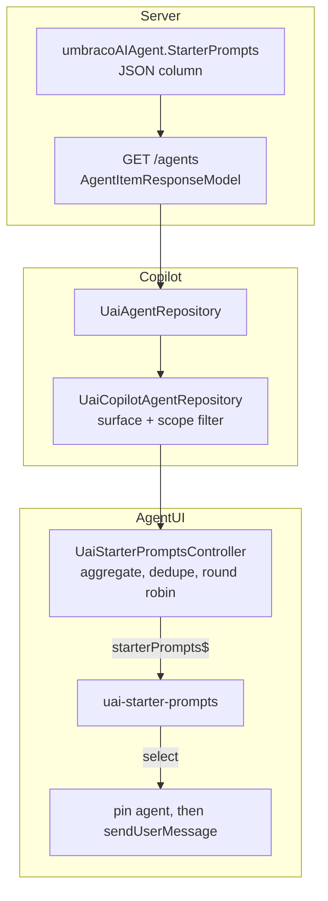

> **Scope cut, 16-09-2026.** v1 is **agent-defined starter prompts only**. User-saved prompts are
> deferred to a follow-up, with the seams left in place so they are additive when they come. Everything
> that was decided about them is preserved verbatim in the
> [Deferred: user-saved prompts](#deferred-user-saved-prompts) appendix at the bottom — nothing is lost,
> it is just no longer in the build.
>
> This document consolidates `starter-prompts-plan.md` (draft, 04-08-2026, owner Matt Brailsford) with
> decisions taken 15-09-2026 and the scope cut of 16-09-2026.
>
> The plan's sequencing section named the wrong vehicle: PRs #255, #259 and #292 are closed and
> unmerged, because that work shipped through the long-running `v17/release/2026.08.1` and
> `v18/release/2026.08.1` branches instead, where it is still being actively fixed. The
> `empty-state-message` slot and `Umbraco.AI.Agent.Copilot.Workspace` both exist there and in neither
> `dev` nor `main`. Those release branches are weeks from merging down, so they are the base for this
> work.

### Summary of change request

Give every chat surface a useful empty state by showing clickable **starter prompts**: short seed
prompts authored on the agent definition, versioned and deployed with the agent. Clicking one sends it.

One source, one surface, one vertical slice. A second source — prompts the signed-in user saves for
themselves — is a separate, later piece of work.

### Current State

- Opening Copilot shows a chat icon and a single sentence: *"Start a conversation with {agent}"*.
  There is nothing to click and nothing to learn from.
- A user facing a new agent has no idea what that agent is good at. They have to guess a first message.
- An agent author has no way to suggest how their agent should be used. The only guidance they can
  leave is a description, which the user never sees in the chat view.
- In Auto mode — which is what most users have selected on open, because Copilot auto-selects the
  first entry and injects a synthetic "Auto" whenever more than one agent is available — there is no
  way to discover which agents even exist.

Two further pains are **real but out of scope for v1**, and are what the deferred half addresses: a
user who works out a good prompt has no way to keep it (closing the sidebar wipes the conversation
entirely, nothing is stored client or server), so re-using a good prompt means retyping it.

### Desired End State

- Opening a chat shows clickable starter prompts instead of an empty sentence, in any surface that
  consumes `UAI_CHAT_CONTEXT`. No per-surface code.
- The active agent's starters render as chips, four at a time in authoring order, with a rotate control
  when there are more.
- In Auto mode the chips aggregate across every available agent, deduplicated and round-robin
  interleaved, each chip tagged with its agent name — so the empty state doubles as agent discovery.
- Clicking a starter sends it immediately and pins the conversation to that starter's agent, with no
  classifier round trip.
- An agent author can add, edit, reorder and remove starters while editing an agent; the order is what
  the chat shows. Starters are versioned and travel through Deploy with the agent.
- An agent author can press **Suggest starters** to have the agent's own `Instructions` turned into a
  set of draft starter rows, which they then edit or discard. Nothing is saved automatically.
- A surface that supplies neither of the two new optional context members renders today's empty state,
  byte for byte.

### What we're not doing

- **Not building user-saved prompts in v1.** No per-user table, no per-user API, no "Save as starter"
  button on messages, no saved-prompt rows, no edit modal, no `DateLastUsed`, no cascade-delete
  handler. See the [seams](#the-four-seams-that-keep-the-door-open) for what makes this additive later,
  and the [appendix](#deferred-user-saved-prompts) for the design that is already worked out.
- **Not persisting conversations.** Transcripts stay in memory and are still cleared when the sidebar
  closes. That belongs to the Copilot Workspace line.
- **Not reusing `Umbraco.AI.Prompt`.** `AIPrompt` entities are field-level property actions with their
  own profile, contexts and guardrails — not chat conversation starters. Neither `Umbraco.AI.Agent`
  nor `Umbraco.AI.Agent.Copilot` references that package today.
- **Not building team or organisation-shared prompt libraries.** The promotion ladder
  (mine → group → agent) needs a sharing model and is its own plan.
- **Not generating follow-up suggestions after each assistant reply.** Different feature, different
  lifetime.
- **Not adding variables or templating** (`{{placeholder}}` substitution).
- **Not adding a manifest extension kind** for empty-state contributions. Two narrow slots cover
  replacement; nobody outside this repo needs to *contribute* widgets yet.
- **Not tracking clicks to reorder or filter the list.** Usage never defines which starters exist.

Note: reordering **is** in scope, in the agent editor, because authoring order is display order.

### Proposed End State Architecture

Three layers, in three packages. The behaviour is surface-agnostic; only the inputs are
surface-specific, and those already flow through `UAI_CHAT_CONTEXT`.

| Layer | Package | Holds |
|---|---|---|
| **Data** | `@umbraco-ai/agent` | Nothing new. Starters ride the agent item the chat already loads. |
| **Behaviour** | `@umbraco-ai/agent-ui` | `UaiStarterPromptsController` aggregates across agents, dedupes, interleaves, derives display strings, pins on send. Plus the dumb `uai-starter-prompts` element. |
| **Inputs** | each surface | Supplies the available-agent list and the selection setter used for pinning. `UaiCopilotContext` already has both; `copilot-workspace-chat.context.ts` is the second surface and does the same wiring. |

```text
Umbraco.AI.Agent/                            # server-side data
├── Core/Agents/AIStarterPrompt.cs                    NEW  { Prompt }  max 200 chars
├── Core/Agents/AIAgent.cs                            + StarterPrompts       max 4
├── Core/Agents/AIAgentVersionableEntityAdapter.cs    + snapshot & restore
├── Core/Agents/AIStarterPromptSuggester.cs           NEW  Instructions -> draft starters
├── Persistence/                                      + StarterPrompts column
├── Web/Api/.../AgentItemResponseModel.cs             + starterPrompts   <- what the chat reads
├── Web/Api/.../SuggestStartersAgentController.cs     NEW
└── Web.StaticAssets/Client/src/agent/                + editor rows + Suggest starters

Umbraco.AI.Agent.UI/                         # behaviour + rendering
├── chat/context.ts                                   + 2 optional members (see below)
├── chat/services/starter-prompts.controller.ts       NEW  aggregate, dedupe, interleave, pin
├── chat/components/chat.element.ts                   + empty-state-suggestions slot
└── chat/components/starter-prompts.element.ts        NEW  dumb: entries in, select event out

Umbraco.AI.Agent.Copilot/  +  .Copilot.Workspace/     # wiring only
├── …/repository/*-agent.repository.ts                + starters in the item projection
└── …/*.context.ts                                    instantiate controller, delegate (~5 lines)
```

Compared with the two-source design this removes, from the build: a new entity, a new table, a
migration pair, a repository, a service, five controllers, a map definition, a notification handler, a
frontend repository, a sidebar modal with its token and manifest, a new message-action button, a change
to `message.element.ts`, and the ownership test suite. It removes roughly half the surface area and all
of the security-sensitive part.

#### What the user sees

```diff
 <uai-chat>
   _messages.length === 0
     <div class="empty-state">
       <slot name="empty-state-message">        # exists on release/2026.08.1, unchanged by us
         <uui-icon name="icon-chat">
         <p>Start a conversation with {agent}</p>
+      <slot name="empty-state-suggestions">    # NEW sibling, never the same slot
+        <uai-starter-prompts>                  # only when the context supplies both members
   <uai-chat-input>
```

`.empty-state slot { display: contents; }` is already in place on the release branch, so the new
sibling slot participates in the same centred flex column with no extra styling.

```text
┌──────────────────┐ ┌──────────────────┐
│ Audit this page… │ │ Draft a summary… │
└──────────────────┘ └──────────────────┘
┌──────────────────┐ ┌──────────────────┐   ⟳
│ Find broken lin… │ │ Summarise the c… │
└──────────────────┘ └──────────────────┘
```

No group heading in v1. With one source a heading labels nothing, and the headings only start earning
their keep when a second group appears below — at which point adding them is a render change with no
contract change.

#### The contract — two optional members

```ts
starterPrompts$?: Observable<UaiStarterPromptEntry[]>;
sendStarterPrompt?(entry: UaiStarterPromptEntry): void;
```

`uai-chat` renders `<uai-starter-prompts>` only when **both** are present. `UAI_CHAT_CONTEXT` is
exported public API through the agent-ui rollup, so optional is what keeps this additive rather than
breaking — and is also what lets the three write members arrive later without a version bump.

```ts
export interface UaiStarterPromptEntry {
    source: "agent" | "saved";   // always "agent" in v1 — see seam 2
    prompt: string;              // what gets sent, in full
    display: string;             // the string the chip renders — see seam 3
    agentId?: string;            // the agent to pin
    agentName?: string;          // shown as a tag only when the list spans >1 agent
}
```

#### The four seams that keep the door open

Each is a deliberate, costed decision to carry a little shape now so the deferred half is purely
additive. Total cost across all four is under ten lines.

| # | Seam | Cost now | What it buys |
|---|---|---|---|
| 1 | Every new context member is optional (`?`) | none — required anyway for public API compat | The three write members (`saveStarterPrompt`, `updateStarterPrompt`, `deleteStarterPrompt`) land later as pure additions, no breaking change, no surface forced to implement them |
| 2 | `UaiStarterPromptEntry.source` is typed `"agent" \| "saved"` today | one union member never produced | The entry type never changes shape; only new *values* become reachable. Widening a discriminator later is a breaking read for any exhaustive `switch` a consumer wrote |
| 3 | The entry carries `display` separately from `prompt` | one assignment (`display = prompt`) in the controller | Labels — the whole point of the saved half, and the escape hatch for the 200-char cap on agent starters — slot in with no type change and no branching in the element |
| 4 | `AIStarterPrompt` is a JSON **object**, not a bare string | one wrapper record | An optional `Label` can be added to agent starters later with no data migration (this is the plan's D3, reaffirmed 15-09-2026) |

Seam 2 is the only one with any smell to it — a union with one inhabitant. Call it if you would rather
drop it; the cost of adding it back is a one-line type widening plus a check of every `switch` on
`source`, of which there will be at most two.

Explicitly **not** a seam: the `UaiStarterPromptsController` is not speculative. Aggregation, dedupe,
round-robin and pinning are all needed for Auto mode in v1, which is the majority case. The merge step
inside it is simply where a second source plugs in later.

#### Where starters come from



Starters cost no extra request — they ride the agent item the chat context already loads.

#### Clicking a starter

```text
click chip
  sendStarterPrompt(entry)                       UaiStarterPromptsController
    if entry.agentId && entry.agentId !== current
      chatContext.selectAgent(entry.agentId)     picker moves Auto -> that agent
    chatContext.sendUserMessage(entry.prompt)    same path as typing
```

The classifier is never consulted. The prompt was authored against one agent's instructions and
tools, so re-deciding at click time is slower and can route somewhere the author did not intend.

### Design Questions

#### How wide should the door be?

The scope cut is settled; how much shape to carry forward is the one judgement call left. My
recommendation is **all four seams**, because together they cost under ten lines and they are exactly
the four places where a later change would otherwise be *breaking* rather than additive.

- **All four** *(recommended)* — under ten lines, and the deferred half becomes pure addition.
- **Drop seam 2 only** — removes the one-inhabitant union, the only piece with a whiff of speculative
  generality. Re-adding it later is a one-line widening plus auditing at most two `switch` sites.
- **Drop seams 2 and 3** — the leanest v1: the chip renders `prompt` directly with a CSS clamp. Costs a
  type change and an element change when labels arrive.

Recommending all four because seams 1 and 4 are free (public-API compatibility and the existing D3
decision already require them), so the only real question is 2 and 3, and both are one line each.

### Resolved Design Questions

Decisions 1–12 come from `starter-prompts-plan.md`; those marked **15-09-2026** were taken in the first
round of this discussion; the scope cut is **16-09-2026**.

#### v1 ships agent starters only; user-saved prompts are deferred — **16-09-2026**

The feature splits cleanly along its two sources, and the agent-starter half is both the larger user
win and the cheaper build. Deferring the user half removes a new entity, a new table and migration
pair, a service, a repository, five controllers, a notification handler, a frontend repository, a
sidebar modal, a new message action, and a change to `message.element.ts` — plus the ownership test
suite, which was called out as the highest-value testing in the feature precisely because it is the
only security-sensitive part.

Three reasons this is the right cut rather than an arbitrary one:

1. **The halves do not depend on each other.** Agent starters ride the existing agent load; saved
   prompts need their own store and their own endpoints. Nothing in the agent half is shaped by the
   user half except the four seams above.
2. **The risk is concentrated in the deferred half.** Per-user data means ownership enforcement,
   fail-closed reads, and a cascade on agent delete. Shipping the half with no per-user data first
   means the first release carries no new security surface at all.
3. **The empty state is fixed either way.** The user-visible problem in the ticket — "opening Copilot
   shows nothing to click" — is solved entirely by agent starters. Saved prompts improve re-use for
   people who already know what to ask; they do not fix the blank page.

*Discarded:* shipping both, as previously planned — correct on merit, but roughly double the surface
area for an increment that is already the whole user-visible win. *Also discarded:* shipping the saved
half first — it depends on the user having a good prompt to save, which is exactly what the agent half
provides.

`message.element.ts` staying untouched is a secondary win worth naming: the per-role branch in
`#renderActions()` was a change to a hardcoded, actively-worked file on a long-running release branch.

#### Base the feature on `release/2026.08.1`, not `dev` — **15-09-2026**

**Option B chosen.** The release branches are at most weeks from merging down, and they are the only
place the `empty-state-message` slot and the Copilot Workspace surface exist. Branching from them
means the whole feature — backend, editor and UI — can be built in one pass against the real shape,
with Workspace getting starters at the same time as Copilot rather than needing a retrofit.

*Discarded:* basing on `dev` and splitting the work — correct while the release date was unknown, but
it stalls the user-visible half of the feature for no benefit once the merge is weeks away. *Also
discarded:* basing on `dev` and adding `empty-state-message` ourselves — guarantees a conflict in
`chat.element.ts` against ~187 commits of pending work, in the file the plan already flagged as the
highest-conflict spot.

> **Confirmed 16-09-2026:** we *branch from* the release branch and merge back into `v18/dev` once
> `release/2026.08.1` has merged down — **not** into the release branch itself. Landing a feature on a
> stabilisation branch would put it in the 2026.08.1 release unreviewed and would need it adding to
> `release-manifest.json`.

#### "Suggest starters" from the agent's instructions is in v1 — **15-09-2026**

**Option B chosen.** The agent editor gains a **Suggest starters** button: one AI call against the
agent's `Instructions`, prefilling the repeatable rows for the author to edit or discard. It never
auto-saves. Copilot Studio does the same, and it removes the blank-page problem for whoever is creating
the agent.

The reason this earns its place: the main threat to the whole feature is agents shipping with no
starters, leaving the empty state as empty as it is today. **The scope cut sharpens this, it does not
soften it** — with the saved-prompt half gone, agent starters are the *only* source, so an agent with
none means an empty state with nothing in it. The cost is one call on a screen that already has a
profile and an instructions field.

*Discarded:* deferring it. Nothing in the data model blocks adding it later, but deferring accepts the
adoption risk for the entire feature — and post-cut, for the entire feature's only source.

#### Clicking a starter pins its agent for the thread — **15-09-2026**

**Option A chosen**, confirming the plan's D11. Pinning goes through `chatContext.selectAgent(agentId)`,
not `runController.setAgent(...)`: on the release branch `setAgent` takes a `UaiAgentItem` and
deliberately preserves the conversation, and in Workspace the run controller's agent is the
*conversation* (`conversation:{id}`), not the agent. `selectAgent` is already on the shared interface
and is what both surfaces implement.

One consequence to state plainly: a thread started from a starter stays with the pinned agent rather
than being re-classified per message the way an Auto thread is today. For a thread that began with a
purpose-written prompt, that is the intended behaviour. The picker visibly moves from "Auto" to that
agent and the user can flip back whenever.

*Discarded:* pinning for a single message and leaving the thread on Auto — needs an `agentId` argument
threaded through `sendUserMessage` and `UaiAgentClient`, growing both public surfaces for no visible
gain until the second message.

#### The agent name shows on chips only when the list spans more than one agent — **15-09-2026**

**Option C chosen**, refining the plan's D10 (which said "in auto mode only"). The name renders as a
small `<uui-tag>`, and suppresses itself whenever the aggregated list contains a single agent —
including Auto mode with only one agent available, where the tag would be pure noise.

This keeps the discovery win exactly where it pays and costs no vertical space in the common case,
which matters in a narrow sidebar where chips already clamp to two lines.

*Discarded:* always showing it in Auto mode — costs space even when there is nothing to disambiguate.
*Also discarded:* never showing it — loses the discovery win that is the main argument for aggregating
across agents at all.

#### Four starters per agent, not ten — **16-09-2026**

Four is what the chip window shows, so a single selected agent now always fits on one page and the
rotate control is reserved for Auto mode aggregating across agents. The cap is a guard in
`SaveAgentAsync` and a `max` on the editor component; the database never counts, because the column is
one JSON blob. Caps are cheap to raise and breaking to lower, so it starts where the UI actually is.

Deploy import **clamps** to the first four rather than throwing, since `Pass3Async` goes through
`SaveAgentAsync` and an artifact from another version line should not fail a whole transfer over a
presentation rule.

*Discarded:* ten, as originally planned — it made the rotate control necessary even for a single agent,
and asked authors for six starters nobody sees first.

#### Agent starters stay capped at 200 characters, with a named escape hatch — **15-09-2026**

**Option C chosen.** The cap holds, and `AIStarterPrompt` stays a JSON **object** rather than a bare
string, so an optional `Label` can be added later with no data migration if authors keep hitting the
limit for good reasons. This is seam 4 above.

This is the plan's D3 with its escape route made explicit: the fix for a too-tight cap is a label, not
a bigger cap.

*Discarded:* raising the cap outright — the moment starters get long they need a label to display.

---

#### Agent starters live top-level on `AIAgent`, not inside `Config` (D1)

`Config` is per-agent-type (`AIStandardAgentConfig` / `AIOrchestratedAgentConfig`) with only a marker
interface between them, so putting starters there means duplicating the property, the API model and
the editor. Top-level costs one paired migration and works identically for both agent types.

*Also decisive, and found while checking:* `AgentItemResponseModel` deliberately omits `Config`, and
`UaiCopilotAgentRepository` builds its whole agent list from `getAllAgents` → `AgentItemResponseModel`.
Starters inside `Config` would be invisible to the chat without either fattening every item in the
list response or issuing a request per agent.

*Discarded:* inside `AIStandardAgentConfig` / `AIOrchestratedAgentConfig` — zero migrations, but
duplicated twice over and unreachable from the list endpoint.

#### Stored as a JSON string column (D2)

`AIAgentEntity.StarterPrompts` as `string?`, matching `Scope`, `GuardrailIds` and `SurfaceIds`. No new
table, no relational shape, and the same hand-written serialize/deserialize pattern reviewers already
know from `AIAgentEntityFactory`.

*Discarded:* EF owned types / `.ToJson()` — used nowhere in this codebase.

#### Agent starters are prompt-only (D3)

Agent starters are **seeds**: one line, 40–120 characters, and an agent already has a home for long
text in its `Instructions`.

```csharp
public sealed record AIStarterPrompt      { public required string Prompt { get; init; } }  // max 200
                                          // max 4 per agent
```

Every surveyed platform that allows a long payload stops showing the payload; only OpenAI shows raw
text, and only because its starters are always short. The record stays a JSON **object**, so adding
`Label` later is additive with no data migration. The merged entry carries a display string (seam 3)
so the chip component never has to care where an entry came from.

#### Agent starters ride the agent load (D6)

Starters on `AgentResponseModel` and `AgentItemResponseModel` mean the chat context has them the
moment an agent is selected, with no extra request.

#### Rendering is a core `uai-chat` feature behind an optional capability, not a slot-only design (D7)

The behaviour — aggregate, dedupe, rotate, send, pin — is surface-agnostic; only the inputs are
surface-specific, and those already flow through `UAI_CHAT_CONTEXT`. A slot-only design would mean the
Copilot sidebar and Copilot Workspace each build their own empty state and then drift apart.

*Discarded:* an `umb-extension-slot` with its own manifest kind — the repo uses that where it earns
its keep (`uai-agent-tool-renderer` exists because third parties genuinely need to render arbitrary
tool output), but nobody outside this repo needs to inject empty-state widgets, and a kind means a
registry, a schema and a public contract to keep stable.

#### Two narrow slots, never one wide one

The empty state does two unrelated jobs: it greets you, and it suggests what to ask. One slot over the
whole region couples them — a surface that only wants to reword the greeting would be forced to
re-supply the starters, and would silently lose them when the default changed.

Filling one leaves the other on its default; that is native slot behaviour with no wiring. A surface
wanting to replace everything fills both. Deliberately no coarse whole-region slot, because two
overlapping slots need a precedence rule and that is a bug waiting to happen.

#### Clicking a starter sends it immediately (goal 3)

No prefill-and-edit step. This also avoids adding a public draft-setting API to `<uai-chat-input>`,
whose `_value` is private `@state` today.

*Discarded:* filling the input for the user to edit — better for tweaking a long prompt, but costs a
second action on every use and needs new public surface on the input element.

#### Presentation: chips, four at a time, with a rotate control (D9)

Chips suit short seeds. Four visible in definition order, with a small rotate control when there are
more. No paging.

#### Auto mode aggregates starters from every available agent (D10)

`UaiCopilotAgentRepository.agentItems$` is already filtered by surface and by the live entity context
using the same allow/deny scope rules the server applies, so there is no new availability logic —
just read starters off the items we already have. Dedupe on prompt text; interleave round-robin one
per agent per pass so an agent with 4 starters cannot crowd out one with 1; keep the window at 4 with
the rotate control, since aggregation makes overflow the normal case even though a single agent never
does. Agent-name tagging follows the
15-09-2026 refinement above.

*Discarded:* showing no starters in Auto mode — clean, but Auto is what most users have selected on
open, so it would leave the empty state empty for the majority.

#### No usage-driven behaviour in v1 (D8)

Click tracking and ranking are explicitly later. Usage never defines which starters exist.

#### Agent starters are versioned and deployed (Phases 1, 4)

`AIAgentVersionableEntityAdapter` gains `StarterPrompts` in both snapshot and restore, so version
history shows a starter change as a change. `AIAgentArtifact` and the service connector carry them so
a Deploy round-trip preserves them.

> Pre-existing bug found while planning: `AIAgentVersionableEntityAdapter.CreateSnapshot` already
> omits `GuardrailIds` and `Scope` entirely — neither captured, restored, nor compared. Out of scope
> here; worth its own issue.

### Patterns to follow

#### Storing a collection as a hand-serialised JSON string column

`AIAgentEntityFactory` already does this for three collections, always swallowing malformed JSON to a
safe default and writing `null` rather than `"[]"` for an empty list.

Existing — `Umbraco.AI.Agent.Persistence/Agents/AIAgentEntityFactory.cs:91-143`:

```csharp
private static string? SerializeSurfaceIds(IReadOnlyList<string> surfaceIds)
    => surfaceIds.Count == 0 ? null : JsonSerializer.Serialize(surfaceIds, JsonOptions);

private static IReadOnlyList<string> DeserializeSurfaceIds(string? json)
{
    if (string.IsNullOrWhiteSpace(json)) return [];
    try { return JsonSerializer.Deserialize<List<string>>(json, JsonOptions) ?? []; }
    catch (JsonException) { return []; }
}
```

Proposed — identical shape, objects rather than strings so `Label` stays additive later:

```csharp
private static string? SerializeStarterPrompts(IReadOnlyList<AIStarterPrompt> prompts)
    => prompts.Count == 0 ? null : JsonSerializer.Serialize(prompts, JsonOptions);

private static IReadOnlyList<AIStarterPrompt> DeserializeStarterPrompts(string? json)
{
    if (string.IsNullOrWhiteSpace(json)) return [];
    try { return JsonSerializer.Deserialize<List<AIStarterPrompt>>(json, JsonOptions) ?? []; }
    catch (JsonException) { return []; }
}
```

#### Paired SQL Server and SQLite migrations, authored by hand

Every schema change is a matched pair with identical intent and provider-specific dialect, each with a
generated `.Designer.cs`, both updating a shared `ModelSnapshot.cs`. Copy
`20260316100000_UmbracoAIAgent_AddGuardrailIds` as the template — minus its data-lift SQL, since the
starters column is purely additive with `null` meaning "none". **One pair, not two** — the second pair,
for the user-prompt table, goes with the deferred half.

```text
Persistence.SqlServer/Migrations/
├── …_UmbracoAIAgent_AddStarterPrompts.cs            AddColumn<string>(..., "nvarchar(max)")
├── …_UmbracoAIAgent_AddStarterPrompts.Designer.cs   generated
└── UmbracoAIAgentDbContextModelSnapshot.cs          updated
Persistence.Sqlite/Migrations/                        same three, type: "TEXT"
```

Branching from `release/2026.08.1` means the Conversations DbContext migrations are already present.
Ours are in a different DbContext, so there is no ordering problem, but pick timestamps later than the
ones already on that branch.

#### The repeatable list comes from the CMS, not from us — **16-09-2026**

`<umb-input-multiple-text-string>` is the component behind the CMS's Repeatable Text String property
editor, and it is publicly exported from `@umbraco-cms/backoffice/components` — an import path this repo
already uses in eleven places
(`Umbraco.AI.Agent/.../agent-table-collection-view.element.ts:10` and siblings). It brings add, remove,
drag-to-reorder via `UmbSorterController`, and a `max` item-count validator, none of which we then own.

```ts
<umb-input-multiple-text-string
    max="4"
    .items=${this.prompts.map((p) => p.prompt)}
    @change=${this.#onChange}>
</umb-input-multiple-text-string>
```

*Discarded:* the property editor UI itself, `umb-property-editor-ui-multiple-text-string`. It is not
exported from any package entry point and is only reachable through its manifest alias
(`Umb.PropertyEditorUi.MultipleTextString`) inside a document-type property context, so it cannot be
placed in a workspace view. The inner component is the reusable piece.

*Also discarded:* hand-rolling rows in the `uai-agent-scope-rules-editor` shape (below). It was the plan
until the CMS component was checked, and it costs a component plus reorder buttons that no list in this
monorepo has ever implemented.

A thin `uai-agent-starter-prompts-editor` wrapper still exists, for three jobs: mapping `string[]` to
`AIStarterPrompt[]` and back, enforcing the 200-character cap the CMS component knows nothing about, and
hosting the **Suggest starters** button. Two divergences are accepted rather than worked around: the
component has no `maxlength` or per-item counter, and it opens a `umbConfirmModal` on delete where every
other list in this repo removes immediately. When an optional `Label` lands on `AIStarterPrompt`, the
component stops fitting and the wrapper's insides become hand-rolled rows — a UI change with no data
change, which is what seam 4 buys.

#### The add/remove/reorder array editor with a placeholder add button

Superseded for starter prompts by the CMS component above; still the pattern for any
object-shaped repeating collection, and the model the starter prompts editor falls back to if `Label`
ever arrives.

`uai-agent-scope-rules-editor` is the canonical repeating-collection editor.

Existing — `Umbraco.AI.Agent/.../agent-scope-rules-editor/agent-scope-rules-editor.element.ts:21-65`:

```ts
#onAddRule() { this.#dispatchChange([...this.rules, createEmptyAgentScopeRule()]); }
#onRemoveRule(index: number) { this.#dispatchChange(this.rules.filter((_, i) => i !== index)); }

render() {
    return html`<div class="rules-container">
        ${this.rules.map((rule, index) => html`
            <uai-agent-scope-rule-editor .rule=${rule}
                @rule-change=${(e) => this.#onRuleChange(index, e.detail)}
                @remove=${() => this.#onRemoveRule(index)}></uai-agent-scope-rule-editor>`)}
        <uui-button look="placeholder" @click=${this.#onAddRule}>
            <uui-icon name="icon-add"></uui-icon>${this.addButtonLabel}
        </uui-button>
    </div>`;
}
```

Reorder is the one thing this pattern does not already do — no list component in the monorepo
implements drag-to-reorder, which is precisely why the CMS component wins for starter prompts: it has
one. The **Suggest starters** button sits below that component in the wrapper, and replaces the rows
with drafts the author can then edit or discard.

#### Exports go through the barrel chain, never by path

New Lit components are reached by tag name only and must be exported through `index.ts` →
`internal-components.ts`. Only genuinely public values — the two new context members and
`UaiStarterPromptEntry` — belong in `exports.ts`. See `.claude/memory/frontend-entry-points.md`.

#### Public API backwards compatibility

`UAI_CHAT_CONTEXT` and `UaiChatContextApi` are exported public API through the agent-ui rollup. Every
new member must be optional (`?`), and `<uai-chat>` must treat missing members as "no starters" and
fall back to the empty state unchanged. This is seam 1, and it is what lets the deferred write members
arrive without a breaking change. Any C# method that gains a parameter keeps its old signature proxying
to the new one, marked `[Obsolete("Will be removed in v19")]`.

#### Localisation

Nested dictionary objects addressed as `namespace_key`, one `type: "localization"` manifest per
culture at `weight: -100` with a lazy `js:` import.

```ts
export default {
    uaiChat: {
        rotateStarters: "Show more suggestions",
    },
} as UmbLocalizationDictionary;
```

Agent-editor strings — including **Suggest starters** and its failure message — go in
`Umbraco.AI.Agent`'s `lang/en.ts`; chat strings go in Agent.UI's. Reuse the CMS's `general_*` keys for
cancel, submit, remove and edit.

### Testing approach

- **Serialization (xUnit + Moq + Shouldly, following `AIAgentConfigSerializerTests.cs`)** — round-trip
  and malformed-JSON-fallback for the `StarterPrompts` pair, plus a backward-compatibility test
  feeding a pre-migration row with a `null` column and asserting an empty list comes out.
- **Validation** — count cap (4) and length cap (200) rejected with a clear message, not silently
  truncated, on both create and update.
- **Mapping** — `AgentMapDefinition` is untested today, but assert `StarterPrompts` survives
  `CreateAgentRequestModel → AIAgent → AgentResponseModel` *and* reaches `AgentItemResponseModel`. A
  silent drop in the mapper is the most likely failure mode, and the item model is what the chat reads.
- **Versioning** — `AIAgentVersionableEntityAdapter` is entirely untested and already omits `Scope`
  and `GuardrailIds`. Add snapshot/restore coverage for `StarterPrompts` so we do not reproduce the
  existing gap.
- **Deploy** — the connector's import path (`ProcessAsync`/`Pass3Async`) is untested; at minimum
  assert an export/import round trip preserves starters.
- **Suggest starters** — the generation call is mocked; assert the editor prefills rows and saves
  nothing on its own, and that a failed call surfaces a message rather than clearing existing rows.
- **Frontend** — `Umbraco.AI.Agent.Copilot` has vitest configured (`happy-dom`); `Umbraco.AI.Agent.UI`
  does not and would need it adding for controller tests. The aggregate/dedupe/round-robin/pin logic in
  `UaiStarterPromptsController` is pure and is worth covering: dedupe on identical prompt text across
  agents, round-robin so a 4-starter agent cannot crowd out a 1-starter one, agent-tag suppression when
  the list spans a single agent, and the rotate control appearing only above four entries. Component
  behaviour stays manual against the demo site, as Agent.UI's `CLAUDE.md` prescribes.

The ownership test suite — previously called the highest-value testing in the feature — goes with the
deferred half, because v1 introduces no per-user data and therefore no new security surface.

### Version lines

Primary base is **`v18/release/2026.08.1`**, per the resolved decision above. Both v17 and v18 are in
active support (features + bug fixes), so both lines get the feature — port to
`v17/release/2026.08.1` (or to `v17/dev` after that branch merges down, whichever the timing favours)
per the Backport Workflow, with migrations authored on each line's own branch. Note this document and
the prior plan were both drafted while sitting on `v17/dev`, so both need to land on the v18 line too.
Confirm the port before treating the work as done.

---

## Deferred: user-saved prompts

Everything below is **out of v1**, preserved so the follow-up starts from a finished design rather than
a blank page. Nothing here is built now.

### What it adds

- A backoffice user saves a prompt they typed so they can re-run it later. Private to that user, and
  scoped to the agent they were using.
- Saved prompts render as rows under a "Saved prompts" heading beneath the agent chips, most recently
  used first, all of them visible without paging, with edit and delete actions.
- Any user with chat access can save a sent message in one click — no modal, no title to invent — with
  a toast and an undo.
- A long saved prompt shows its opening line, sends in full, and can be given a proper label later in a
  sidebar edit modal.
- One user's saved prompts are never visible to another user, even with a hand-crafted request.

Two treatments on purpose: chips suit short seeds, rows take a two-line clamp better and have somewhere
to hang the actions. The "Saved prompts" heading appears only once the user has one — and the
"Suggested" heading over the chips appears at the same moment, for the same reason.

### The three write members it adds to the contract

```diff
 starterPrompts$?: Observable<UaiStarterPromptEntry[]>;
 sendStarterPrompt?(entry: UaiStarterPromptEntry): void;
+saveStarterPrompt?(prompt: string): Promise<void>;
+updateStarterPrompt?(entry: UaiStarterPromptEntry): Promise<void>;
+deleteStarterPrompt?(entry: UaiStarterPromptEntry): Promise<void>;
```

All additive against seam 1. The three write operations are symmetrical: every one of them is a dumb
component emitting a bubbling event that `uai-chat` forwards to the context, with
`UaiStarterPromptsController` doing the actual work. Save takes a bare `string` rather than an entry
because the thing being saved is not a starter yet — it is the content of a sent message. The
controller supplies the rest: it resolves the agent to scope the prompt to (the selected one, or the
classifier's choice from the `agent_selected` event when the thread was on Auto), dedupes against the
user's existing prompts, and owns the confirmation toast and its undo so both surfaces get them free.

Read and write capability stay separable: `message.element.ts` renders "Save as starter" on user
messages only when `saveStarterPrompt` is present, and a surface with no saved-prompt store omits all
three writes and keeps read-only agent starters.

The entry type needs no change — `source: "saved"` (seam 2), `display` for the label (seam 3), and an
`id?: string` for saved prompts only, which is the one genuinely additive optional field.

### Resolved decisions, carried forward

#### Every write reaches the repository through its own optional context member — **15-09-2026**

**Option A chosen.** `starter-prompts.element.ts` stays dumb: it emits `edit` and `delete` events
alongside `select`, and `uai-chat` forwards them to `updateStarterPrompt` / `deleteStarterPrompt` on
the context. This closes a gap in the plan, which described the element as dumb but gave its rows
pencil and trash actions with no stated path to the repository. Reviewing that decision surfaced a
second gap: **save** had the same problem, and gets a member on the same principle.

*Discarded:* passing the controller into the element as a property — no contract growth, but the
element stops being dumb and becomes hard to test in isolation. *Also discarded:* putting callbacks on
each `UaiStarterPromptEntry` — entries stop being plain serialisable data, which complicates the
dedupe and interleave logic that copies and merges them.

#### The write verbs are `save` / `update` / `delete`, never `edit` — **15-09-2026**

A naming audit across both the C# and TypeScript sides found that `edit` is the codebase's word for
*opening an editor*, never for *writing a record* — it has zero occurrences as a method verb anywhere
in the C# codebase, and appears on the frontend only as private `#onEdit(...)` handlers that open an
editor and never touch a repository.

| Verb | C# services / repositories | Frontend | Verdict |
|---|---|---|---|
| `Save` / `save` | The single write method on all 12 repositories and every entity service — `SaveProfileAsync`, `SaveAgentAsync`, `SavePromptAsync`. Handles insert *and* update. | The create-or-update method on all 6 detail repositories (`UmbDetailRepositoryBase.save`), plus `settings.repository.ts:19` and the entity adapters. | **Consistent.** Use `saveStarterPrompt`. |
| `Delete` / `delete` | `DeleteProfileAsync`, `DeleteAgentAsync`, … on every service and repository; `Delete[Entity]Controller` on every API. | The persistence verb in all 7 detail repositories and their data sources. | **Consistent.** Use `deleteStarterPrompt`. |
| `Update` / `update` | The API-layer verb: `UpdateProfileController`, `UpdateAgentController`, … which then call `Save…Async`. | The data-source-layer verb (`connection-detail.server.data-source.ts:60` and its six siblings), which repository `save` calls into. | **Exists, means "modify an existing record".** Use for the pencil action. |
| `Edit` / `edit` | **Zero occurrences as a method verb anywhere in the C# codebase.** | Only ever a private handler that *opens* an editor — `#onEdit(card)`, `#onEdit(rule)`, `#onEdit(grader)` and three more. None of them touch a repository; the write that follows always goes through `save`. | **Not a persistence verb here.** Never use for a context member. |

The dumb element still emits a bubbling `edit` event (that name is correct — it is a request to open
the editor) and the button label still reads "Edit"; only the context member is `updateStarterPrompt`.
The word changes exactly where the meaning changes, at the boundary between "open something" and "write
something".

*Discarded:* folding the pencil path into `saveStarterPrompt` with an optional second argument, to
mirror the C# one-`SaveAsync`-does-both convention. The two inputs are genuinely different — save takes
a bare `string`, update takes a `UaiStarterPromptEntry` with an id and a label — so a union-typed single
member would need a runtime branch on its own argument. The frontend already splits these at the
data-source layer (`create` vs `update`), so two members is the closer precedent.

#### User-saved prompts are a new entity and table (D4)

Table `umbracoAIAgentUserStarterPrompt` in `Umbraco.AI.Agent`, with `Id`, `UserId`, `AgentId?`,
`Prompt`, `Label?`, `DateCreated`, `DateLastUsed?`, indexed on `(UserId, AgentId)`. Different lifecycle
(per user, no versioning, no Deploy) and different permissions (anyone who can chat may save; only
agent managers may edit agent starters). Merging them into the agent definition would leak one user's
prompts into a deployable artifact.

*Discarded:* the CMS's `umbracoUserData` table — no migrations and ownership enforced by the CMS, but
it stores one opaque blob per key, which does not support the `(UserId, AgentId)` index, the
`DateLastUsed` ordering, or the delete-agent cascade. *Also discarded:* browser `localStorage` — does
not follow the user between machines.

#### Saved prompts are scoped to `(UserId, AgentId?)`; the UI always sets an agent (D5)

`AgentId` stays nullable in the model and API, where null means "show for any agent". The UI never
writes null — saving always assigns the agent in use, with nothing for the user to choose. Prompts are
written against a specific agent's tools, so agent-scoped is the honest default. The null path stays
implemented and tested because it is the shape a future shared layer needs.

#### Saved prompts get their own current-user-scoped endpoints (D6)

A small CRUD controller — list, create, update, delete, mark-used. The service **never** takes a user id
from the request; it reads the current user via `IBackOfficeSecurityAccessor`, always. Separate
`CreateUserStarterPromptController` / `UpdateUserStarterPromptController` /
`DeleteUserStarterPromptController`, both writes calling one
`IAIUserStarterPromptService.SaveUserStarterPromptAsync`, which calls
`IAIUserStarterPromptRepository.SaveAsync` / `DeleteAsync`. Same Create+Update-over-one-Save shape as
`CreateProfileController` / `UpdateProfileController` → `SaveProfileAsync`.

```text
GET    /umbraco/ai/management/api/v1/user-starter-prompts?agentId=      -> mine only, always
POST   /umbraco/ai/management/api/v1/user-starter-prompts               -> 201 + Location
PUT    /umbraco/ai/management/api/v1/user-starter-prompts/{id}          -> 404 if not mine
DELETE /umbraco/ai/management/api/v1/user-starter-prompts/{id}          -> 404 if not mine
POST   /umbraco/ai/management/api/v1/user-starter-prompts/{id}/used     -> bumps DateLastUsed
```

"Not mine" and "not found" are deliberately indistinguishable, and every read fails closed when there
is no current user.

#### Fallbacks and cascade (D11, D12)

Saving while in Auto mode records the agent the classifier resolved to, taken from the `agent_selected`
event, so there is always one by the time a message has been sent. An `AgentId = null` prompt
(API-only) leaves the selection on Auto and is the one path where a click costs an LLM call. A saved
prompt whose agent is currently unavailable is hidden, not deleted — the user may navigate somewhere it
applies again. Deleting an agent deletes its scoped saved prompts via a notification handler mirroring
`AIProfileDeletingAgentNotificationHandler`.

#### Save is one click; the label is asked for later (D3)

A "Save as starter" action sits next to the existing copy button on **user** messages. No modal, no
title to invent; a toast confirms with an undo. The row falls back to displaying the front of the
prompt. The optional `Label` (max 100; `Prompt` max 4000) is set afterwards in the sidebar edit modal,
where the full text is readable. Saving twice from the same text must not create a duplicate.

*Discarded:* a label dialog at save time — it turns a one-click action into a form, and asks for a
label at the exact moment the user cannot see the whole prompt.

#### Management happens inline; there is no separate manage screen

Clicking a row's text sends it, same as a chip. Trash deletes inline with an undo toast — the common
case never opens a modal. Pencil opens a sidebar modal (mirroring
`UAI_TOOL_PERMISSIONS_OVERRIDE_EDITOR_MODAL`, `type: "sidebar"`) with the full prompt in a textarea plus
the `Label` field. The per-agent cap of 10 is what makes this work: a list that always fits is simpler
than any paging or overflow affordance. No search and no manual ordering.

### Patterns the deferred half will need

#### Repository access stays behind the service

`IAIUserStarterPromptRepository` is `internal` per the repo convention; only
`AIUserStarterPromptService` touches it, and controllers go through the service. The service resolves
the current user itself and never accepts a user id from the request — this is the whole security model
for the feature.

```text
UserStarterPromptController -> IAIUserStarterPromptService -> IAIUserStarterPromptRepository (internal)
                                        |
                                        +-- IBackOfficeSecurityAccessor.CurrentUser
```

The nearest existing precedent for fail-closed per-user access is `AIFileStore.IsOwnedByCurrentUser`
(`Core/FileStore/AIFileStore.cs:138-169`), which returns null and warns on *any* of: no current user,
no owner recorded, owner mismatch. Mirror that posture.

#### Cascade delete via a notification handler

`AIProfileDeletingAgentNotificationHandler` (`Core/Agents/AIProfileDeletingAgentNotificationHandler.cs`)
is the existing shape to copy — `INotificationAsyncHandler` on the `Deleting` notification, registered
in the Core composer.

#### The removable-row list with a hover-revealed action bar

`uai-user-group-settings-list` and `uai-agent-surface-picker` both render `<uui-ref-list>` of
`<uui-ref-node>` with actions appearing on hover and removal taking effect immediately.

Existing — `Umbraco.AI/.../core/components/user-group-settings-list/user-group-settings-list.element.ts:183-260`:

```ts
<uui-ref-list>
  ${repeat(entries, ([key]) => key, ([key, settings]) => html`
    <uui-ref-node name=${this._name(key)} detail=${this._detail(settings)}
        @open=${() => this._edit(key)}>
      <uui-action-bar slot="actions">
        <uui-button label=${this.localize.term("general_remove")} @click=${() => this._remove(key)}>
          <uui-icon name="icon-trash"></uui-icon>
        </uui-button>
      </uui-action-bar>
    </uui-ref-node>`)}
</uui-ref-list>
```

Note the divergence: existing lists remove with no confirmation. Saved prompts are more precious, so
an undo toast replaces confirmation rather than adding a dialog.

#### A hardcoded message action beside copy and regenerate

Per-message actions are hardcoded in `message.element.ts`, whose `#renderActions()` currently
early-returns for anything that is not an assistant message — so user messages render no actions at
all today. The save button follows `<uai-message-copy-button>` exactly: a tiny element dispatching a
bubbling event that `<uai-chat>` forwards to the chat context.

Existing — `Umbraco.AI.Agent.UI/.../chat/components/message.element.ts:187-203`:

```ts
#renderActions() {
    if (this.message.role !== "assistant" || !this.message.content?.trim()) return html``;
    return html`<div class="message-actions ${visibilityClass}">
        ${this.isLastAssistantMessage ? html`<uai-message-regenerate-button></uai-message-regenerate-button>` : ""}
        <uai-message-copy-button .content=${this.message.content}></uai-message-copy-button>
    </div>`;
}
```

Proposed — the assistant-only guard becomes a per-role branch:

```ts
#renderActions() {
    if (!this.message.content?.trim()) return html``;
    if (this.message.role === "user") {
        return this.canSaveStarter
            ? html`<div class="message-actions">
                <uai-message-save-starter-button .content=${this.message.content}></uai-message-save-starter-button>
              </div>`
            : html``;
    }
    if (this.message.role !== "assistant") return html``;
    // ...unchanged assistant branch
}
```

*Discarded:* turning message actions into a `uaiChatMessageAction` extension point. It follows the
`uaiAgentToolRenderer` precedent and is the better long-term shape, but it is a large refactor of a
deliberately hardcoded area for one new action.

#### The four-part modal: token, manifest, element, caller

The saved-prompt editor is a sidebar modal, mirroring `UAI_TOOL_PERMISSIONS_OVERRIDE_EDITOR_MODAL`
rather than the small dialog used for agent creation, because it holds a 4,000-character textarea.

```ts
// token
export const UAI_SAVED_PROMPT_EDITOR_MODAL = new UmbModalToken<
    { prompt: string; label?: string }, { prompt: string; label?: string }
>("UmbracoAIAgentUI.Modal.SavedPromptEditor", { modal: { type: "sidebar", size: "medium" } });

// manifest — chat/manifests/
{ type: "modal", alias: "UmbracoAIAgentUI.Modal.SavedPromptEditor", name: "Saved Prompt Editor Modal",
  js: () => import("./saved-prompt-editor-modal.element.js") }

// caller
const modalManager = await this.getContext(UMB_MODAL_MANAGER_CONTEXT);
const result = await modalManager
    .open(this, UAI_SAVED_PROMPT_EDITOR_MODAL, { data: { prompt: entry.prompt, label: entry.label } })
    .onSubmit().catch(() => undefined);
```

Sidebar modals use `<umb-body-layout>`; small dialogs use `<uui-dialog-layout>`.

### Testing the deferred half

- **Ownership** — the highest-value tests in that half. Mirror `AIFileStoreOwnershipTests.cs`: user A
  cannot read, update or delete user B's prompts even with a hand-crafted request; a user with chat
  access but no agent-management permission can still save and delete their own; no current user fails
  closed.
- **Cascade** — deleting an agent leaves no orphan rows.
- **Controller logic** — hiding saved prompts whose agent is unavailable, dedupe against existing
  prompts on save, delete-then-undo restores the entry, rows order by `DateLastUsed`.
- **Localisation** — `savedPrompts`, `suggested`, `saveAsStarter`, `starterSaved` join the Agent.UI
  dictionary; `general_*` covers cancel, submit, remove, edit and undo.
